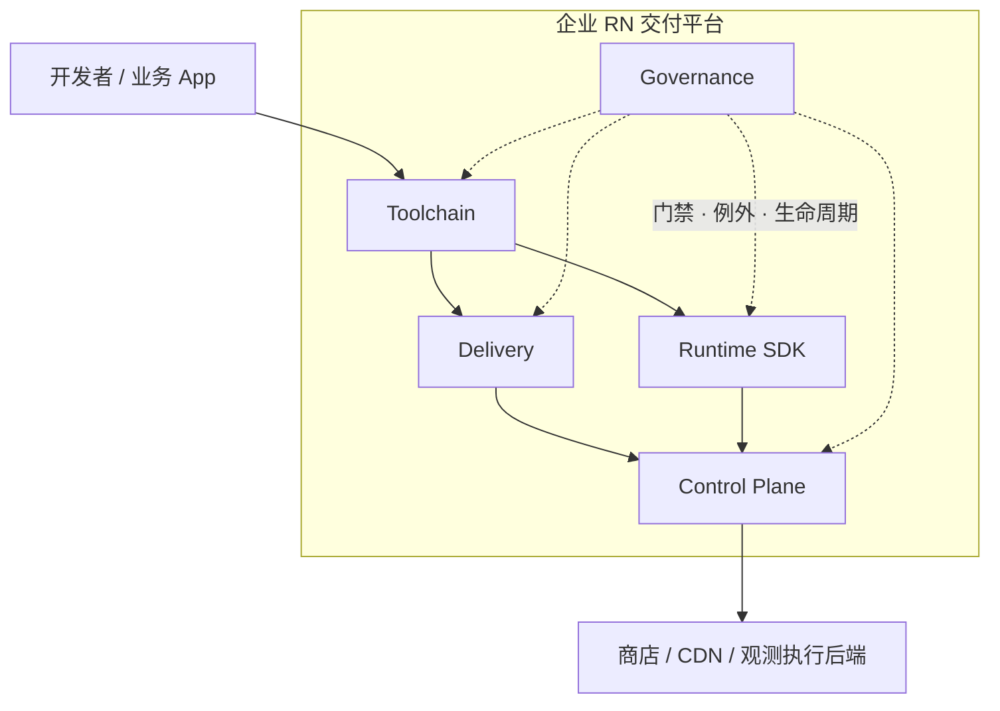
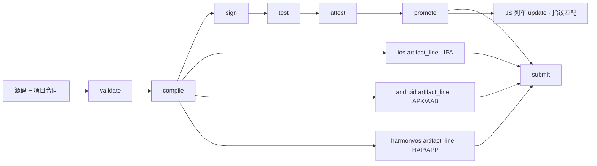
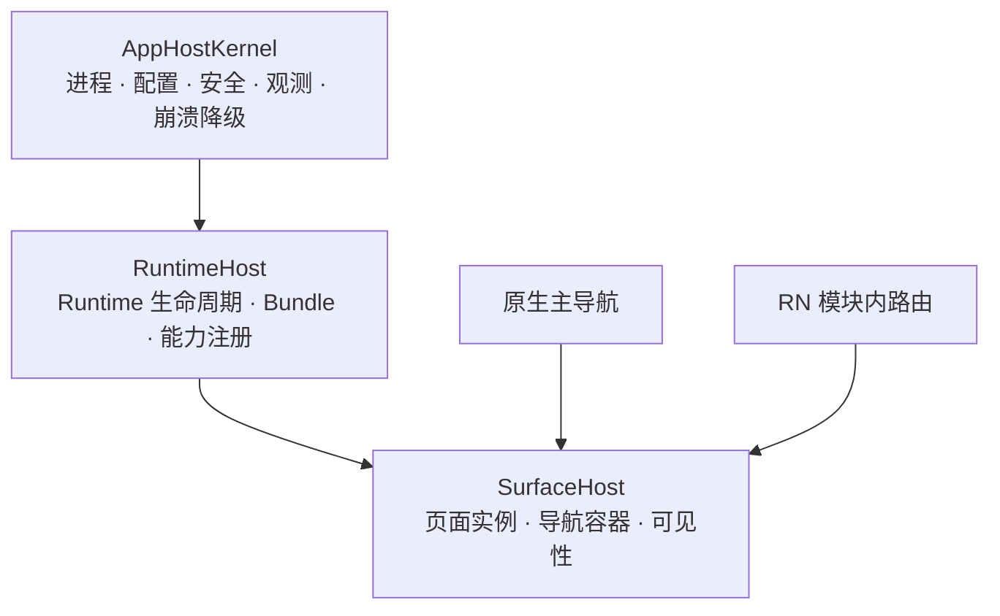
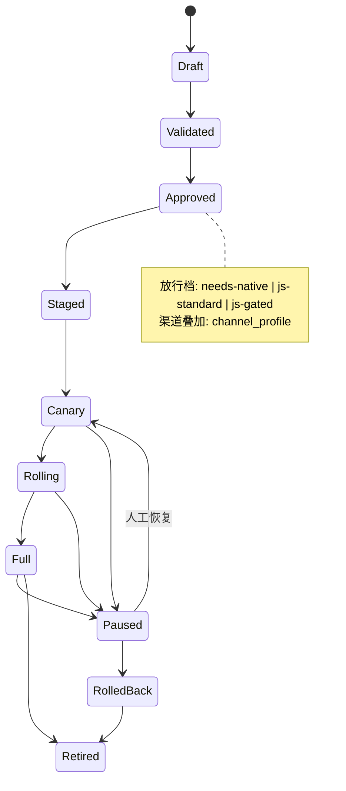
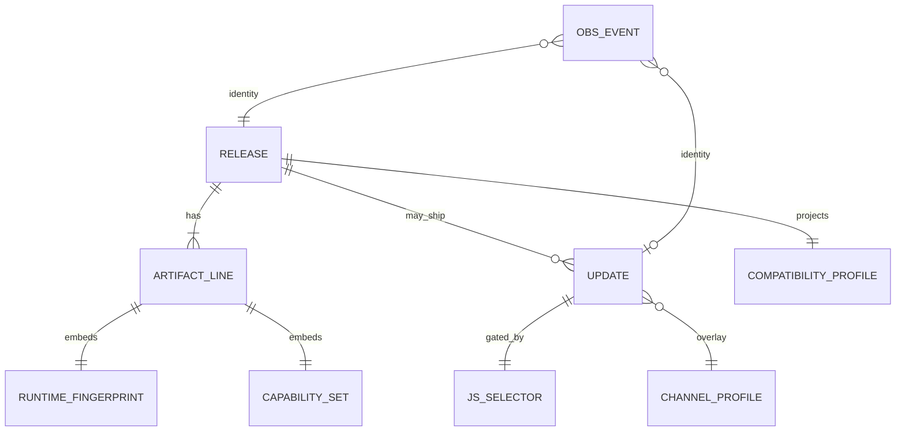

# 企业级 RN 交付平台蓝图 · 入口

## Destination

产出一套可直接进入实施拆期与验收的企业级 React Native 交付平台蓝图：面向中国大陆 `ios` / `android` / `harmonyos`、多业务线、50+ 开发者；纯 RN 与 Brownfield 均为一等场景。平台由 Runtime SDK、Toolchain、Delivery、Control Plane、Governance 五边界组成，工程默认解为**薄核心 + 可版本化插件**与**双宿主 CLI**（本地 `rn` + 交付 CLI）。

本目录是读者向合同组装；北极星仍是可运行的完整平台与 CLI，但**本地图止于蓝图完成**，不宣称平台已实现。

## 读者与用法

| 角色 | 用法 |
|------|------|
| 主读者：平台架构 / 实施负责人 | 从本入口读五卷合同，按 `Decided in` 回票，再拆实施地图 |
| 辅读者：业务接入 TL | 看 Runtime SDK、能力契约、JS 列车与放行档 |
| 辅读者：安全合规 | 看 Governance、渠道 `channel_profile`、合规叠加档 |
| 辅读者：运维发布 | 看 Delivery 阶段合同、Control Plane 状态机与观测身份 |

开发者日用手册与值班 runbook **不在**蓝图内（留给实施地图）。

## 五边界总览

| 边界 | 卷 | 一句话 |
|------|----|--------|
| Runtime SDK | [01-runtime-sdk.md](./01-runtime-sdk.md) | 宿主三层、能力四级、三端实现树 |
| Toolchain | [02-toolchain.md](./02-toolchain.md) | 双宿主薄 CLI、doctor/dev、插件三 ABI |
| Delivery | [03-delivery.md](./03-delivery.md) | 阶段合同、签名根、硬门禁 vs E2E 信号 |
| Control Plane | [04-control-plane.md](./04-control-plane.md) | 宿主/JS 列车、三档放行、渠道叠加 |
| Governance | [05-governance.md](./05-governance.md) | RACI、列车分级、安全基线、例外账本 |

## 身份与发布脊柱

```text
release_id
  └─ artifact_line（每运行时目标独立签名/晋级）
       └─ runtime_fingerprint（RN 元组 · Hermes · HBC Bytecode Version · New Arch · Codegen/TurboModule ABI）
            └─ capability_set（壳内已链接能力 ⊆ 选择器用子集）
                 └─ update_id / channel（JS 列车灰度身份）
                      └─ compatibility_profile_id（对外投影）+ 人类发布列车标签
```

- **宿主列车**（慢）：原生 / RN·Hermes·Codegen / 权限·隐私 / SDK → 商店通道；每端 `ios-host` / `android-host` / `harmony-host`。
- **JS 列车**（快，**生产默认开启**）：匹配指纹的业务 Hermes/JS；机器门禁 = HBC Bytecode Version + `runtime_fingerprint` + 能力子集 + `channel_profile` / 行允许。
- **放行档**：`needs-native` / `js-standard` / `js-gated`（企业策略层，非 ISO 名）。
- **渠道叠加**：一等七渠 + 可审计 `channel_profile`；缺口渠对可执行 JS/自更新默认保守阻断（**非** CLI 安装门槛；企业可选证据覆盖，见票 23）。

字段表与机读样例见 [appendix/](./appendix/)。

## 强制图件索引

下列五图为合同强制件；专题卷可加局部图，不另开平行图体系。

### 1. 五边界上下文图



### 2. 三端制品流



### 3. 宿主三层



### 4. 发布列车 / 放行档状态机

见 [appendix/release-state-machine.md](./appendix/release-state-machine.md)。摘要：



### 5. 控制面对象关系



## 范围与非目标

**范围内（蓝图）**

- 五边界合同、身份脊柱、强制图、附录机读样例、决策追溯、验收清单。
- 已锁定修订：薄核心 + 插件；JS 列车生产默认开启；E2E 永不阻断 `promote`/`submit`；`channel_profile`；`init` 默认 ios+android，Harmony 经 `add-target`；双宿主 CLI。

**非目标（蓝图明确不含）**

- 生产平台代码、真实渠道书面回函、可投产控制面。
- 开发者手册、值班 runbook、公司具体 CI/云账号适配清单。
- 用 OTA 规避审核；默认金融/医疗专项认证（仅 `compliance_profile` 叠加边界）。
- 参考骨架 [`prototype/reference-skeleton/`](../prototype/reference-skeleton/) 属原型票产物，**不并入**「蓝图完成」定义。

## 决策索引

全部已关闭决策/研究票的一句话摘要与 Answer 链接：[appendix/decision-index.md](./appendix/decision-index.md)。

## 蓝图完成 vs 平台已实现

| | 蓝图完成 | 平台已实现 |
|--|----------|------------|
| 含义 | 决策收口 + 本合同文档/图/样例/验收清单齐备 → **可进入实施拆期** | 生产级 Runtime/CLI/控制面/渠道证据与 SLA 可运行 |
| 本目录状态 | 见 [acceptance.md](./acceptance.md) | **未实现**；勿将样例 JSON 或参考骨架当作投产合同 |

开放 fog：见实施地图 [wayfinding-impl/map.md](../wayfinding-impl/map.md)。蓝图地图已收口。
