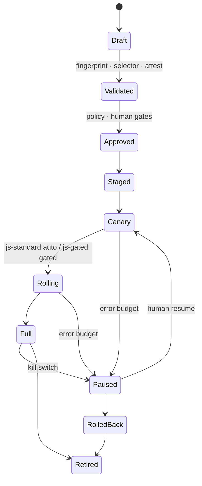

# 发布状态机（样例）

> SAMPLE：合同语义来自票 [13](../../wayfinding/issues/13-ota-gray-release-control-plane.md)。宿主包与 JS 更新**共用**状态机；转移规则按通道与放行档不同。

## 状态

```text
Draft → Validated → Approved → Staged → Canary → Rolling → Full
                                              ↘ Paused ⇄（人工恢复）→ Canary / Rolling
Paused → RolledBack → Retired
Full → Retired
```

| 状态 | 含义（摘要） |
|------|----------------|
| `Draft` | 发布单元已创建，未过验证 |
| `Validated` | 指纹/选择器/供应链/渠道档检查通过 |
| `Approved` | 策略与人工边界已满足（见下） |
| `Staged` | 已暂存，待放量 |
| `Canary` | 小流量 |
| `Rolling` | 扩量中 |
| `Full` | 全量 |
| `Paused` | 错误预算或 Kill Switch；**恢复须人工确认** |
| `RolledBack` | 已回滚（JS update 可；原生默认 `FORWARD_FIX`） |
| `Retired` | 退役 |

另：选择器失败可记为 `BLOCKED_INCOMPATIBLE`（不下发）；渠道证据缺口为 `BLOCKED_PENDING_CHANNEL_RULES`。

## 放行档如何约束转移

| 放行档 | 典型约束 |
|--------|----------|
| `needs-native` | 不得进入 JS 列车 Staged+；改走宿主/商店通道 |
| `js-standard` | 可通过错误预算自动 Canary→Rolling→Full |
| `js-gated` | 可进 Canary；**Full 前**默认需策略/人工 |

## 必须人工审批的边界（票 13）

- `needs-native` / 权限隐私清单变更  
- `js-gated` 全量前  
- 渠道禁热更新行的例外开放  
- 失败预算超限后的恢复  
- 关键实验与合规配置档变更  

## Mermaid


