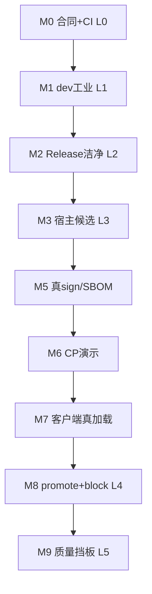
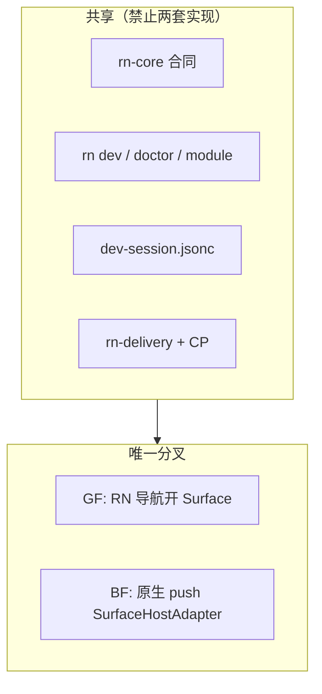

# Architecture roadmap（脉络总图 · Map A）

**Purpose:** One navigable spine for humans and agents — **where we started**, **where we end**, **what we ship**, **how we accept it**, **in what order**. Does **not** replace normative contracts; links to them.

| Layer | Authority |
|-------|-----------|
| **Why / contracts** | [blueprint/00-entry.md](../blueprint/00-entry.md) · P1–P17 [research/01](../wayfinding-impl-2/research/01-multi-plane-industrial-remediation.md) |
| **Map A tickets** | [wayfinding-impl-2/map.md](../wayfinding-impl-2/map.md) · GitHub [#18](https://github.com/client-platform-labs/rn/issues/18) |
| **Map B** | [wayfinding-map-b/map.md](../wayfinding-map-b/map.md) · [#23](https://github.com/client-platform-labs/rn/issues/23) · [map-b-loop.md](./agents/map-b-loop.md) |
| **GF/BF unity** | [agents/gf-bf-unified-model.md](./agents/gf-bf-unified-model.md) |
| **Promotion levels** | [agents/enterprise-promotion-gates.md](./agents/enterprise-promotion-gates.md) |
| **Process** | [agents/architecture-governance.md](./agents/architecture-governance.md) |

**Maintenance:** Update **§9 Current position** and milestone checkboxes when a GitHub issue closes or HITL signs. Do not fork a second issue tracker.

**Quick read (2026-08-26):** Map A **closed** (#18) · GF/BF **L5** · Map B **B1–B5 green** ([#23](https://github.com/client-platform-labs/rn/issues/23) open) · 双 loop：`run-afk-hitl-loop.mjs`（Spine）· `run-map-b-loop.mjs`（Map B）→ 详情 **§9**。

---

## 1. 起点（我们从哪里出发）

```text
2026-08  baseline
├── 已结：wayfinding-impl MVP（薄 CLI 合同、monorepo、rn-delivery stub）
├── 已结：蓝图五卷 + Map A 六切片决策（票 01–03、11）
├── 已结：身份脊柱 rn-core（fingerprint、manifest schema v2）
└── 已结：地图 A 真机 + 企业闭环（#18 · M10）
```

**技术起点：**

- RN **0.87.x** + Hermes V1 + New Arch only（production 列车）
- 双宿主 CLI：`rn`（本地环）+ `rn-delivery`（交付环）
- 拓扑 **B** 为工业默认：壳 workspace + 外置 `modules/<id>`
- GF/BF **一套** DevSession / Runtime 合同，仅 `SurfaceHost` 分叉

**能力起点（2026-08-26 实测位）：**

| 推广等级 | GF | BF |
|----------|----|----|
| L0 合同+CI | ✅ | ✅ |
| L1 开发工业 | ✅ | ✅（debug-host HITL） |
| L2–L3 候选 | ✅ | ✅ |
| L4 可推广 | ✅ | ✅ |
| L5 企业闭环 | ✅ | ✅（共享 M9 · [bf-l5 HITL](./hitl/bf-l5-quality-gate-2026-08-26.md)） |

---

## 2. 终点（我们要达成什么）

### 2.1 跨地图北极星（产品级）

```text
大型 C/B 端 · 多业务线 · 50+ 开发者
├── 纯 RN（GF）与原生嵌 RN（BF）一等
├── 一壳多 Bundle · 多 Metro · 双列车（宿主 vs JS）
├── 本地环 + CI 制品 + 控制面 + 运行时治理（多平面）
└── Harmony 合同一等（真机可挂地图 B）
```

**地图 A Done ≠ 产品完成** — 结 A 后挂地图 B/C/D（Harmony 真机、渠道生产化、全量治理）。

### 2.2 地图 A 终点（本脉络图边界）

六切片 **可企业推广候选**（非全国投产宣称）：

| 切片 | 终点一句话 |
|------|------------|
| **A1** GF | init/doctor/dev + 候选宿主包 + Debug Host SLA |
| **A2** BF | 参考宿主真机 + 同协议多 Metro + `rn-module` 集成路径 |
| **A3** Delivery | 七阶段至候选包、双 SBOM 接口、同物晋级 |
| **A4** CP | Node API + Web 可演示；灰度/回滚/Kill **按 module** |
| **A5** Fallback | 客户端选择器 + baseline/N/N-1 **按 module** |
| **A6** Quality | 质量信号总线；可挡 promote |

对外宣称 **「可企业推广（单 module）」** 需达到推广 **L4**（见 §5.5）。

---

## 5. 交付策略：Spine → Branch → Depth

**原则（Tracer Bullet / Steel Thread）：** 里程碑不是散点清单。先打通 **一条最小可验证的全流程**（细但完整），再在 **同一骨架** 上加深细节、补 BF 分支、叠工业切面。

| 类型 | 含义 | 排期 |
|------|------|------|
| **Spine** | 主链；每一步穿过多平面；后步依赖前步 | **严格按序** |
| **Branch** | 同一合同、换宿主形态（GF→BF） | Spine 过 **M2** 后 |
| **Depth** | 体验/合规/规模化加厚；不挡首条全流程 | 与 Spine **并行** 或接在 **M8** 之后 |

合同（字段名、状态机）可 **先于** Spine 钉死；Spine 实现可 **极薄**（CP 可先 JSON 文件），但管子口径不可改。

### 5.1 最小全流程（Steel Thread · 单 module · GF 优先）

第一条必须跑通的链（实现可 stub，**每一步必须存在且可演示**）：


```bash
# Spine 验收串（GF · 单 business_module · HITL 归档）
rn doctor
rn init --demo                    # 或已有壳仓
rn dev --android
rn-delivery build --platform android --profile release
rn-delivery validate
rn-delivery release --install          # M3: staging + adb install
rn-delivery block --reason 'rollback'  # steel-thread drill
# → CP: .rn/delivery/registry.json (file stub until M6)
# → 客户端: 加载该 update_id（gateBundleLoad + 槽位）— M7
```

**Spine 终点 = M8（推广 L4）**：上述串 **真机 + 机读证据** 各走一遍。M2–M7 是把它 **一节一节做实**，不是六个无关任务。

### 5.2 Spine（主链 · 必须按序）



| 步 | 名 | 推广级 | GitHub | Spine 验收（这一步打通什么） | 状态 |
|----|-----|--------|--------|------------------------------|------|
| **M0** | 合同+CI | L0 | #10 · ADR · #17 | rn-core + governance + doctor L3e API | ✅ |
| **M1** | 本地 dev 环 | L1 | #13 · #17 | dev 真机；多 Metro；dispose HITL | ✅ GF |
| **M2** | Release 洁净 | L2 | [#20](https://github.com/client-platform-labs/rn/issues/20) | release 包无 DevSession；**Spine 进交付前的门** | ✅ |
| **M3** | 宿主候选可装 | L3 | [#21](https://github.com/client-platform-labs/rn/issues/21) | `validate` + `release` + metadata + 安装 | ✅ [HITL](./hitl/m3-gf-2026-08-26.md) |
| **M5** | 交付加深 | L4− | #6 | 真 sign + SBOM **生成**（可仍薄 CP） | ✅ thin [HITL](./hitl/m5-m7-js-update-2026-08-26.md) |
| **M6** | CP 接入 Spine | L4− | #7 | promote 状态机走通 **一条** module | ✅ file CP [HITL](./hitl/m5-m7-js-update-2026-08-26.md) |
| **M7** | 运行时接入 | L4− | #8 | `gateBundleLoad` + sidecar 验证 | ✅ [HITL](./hitl/m5-m7-js-update-2026-08-26.md) |
| **M8** | **全流程签字** | **L4** | #6+#7+#8 | §5.1 整串 HITL + block 各一次 | ✅ [HITL](./hitl/m8-l4-gf-2026-08-26.md) |
| **M9** | 质量挡 promote | L5 | [#9](https://github.com/client-platform-labs/rn/issues/9) | A6 信号 **阻断** promote 一次 | ✅ [HITL](./hitl/m9-quality-gate-2026-08-26.md) |

**当前 Spine 焦点：** M0–M10 **已结** — 回归见 [`afk-hitl-loop.md`](./agents/afk-hitl-loop.md) · 工业加深见 [`map-b-loop.md`](./agents/map-b-loop.md)。

> M4 不在 Spine 上——见 §5.4。M3b 是 Branch，不替代 M3。

### 5.3 Branch（分叉 · 同一协议，第二条宿主）

在 **M2 Release 洁净** 于 GF 上证明后，用 **同一 DevSession / delivery / CP 管子** 换 `SurfaceHost`：

| 步 | 名 | GitHub | Branch 验收 | 状态 |
|----|-----|--------|-------------|------|
| **M3b** | BF 垂直切片 | [#22](https://github.com/client-platform-labs/rn/issues/22) · #5 | BF 同源脚本 + doctor brownfield | ✅ [HITL](./hitl/m3b-bf-2026-08-26.md) |
| **M8b** | BF L4 钢线等价 | [#22](https://github.com/client-platform-labs/rn/issues/22) | 同一 `verify-l4` 管道 + BF host + device | ✅ [HITL](./hitl/bf-l4-bf-2026-08-26.md) |

Branch **不**新造：Metro 编排、dev-session schema、rn-delivery 子命令、CP 状态机。见 [gf-bf-unified-model.md](./agents/gf-bf-unified-model.md)。

Branch 完成后：对 BF 宿主 **重跑 M8 等价 HITL**（同一 L4 标准）。

### 5.4 Depth（加深 · 不挡首条 Spine）

可与 Spine 并行，或在 **M8 之后** 加厚；**开新票前先问：「是否加深已有 Spine？」**

| 步 | 名 | GitHub | 加深什么 | 挡 Spine？ |
|----|-----|--------|----------|------------|
| **M4** | Debug Host SLA | [#14](https://github.com/client-platform-labs/rn/issues/14) | `dev.warm.reinstall`；L1 体验 | 否 | **✅ HITL** [m4](../hitl/m4-debug-host-2026-08-26.md) |
| — | Expo 同机 bench | [#19](https://github.com/client-platform-labs/rn/issues/19) | 对标 SLA 口径 | 否 |
| — | 多 module / L-C 细节 | #17 | 并行 Metro、env ABI（已在 M1 部分交付） | 否 |
| **M10** | 地图 A Spine 结项 | [#18](https://github.com/client-platform-labs/rn/issues/18) | Spine DoD + Map B 挂接 | 否 | ✅ [HITL](./hitl/m10-map-a-spine-closure-2026-08-26.md) |
| 地图 B+ | Harmony 真机、装包台 #15、渠道… | 后续地图 | 工业 **切面** | 否 |

### 5.5 推广等级（对外口径 · L0–L5）

与 [enterprise-promotion-gates.md](./agents/enterprise-promotion-gates.md) 对齐。**Spine 走到 M8 = 可称 L4**；M9 = L5。


| 等级 | 对应 Spine 步 | 可对外说 |
|------|---------------|----------|
| L0 | M0 | 合同已钉 |
| L1 | M1 | 开发环工业可用 |
| L2 | M2 | 可发 release-clean 宿主 |
| L3 | M3（+M3b BF） | 候选可装可验 |
| L4 | **M8** | 单 module 可企业推广 |
| L5 | M9 + M10 | 地图 A 企业闭环 |

### 5.6 排期规则（防散落）

1. **无 Spine 步不得宣称更高 L 级**（例如无 M2 不说 L3）。  
2. **Depth 票不得阻塞 M2–M8**（#14、#19 可并行，不可挡 #21）。  
3. **新功能默认问**：属于 Spine 下一节、Branch、还是 Depth？  
4. **BF 功能** 只允许 M3b / Surface 适配器，禁止 second CLI。  
5. **M8 通过后** 每个 Depth 加深应 **重跑 §5.1 回归**（签名、SBOM、质量挡板接上后各跑一轮）。

---

## 3. 架构脉络图（五平面 + 双宿主）

### 3.1 多平面（运行时治理横切 Governance）

```mermaid
flowchart TB
  subgraph Local["本地内环 · Toolchain"]
    RN[rn CLI]
    DS[.rn/dev-session]
    DOC[doctor / verify scripts]
  end
  subgraph CI["CI / 制品平面 · Delivery"]
    RD[rn-delivery]
    ART[候选包 + metadata + SBOM 槽]
  end
  subgraph CP["控制面 · Control Plane"]
    API[Node API]
    WEB[Web 控制台]
    SM[发布状态机 / 灰度 / Kill]
  end
  subgraph RT["运行时 · Runtime SDK"]
    RH[RuntimeHost]
    SH[SurfaceHost GF|BF]
    MOD[business_module bundles]
  end
  subgraph GV["治理横切 · Governance"]
    FP[runtime_fingerprint]
    P0[ADR-008 P0 gates]
  end

  Dev[开发者] --> RN
  RN --> DS
  RN --> DOC
  RN --> RD
  RD --> ART
  ART --> CP
  CP --> RT
  RT --> MOD
  GV -.-> Local
  GV -.-> CI
  GV -.-> CP
  GV -.-> RT
```

### 3.2 GF/BF 统一分叉（仅 Surface 层）



Detail: [gf-bf-unified-model.md](./agents/gf-bf-unified-model.md)

### 3.3 调试分层（L-N → L-P）

```text
L-N 壳原生重装          → A1 DevTransport / Debug Host (#13/#14)
L-J 多 module JS/Metro  → A1+A2 #17（一等）
L-C 环境 profile        → A1 #17 dev-session ABI
L-O OTA 槽位            → A5 + A4
L-P 发布态复现          → A4 + A5
```

---

## 4. 交付产物清单与验收标准

### 4.1 按平面

| 交付产物 | 包/路径 | 消费者 | 验收标准（摘要） | 地图切片 |
|----------|---------|--------|------------------|----------|
| **合同库** | `rn-core` | 全平台 | 类型+纯函数；无 Metro I/O；CI 单测 | 03/10 |
| **本地 CLI** | `rn` | 壳+module 开发者 | doctor/dev/init/module；CI `rn doctor` | A1 |
| **交付 CLI** | `rn-delivery` | CI/发布 | 七阶段合同；候选 metadata；debug-host≠release promote | A3 |
| **宿主配置** | `.rn/host-profile.jsonc` | 壳团队 | GF/BF 字段；protocol 版本 | A1/A2 |
| **开发会话** | `.rn/dev-session.jsonc` | 全 dev | 多 module 端口；协商版本；demo remove 零残留 | A1/#17 |
| **企业门禁** | doctor L3e + governance script | CI | ADR-008 P0；无假交付命令 | #17/009 |
| **参考 BF 桩** | `examples/brownfield-host` | 壳团队/测试 | doctor brownfield PASS；非生产宿主 | A2 |
| **控制面** | `rn-delivery serve` + thin Web | 发布/on-call | file registry · Bearer · RBAC · SQLite opt-in；rollout/Kill UI 仍 Map C | A4 · Map B |
| **客户端兜底** | 选择器+槽位+Failed UI | App 运行时 | `gateBundleLoad` · A5 verify | A5 |
| **质量总线** | `quality_signal` + M9 gate | CP promote | 信号 **挡 promote**（thin）；E2E 挡晋级 → Map C | A6 |
| **开发者文档** | `docs/guides/*` | 人 | module 无 GF/BF；壳 cheatsheet | — |

### 4.2 按角色（谁拿什么）

| 角色 | 产物 | 验收 |
|------|------|------|
| **Module 开发者** | module 仓 + guides | L1 dev；doctor；multi-Metro HMR 不串 |
| **壳团队** | 宿主仓 + cheatsheet + BF 参考 | L2–L3；同协议 BF/GF |
| **平台/CI** | rn-delivery + CP + governance | L4 promote/block 演练 |
| **On-call** | CP + 双列车语义 | L5 灰度+质量挡板 |

---

## 6. 实现路径脉络（Spine 穿过的切片）

票 [#2 切片序](wayfinding-impl-2/issues/02-map-a-slice-order.md) 仍成立，但 **执行以 §5.1 Steel Thread 为主轴**：切片是 **切面**，不是 six 条平行坑。

```text
Spine 穿过的平面（由细到实）
────────────────────────────
Toolchain (A1) → Delivery (A3) → Control Plane (A4) → Runtime (A5)
         ↑ 同一 business_module · 同一指纹窗 ↑

Branch: A2 仅替换 SurfaceHost（M3b）
Depth:  A6 质量、#14 Debug Host、地图 B…
```

```text
进度（相对 Spine · 2026-08-26）
────────────────────────────────
M0–M10 + M3b/M8b/M4   [done]     Map A closed (#18)
Map B B1–B5           [done]     CP/BF industrial thin slices
Map B B6–B8           [backlog]  Xcode CI · Harmony · Postgres CP
Map C/D               [未开]     控制面服务化 · 渠道 · 全量治理
```

### 6.1 Spine 上的 A1 段（Toolchain → 候选包）

```text
rn init (topology B)
  → rn module init|link
  → .rn/dev-session.jsonc
  → rn dev [--modules] [--android]     # M1
  → rn doctor (L3e)                    # M0–M1
  → rn-delivery build --profile release # M2–M3
```

### 6.2 Branch：A2 段（仅换 Surface）

```text
host-profile brownfield + SurfaceHostAdapter
  → 同一 dev-session / rn dev / doctor --profile brownfield
  → 重跑 §5.1 验收串（M3b → M8 等价）
```

### 6.3 Spine 上的 A3→A6 段（Delivery → 运行时）

```text
validate → compile → sign → … → promote     # M5–M6（可先 stub 后实）
promote ──→ 客户端 gateJsCandidate + 槽位    # M7
quality_signal ──→ 挡 promote（Depth M9）   # L5
```

---

## 7. 关键节点（决策门 · 不可跳过）

| 节点 | 门控 | 未过后果 |
|------|------|----------|
| **G-ADR** | 新 public CLI/合同字段需 ADR + compliance | 治理 CI fail |
| **G-P0** | ADR-008 六条 + Release 洁净 | 不得宣称企业推广 |
| **G-PROTO** | GF/BF `devSessionProtocolVersion` 一致 | BF 不得另开 8081 |
| **G-DEV≠REL** | dev Metro 不进 delivery | 撤 seal 类命令 |
| **G-HITL** | 真机证据归档 | 不得关闭 map-a 票 |
| **G-L4** | 单 module promote+block 演练 | 不得对外 L4 口径 |

---

## 8. 本脉络图与现有文档分工

| 问 | 读哪里 |
|----|--------|
| 字段/状态机长什么样？ | `blueprint/` |
| 这张地图有哪些票？ | `wayfinding-impl-2/map.md` |
| 今天该做哪一步？ | **§9 Current position** · Spine [`afk-hitl-loop.md`](./agents/afk-hitl-loop.md) · Map B [`map-b-loop.md`](./agents/map-b-loop.md) · [spine-inventory.md](./spine-inventory.md) |
| 壳团队命令？ | [guides/shell-team-cheatsheet.md](./guides/shell-team-cheatsheet.md) |
| Module 同学命令？ | [guides/module-developer.md](./guides/module-developer.md) |
| 能不能对外说「可推广」？ | [enterprise-promotion-gates.md](./agents/enterprise-promotion-gates.md) |

**不必**再写第三套 ADR 或第七切片图 — 新细节进 ADR-010+ 或更新本表「当前位置」一行。

---

## 9. 当前位置（滚动更新）

**As of 2026-08-26**

### 9.1 三层目的地

| 层级 | 状态 | 说明 |
|------|------|------|
| **Map A** | ✅ **Closed** [#18](https://github.com/client-platform-labs/rn/issues/18) | 六切片 + Spine M0–M10；GF/BF **L5** |
| **Map B** | 🔄 **In progress** [#23](https://github.com/client-platform-labs/rn/issues/23) | B1–B5+B9–B11 ✅ · B6 SKIP · B7/B8 BLOCKED |
| **Map C** | 🔄 **In progress** [#73](https://github.com/client-platform-labs/rn/issues/73) | C1+C2 ✅ · C3 BLOCKED |
| **Map D** | ⬜ 未开 | 合规 · 迁移 · 运维手册 |
| **产品北极星** | ⬜ 远未达 | 50+ 开发者 · 全渠道投产 · Harmony 主路径 |

**对外口径：** 可称「单 module **可企业推广候选**（L4–L5 thin）」；**不可**称全国投产 / 全渠道 / Map C 能力已就绪。

### 9.2 五平面 · 点亮情况

```mermaid
flowchart TB
  subgraph Local["本地环 ✅"]
    L1[rn · dev-session · doctor L3e/L3b/P4 thin]
  end
  subgraph CI["Delivery ✅ thin"]
    D1[rn-delivery · metadata · HMAC sign · SBOM 槽]
  end
  subgraph CP["Control Plane ⚠️ thin"]
    C1[cp-serve · Bearer · RBAC · SQLite|file · Kill · rollout · slo-breach]
    C2[七渠 channel_profile 执行 ❌ C3]
  end
  subgraph RT["Runtime ✅ thin"]
    R1[RuntimeHost · gateBundleLoad · A5 槽位]
  end
  subgraph GV["Governance ✅"]
    G1[fingerprint · ADR-008 P0 · governance CI]
  end
  Local --> CI --> CP --> RT
  GV -.-> Local & CI & CP & RT
```

✅ = HITL/verify 绿 · ⚠️ = 薄 demo · ❌ = 未做或仅合同

### 9.3 六切片完成度（Spine bar）

| 切片 | 合同 | Spine HITL | 推广级 | 主要余量 |
|------|------|------------|--------|----------|
| **A1** GF | ~95% | ✅ | **L5** | 规模化运维 |
| **A2** BF | ~95% | ✅ | **L5** | XCFramework 二进制 CI（B6） |
| **A3** Delivery | ~85% | ✅ thin | **L4 thin** | 企业 attestation |
| **A4** CP | ~75% | ✅ thin | demo | 全状态机 · 真服务（Map C） |
| **A5** Fallback | ~90% | ✅ | **L5 thin** | 多 module 生产负载 |
| **A6** Quality | ~60% | ✅ M9 | **L5 gate** | E2E 挡 promote（P7 · Map C） |

票级进度：[wayfinding-impl-2/map.md](../wayfinding-impl-2/map.md)（Map A 全票 closed）。

### 9.4 Spine + Branch（全绿）

| 步 | 状态 | 证据 |
|----|------|------|
| M0–M2 | ✅ | governance · dev · release hygiene |
| M3 · M8 · M9 · M10 | ✅ | [m3-gf](./hitl/m3-gf-2026-08-26.md) · [m8-l4-gf](./hitl/m8-l4-gf-2026-08-26.md) · [m9](./hitl/m9-quality-gate-2026-08-26.md) · [m10](./hitl/m10-map-a-spine-closure-2026-08-26.md) |
| M3b · M8b · M4 | ✅ | [m3b-bf](./hitl/m3b-bf-2026-08-26.md) · [bf-l4](./hitl/bf-l4-bf-2026-08-26.md) · [m4](./hitl/m4-debug-host-2026-08-26.md) |
| BF L5 | ✅ | [bf-l5](./hitl/bf-l5-quality-gate-2026-08-26.md) · loop `H-bf-l5` |

**回归入口：** `node scripts/run-afk-hitl-loop.mjs ~/Work/my-rn-app` → [`afk-hitl-loop-latest.md`](./hitl/afk-hitl-loop-latest.md)

### 9.5 Map B 工业切面

索引：[wayfinding-map-b/map.md](../wayfinding-map-b/map.md) · loop：[`map-b-loop.md`](./agents/map-b-loop.md)

| ID | 内容 | 状态 |
|----|------|------|
| B1–B3 | CP Bearer · XCF build path · SQLite | ✅ #24–#26 |
| B4–B5 | P4/P6 native doctor · CP viewer/admin | ✅ #27–#28 |
| B9 | CP Kill/Pause by `business_module` + A5 wire | ✅ #70 |
| B10 | P4 Hermes/NewArch/tuple drift + P6 codegen surface | ✅ #71 |
| B11 | CP thin rollout_steps (P10 soak ladder) | ✅ #72 |
| B6 | XCFramework **binary** CI | SKIP（需 full Xcode） |
| B7 | Harmony 真机 | BLOCKED（DevEco） |
| B8 | CP Postgres 多租户 | BLOCKED（产品） |

**回归入口：** `node scripts/run-map-b-loop.mjs` → [`map-b-loop-latest.md`](./hitl/map-b-loop-latest.md)

### 9.5b Map C

索引：[wayfinding-map-c/map.md](../wayfinding-map-c/map.md) · loop：`node scripts/run-map-c-loop.mjs`

| ID | 内容 | 状态 |
|----|------|------|
| C1 | P7 `e2e_fail` fail-closed promote | ✅ #74 |
| C2 | `cp-serve` service face + slo-breach→pause | ✅ #75 |
| C3 | channel_profile 七渠 | BLOCKED |

### 9.6 P1–P17 · 合同 vs 落地（摘要）

| 态 | 补丁 |
|----|------|
| **✅ 代码+验证** | P3 · P4 thin+depth（B4/B10）· P5 · P6 thin+codegen（B4/B10）· P2 部分 · P7 e2e_fail（C1）· P10 thin rollout（B11） |
| **⚠️ 接口/薄** | P1 · P2 文案 · P9（SBOM stub） |
| **❌ Map C/D 余量** | P8 · P10 SLO 自动 · P11–P17 生产联动 |

合同权威：[research/01](../wayfinding-impl-2/research/01-multi-plane-industrial-remediation.md) — **实现可分期，合同不砍**。

### 9.7 距目标地 · 优先 backlog

1. **实验台：** Xcode CI（B6）· Harmony（B7）· Postgres 多租户（B8）
2. **Map C：** C3 七渠执行适配 · SLO 真观测后端
3. **Map D：** 迁移工具链 · 合规叠加档 · 运维手册

*上一结项：C2 [#75](https://github.com/client-platform-labs/rn/issues/75) · C1 [#74](https://github.com/client-platform-labs/rn/issues/74) · B11 [#72](https://github.com/client-platform-labs/rn/issues/72) · Map C [#73](https://github.com/client-platform-labs/rn/issues/73) · Map B [#23](https://github.com/client-platform-labs/rn/issues/23) 仍 open（B6–B8）。*
