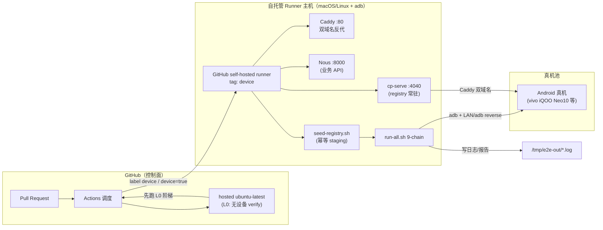

# 全量真机门禁（Pre-merge Device Gate）方案

> 状态：方案（仅设计，不含实现）
> 定位：把现有 9-chain 真机 E2E 从「本地手动跑」升级为「PR 合并前的硬门禁」
> 约束：遵循「如无必要，勿增实体」——复用 `scripts/e2e/*` 现有基础设施，不新造工具

---

## 1. 目标与边界

### 1.1 目标

把 `scripts/e2e/run-all.sh` 的 9 条链路从「架构师本机手跑」变成 **PR 合并前的一道硬门禁**：

| # | Chain | 覆盖 | 门禁后收益 |
|---|-------|------|-----------|
| 01 | CLI 工具链 | `rn` / `rn-delivery` 公开面 · POLA · help 完整性 | 公共 CLI 每次改动有机器兜底 |
| 02 | Debug 包多离线包 | adb reverse 6 端口 · 多 Metro · 多 bundle | Metro/调试链路回归检测 |
| 03 | Release 壳加载 | registry · APK/JS 拉取 · 装包启动 · 无 FATAL | release 壳装上真机即最高信噪 |
| 04 | 壳全生命周期 | 新建/调试/部署/运维 | 七阶段合同真实闭环 |
| 05 | 业务包全生命周期 ★ | 新建/调试/OTA/灰度/AB/维护/卸载 | 核心业务链路最值钱的一条 |
| 06 | 壳发布平台 | CP portal · 鉴权 · 七阶段 | 控制台面回归 |
| 07 | 离线包管理平台 | /portal/js · 注册/检索/catalog | 平台目录面回归 |
| 08 | 离线包更新策略 | staging/production lane · Kill Switch · digest | 灰度/回滚策略回归 |
| 09 | 后台服务 | CP/Distribution/Nous · 跨服务 | 后台联通回归 |

### 1.2 边界（本门禁管什么 / 不管什么）

**管**：9 chain 在真机 + 真实后台上的「过 / 红」。

**不管**（明确排除在本次方案外）：
- 灰度运维引擎（rollout/tick 404、device-manifest）、日志门禁——这些是平台本身待修的 gap（`arch-onboarding.md §6`），门禁只负责「跑」，不负责「修平台」。
- 真 CA/SBOM、per-tenant 隔离——企业级深化 backlog（#89/#90/多租户），不在本门禁 SKIP 清单内。
- iOS / Harmony / 7 渠道厂商矩阵——见 §12，本期不做。

### 1.3 「过」的定义

一条 PR 被本门禁判定为「过」，需**同时**满足：

1. **无设备链路（L0/L1）**：退出码 0，无 FAIL。
2. **真机链路（L2）**：`run-all.sh` 最终 `FAILED == 0`，且单 chain 无 `FAIL`（`SKIP` 需人工审阅是否可接受，见 §11）。
3. **前置就绪**：`run-all.sh` 的 Pre-flight 三关全绿——
   - `adb -s <serial> get-state == device`
   - `curl -sf <CP>/health`
   - `curl -sf <Nous>/v1/health`（Nous 不通时 chain-05 会 SKIP，允许但需标注）
4. **无污染**：seed / promote 只作用在 staging lane，跑完清理后 production lane 与跑前一致（§7）。

> 关键立场：「过」= **全 9 chain 0 FAIL**，而不是「跑完了」。当前链内已有的 SKIP/WARN（灰度运维端点、日志门禁、业务数据未初始化等）**不作为门禁红灯**，但会被追查清单持续跟踪，平台修复后这些 SKIP 应自然收敛为 PASS 或提升为红灯。
>
> 注：签名/SBOM 与 CP-Auth 此前被误报为平台 gap，已核实为测试脚本 bug 并修复（见 `arch-onboarding.md §6.1/6.2`）；其**企业级深化**（真 CA、per-tenant 隔离）仍是独立 backlog，但不在本门禁 SKIP 清单内。

---

## 2. 现状与缺口

### 2.1 现状：hosted CI 跑不了全量

当前 CI 是 `.github/workflows/ci.yml` 里的一组 `ubuntu-latest` job：typecheck、单测、governance、几个 `verify-*.mjs`、afk-hitl plan/run、`rn doctor` 等。它是**纯静态 / 无设备 / 无常驻后台**的验证阶梯。

### 2.2 为什么真机 E2E 进不了 hosted CI（三个硬缺口）

| 缺口 | 详情 | 后果 |
|------|------|------|
| **无 adb / 无真机** | `ubuntu-latest` 是 GitHub 托管的容器，无 Android 设备、无 USB、无 adb server | `run-all.sh` 的 Pre-flight 第一关就 `exit 2` |
| **无常驻后台** | `run-all.sh` 依赖本机 `127.0.0.1:4040`（cp-serve）+ `:80`（Caddy）+ `:8000`（Nous），还依赖 `~/code/tiangong-host` / `~/code/desk` / `~/code/fixture_second` 三个业务仓就位 | hosted job 里既没有这些进程、也没有这些路径 |
| **网络模型不同** | 脚本用 `ipconfig getifaddr`（macOS 专有）拿 LAN IP 做 `adb reverse`，hosted Linux 拿不到，真机也连不上 Job 内网 | 设备 ↔ job 无法打通 |

**结论**：hosted runner 只能承担「不需要真机、不需要后台」的部分（无设备 verify 阶梯），真机验证必然要落到**自托管 runner + 物理设备**上。

---

## 3. 总体拓扑



关系说明：

- **GitHub Actions**（控制面）负责触发、调度、红灯/绿灯合并判定。
- **自托管 runner**（执行面）持有 adb、业务仓、后台服务，是唯一能跑真机 E2E 的环境。
- **真机池**通过 USB/WiFi adb 挂在 runner 主机上，由 runner 独占租用（§10）。
- **后台（CP + Caddy + Nous）**作为 runner 侧常驻服务，与 GitHub 无直接关系，只为 job 提供运行时依赖（§6）。

---

## 4. 自托管 runner 注册

### 4.1 注册方式

在 GitHub 仓库 **Settings → Actions → Runners → New self-hosted runner** 生成一条 token + config 命令，在设备主机上执行 `config.sh` 完成注册。主机需满足：

- 具备 `adb`、Android SDK（`ANDROID_HOME`）
- 具备三个业务仓（`tiangong-host` / `desk` / `fixture_second`），路径与 `run-all.sh` 的环境变量约定一致
- macOS 优先（`ipconfig getifaddr`、`nohup` 现脚本按 macOS 适配；Linux 亦可，需补 LAN IP 探测）

### 4.2 常驻 vs 按需（ephemeral）

| 模式 | 行为 | 适用 |
|------|------|------|
| **常驻（persistent）** | runner 进程常驻，随到随跑，设备/后台一直热 | 首选。真机拔插 + 后台预热有成本，常驻最省 |
| **按需（ephemeral）** | `config.sh --ephemeral`，跑完一个 job 后离线注册自毁 | 设备农场动态扩容时用；单台真机不建议 |

**本方案建议**：设备主机用**常驻 runner**，因为 CP/Caddy/Nous 常驻 + 真机待命是热链路；ephemeral 只留给将来云真机/临时扩容（§5/§12）。

### 4.3 标签（labels）用法

注册时给 runner 打上可识别标签，workflow 用 `runs-on` 精确路由：

```
device           # 通用真机门禁
device-vivo      # vivo 机型（弹窗处理链路）
device-idle      # 可抢占的空闲设备（租约队列用，见 §10）
```

- 主机（后台服务所在）与「有真机」的 runner 通过标签区分，避免把纯 registry job 派到设备机上占坑。
- 标签由运维维护，任何「识别为设备」的 runner 都加 `device` 以命中门禁。

---

## 5. 设备农场选型

### 5.1 三种形态

| 方案 | 保真度 | 成本 | 维护 | vivo 弹窗等机型差异 |
|------|--------|------|------|---------------------|
| **物理真机池（自托管 rack）** | ★★★ 最高，真实 OEM + 真实弹窗 | 设备采购 + 一块场地/电源 | 高（刷机、保修、掉线） | ★★★ 能真实触发并复现 vivo 勾选 checkbox |
| **云真机（Firebase Test Lab / Genymotion Cloud 等）** | ★★ 真设备但受控，弹窗/权限行为可能被压制 | 按次计费，门槛低 | 低（厂商托管） | ★ 弹窗时序可能不可控，且 adb 权限受限，`lib-dismiss.mjs` 不一定能用 |
| **自建 rack（USB hub + 多机）** | ★★★ | 一次性硬件投入 | 中 | ★★★ |
| **本地单机（现状）** | ★★★ | 0（已有） | 低 | ★★★ |

### 5.2 关键 trade-off

- **保真度 vs 弹窗链路**：门禁的价值高度依赖「能真实复现 vivo iQOO Neo10 Android 16 的『勾选 checkbox → 继续安装』时序」。这是 `lib-dismiss.mjs` 存在的原因，云真机若压制系统弹窗或限制 `uiautomator dump`，整条链路退化为假绿。**物理真机是保真的唯一选择**。
- **成本 vs 覆盖**：一张真机≈一条并行 lane。起步 1 台即可（与现状一致），矩阵化后按机型扩。
- **结论**：**L2 起步用物理真机池（1 台先跑通，逐步扩）**；云真机作为「非弹窗敏感 chain」的辅助或容量溢出方案，本期只有选型结论、不接入（§12）。

### 5.3 决策记录

本期（方案）**不落地任何农场**，仅给出结论：物理真机池是唯一满足「机型弹窗保真」的形态；云真机列入观察项，待验证 `lib-dismiss.mjs` 在受限 adb 环境的表现后再定。

---

## 6. 后台前置

### 6.1 CP + Caddy + Nous 放哪

| 组件 | 建议位置 | 理由 |
|------|---------|------|
| **cp-serve (:4040)** | runner 侧**常驻**服务 | `run-all.sh` Pre-flight 要求 `curl -sf <CP>/health` 立即可用 |
| **Caddy (:80)** | runner 侧**常驻**（可选，无 Caddy 时走 `:4040` 直连） | `setup-local-distribution-server.sh` 已有「无 Caddy 跳过」分支 |
| **Nous (:8000)** | runner 侧**常驻** | 独立 Python 项目 `~/code/nous`，不进 GitHub job |

**否决 job-level service container**：GitHub 的 `services:` 容器跑在 job 内，job 结束即回收；而真机 E2E 的完整 setup（cp-serve 常驻 + Caddy 双域名 + 真机 `adb reverse`）在 job 边界内外均需要服务存活，且 `setup-local-distribution-server.sh` 是「一次性起服务 + 写 PID」的编排，不适合塞进容器。**常驻 + PID 管理**才是复用的最小改动。

### 6.2 隔离（避免污染生产 lane）

- 后台常驻在某台主机，但**registry 数据作用域由 lane 决定**，不由进程决定：seed 只写 `staging`（§7），promote 的终点是「测试期 production」，与本方案复用下一条。
- 关键隔离动作：**给门禁配独立 registry 根目录**（`TIANGONG_HOST` 指向一个专用 clone，或 registry 路径重定向），使门禁的 staging/production 与真实生产 lane 物理隔离。
- 双域名（`dist.tiangong.local` / `dist-staging.tiangong.local`）天然切分生产/预发面，门禁只在 staging 面喂数据（§7）。

---

## 7. Seed 与清理

### 7.1 幂等 seed（复用，不新造）

`run-all.sh` 已在链序前自动调用 `scripts/e2e/seed-registry.sh`：

- **幂等性由 ingest-* 的 digest 去重保证**：相同产物返回相同 digest，`release` 到已存在 lane 是 no-op。
- **只写 staging lane**：seed 灌 `app-release.apk`（host）+ `desk`/`fixture_second` 的 `index.bundle` 到 **staging**，不碰 production。

门禁直接沿用即可，唯一要求：**seed 前业务仓 build 产物就位**（`ingest-host` 需要 `app-release.apk`，`ingest-pack` 需要 `.rn/ota-build/<mod>/index.bundle`），因此 job 里要先跑 `build`，再 `run-all.sh`。

### 7.2 跑完清理、不污染生产

- chain-05 内部会 `promote`，把 staging 清空移到 production——**这是「测试期 production」**，必须落到独立 registry（§6.2），而非真实生产 registry。
- 跑完清理策略：
  - 后台常驻，不清进程（下次 job 复用，省预热）。
  - 每个 job 开始时 `seed-registry.sh` 会把 staging 灌回正确初始态（幂等），等价于「软重置」。
  - 可选加一个 `--cleanup` 尾部动作清 `/data/local/tmp/e2e-install.apk`、卸载 `com.hermesgfapp`，由 `run-all.sh --keep` 语义约定是否保留残留（现状默认清残留，`--keep` 不清）。

---

## 8. 弹窗处理复用

### 8.1 现状：已是基础设施

`scripts/e2e/lib-dismiss.mjs` 已把「机型弹窗」抽成可复用库：

- 导出 `ensureInstallPageDismissed({ timeoutMs })` / `dumpUi()` / `isInstallPage()` 等。
- 单次 lifecycle，完成后立即退出，不残留后台进程。
- 命令行入口：`node lib-dismiss.mjs --ms=90000`。
- 调用方：`lib.sh` 的 `safe_install()` 在每次 `pm install` 前起一个单次 watcher（`auto-dismiss-package-intercept.mjs` 包装 `lib-dismiss.mjs`），勾选 checkbox + 点「继续安装」，完成后退出。

### 8.2 跨机型号复用方式

- 弹窗处理**与机型解耦**：`isInstallPage()` 用文本特征（`继续安装`/`仍要安装`/`已了解`/`安全守护`）判页，`findCheckbox()` 找「已了解 + clickable」节点——这些特征跨 vivo 系通用。
- 新增机型的接入成本 = 在该机型上跑一次、把「新增弹窗文本特征」补进 `isInstallPage`/`findCheckbox`，不写机型专属分支。
- 门禁把 `lib-dismiss.mjs` + `with-timeout.mjs` + `safe_install` 整套视为**唯一合法安装路径**：任何 chain 里的安装都必须走 `safe_install`（push + pm install + watcher），禁止裸 `adb install`（vivo streamed install 会 hang）。

---

## 9. 分层接入（渐进式）

> 核心：不一步到位。按「设备依赖度」从低到高分三层落地，每层独立可跑、独立可门禁。

### L0 — 无设备 verify 阶梯（hosted CI，今天就该有量）

- 内容：`scripts/release-readiness/run-all.sh --stop-on-fail --max 05`，即 release-readiness 01-05（平台合同 / 运行时主机 / 交付七阶段 / CP / governance）。
- 归属：**别人的活（release-readiness 套件）**，本方案只提一句：它应由 `ci.yml` 直接纳入，作为"无设备第一道门"。
- 特点：静态、无 adb、无后台，hosted `ubuntu-latest` 即可。

### L1 — 自托管 runner 跑 chain 01/03（有后台、无装包）

- 内容：chain-01（CLI）+ chain-03（release-load 的 registry/APK/JS 拉取部分，不含真机装包启动）。
- 依赖：只要 CP + Caddy + Nous 常驻 + seed 就位，**不装真机**。
- 特点：验证「后台 + 平台面」是否回归，是接入真机前的低成本探针。
- 判定：CP `/health`、`/v1/service`、`/v1/candidates`、`/v1/js-updates` 状态正确即过。

### L2 — 真机跑全 9 chain（含装包/启动/OTA）

- 内容：`bash scripts/e2e/run-all.sh`（全 9 chain），在真机 + 常驻后台 + seed 下连跑。
- 依赖：§4 自托管 runner + §6 后台 + 真机（§5）+ `safe_install`/`lib-dismiss` 弹窗处理。
- 判定：`FAILED == 0` 且单 chain 无 `FAIL`（§1.3）。

**落地顺序**：L0 → L1 → L2，每层先「可手动触发」再「接 PR 门禁」。L2 是最终形态，L0/L1 作为其快速失败短路。

---

## 10. 触发策略与成本

### 10.1 触发矩阵

| 触发 | L0 | L1 | L2（全真机） |
|------|----|----|--------------|
| **每 PR** | ✅ 必跑 | ✅ 必跑 | ⚠️ 可选（见下） |
| **nightly** | ✅ | ✅ | ✅ 每天兜底 |
| **release 分支** | ✅ | ✅ | ✅ 强制 |

- 真机资源有限，**每 PR 全量 L2 会排队**。方案：L2 在每 PR 用「快速卡」只跑高性价比 chain（05 业务生命周期 + 03 壳加载），全 9 chain 放 nightly + release 分支。
- 无真机可用时，L2 job 进入**等待租约**（`device-idle` 租约，见下），不直接 fail。

### 10.2 资源 / 超时预算

- 后台 + seed + build 预热：约 3-5 min（`arch-onboarding §9`）。
- 全 9 chain E2E 实测约 48s-数分钟（不含 build），加设备安装/OTA 节奏，给整套 **30 min 超时**上限。
- runner 主机至少 1 台 + 1 台真机；目标矩阵化后按机型加法扩展（每台独立 lane）。

### 10.3 真机并发冲突（排队 / 租约）

- **单机串行**：一台真机同一时刻只跑一个 job。用 runner + `device-idle` 标签做**软租约**——job 起时抢占空闲设备，起跑时把设备标记 `busy`，跑完释放。
- 多 job 并发时：后到者进入队列（依赖 job index / FIFO），或直接 `concurrency: device-pool` 让 GitHub 串行化。
- 设备离线/掉线（USB 拔插）在租约层视为「不可租」，job 直接报告「设备不可用」而非平台 bug（§11 区分）。

---

## 11. 可观测与回滚

### 11.1 门禁红了怎么定位

- 红灯第一眼：`run-all.sh` 输出的 `report-*.md`（PASS/FAIL/SKIP 表）+ 每 chain 的 `/tmp/e2e-out/chain-NN-name.log`。
- 定位顺序：报告 summary → FAIL chain 的 `.log` 末尾 ✗ 行 → 用 `sed 's/\x1b\[[0-9;]*m//g' log | grep -E "✗|✓|!"` 去 ANSI 找断言点（`arch-onboarding §8.5`）。
- 关联诊断：CP/Caddy/Nous 日志（`~/.rn/distribution-lab/logs/`、`/tmp/nous.log`），与 chain 日志交叉比对时间戳。

### 11.2 区分「平台 bug」vs「设备环境抖动」

| 信号 | 判定 | 动作 |
|------|------|------|
| 同 PR 重跑仍红、断言点稳定、日志指向业务逻辑 | **平台 bug** | 作为正常红灯挡合并 |
| 重跑后变绿、或设备离线/弹窗超时/关键字类 SKIP | **环境抖动** | 自动重跑（见下），并标记「非平台信号」 |
| chain exit 2（前置缺失，如 Nous 不通） | **前置问题** | 非平台回归，记录 SKIP，人工确认后放行或修后台 |

### 11.3 重跑策略

- **自动重跑**：对「判定为环境抖动」的红灯（设备掉线、弹窗超时、`adb get-state` 抖动）做 1 次自动重试；仍红则转人工。
- **不把 SKIP 当 FAIL**：`arch-onboarding §6` 已知的灰度运维引擎、日志门禁、业务数据未初始化等 SKIP 不算红灯，只进「平台待修清单」跟踪，平台修复后再提升为硬断言。
- **人工豁免**：单 chain SKIP、设备不可用等，提供明确的「跳过/豁免」审批路径，避免门禁被假红卡死。

### 11.4 回滚

- 门禁本身落后/误报时，可临时降级：把 L2 job 从 `required` 检查移除或改为 `run-on: [nightly]`，不删代码。
- 平台代码回滚不受门禁影响（门禁只读地跑，不写平台代码）；门禁配置回滚走 workflow 文件 revert。

---

## 12. 先不实现清单（本期明确不做）

| 项 | 不做的理由 |
|----|-----------|
| **设备农场选型落地**（真机 rack 采购 / 云真机接入） | 先单台真机跑通 L2，选型仅记为结论（§5），不进货、不接 SDK |
| **云真机接入**（Firebase Test Lab / Genymotion Cloud） | `lib-dismiss.mjs` 在受限 adb 下的表现未验证；保真度不满足弹窗链路 |
| **真机矩阵化 / 多机型并行** | 起步 1 台即可，矩阵化属 Map B P1 范畴，另立 issue |
| **iOS / Harmony / 7 渠道厂商矩阵** | 见 `arch-onboarding §7`，不在 Android 真机门禁范围 |
| **平台 gap 修复**（真 CA/SBOM 企业化、per-tenant 隔离、灰度引擎、日志门禁） | 门禁只跑不改平台；这些进「平台待修清单」，由平台侧推进 |
| **LA1 每 PR 全 9 chain 强制** | 真机资源有限，先 L0/L1 + L2 快速卡，全量放 nightly/release |

---

## 附：与现有资产的对应关系

| 方案环节 | 复用现有物 | 说明 |
|---------|-----------|------|
| 全量跑测 | `scripts/e2e/run-all.sh` | 不新造，直接封装 |
| 幂等 seed | `scripts/e2e/seed-registry.sh` | staging 幂等灌数据 |
| 断言/工具 | `scripts/e2e/lib.sh` | assertion + `adb_reverse_set` + `cp_get` |
| 后台三件套 | `scripts/setup-local-distribution-server.sh` + Nous | CP + Caddy 双域名 + 业务 API |
| 弹窗处理 | `scripts/e2e/lib-dismiss.mjs` + `auto-dismiss-package-intercept.mjs` + `safe_install` | vivo 勾选 checkbox 链路 |
| 超时/解析 | `scripts/e2e/with-timeout.mjs` / `jget.mjs` / `read-jsonc.mjs` | adb hang / jsonc / BOM 兜底 |
| 无设备阶梯 | `scripts/release-readiness/run-all.sh --max 05` | L0（别人的活，接线即可） |