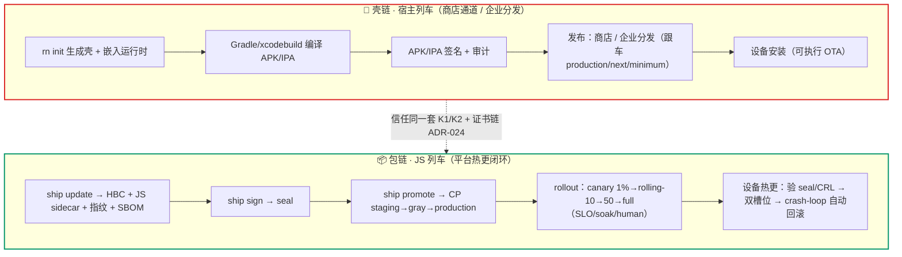

# 企业接入手册（双列车模型 · enterprise integration surface）

**Status:** draft → v2（双列车重写）· **Opened:** 2026-09-14 · 输入到「可企业推广」验收（见 [enterprise-promotion-gates.md](../agents/enterprise-promotion-gates.md)）
**Tracker:** 按 AGENTS.md，状态/认领走 GitHub Issues（本文档不承担 tracker 职责）

---

## 0. 对接模型（一句话）

> 企业**自建服务器**，**实现我们的服务契约**；平台交付「**契约 + 平台本地参考实现 + 验证探针**」。
> 企业**默认跑我们的实现**（🟢 跑 / 🟡 配 / 🔵 嵌），**偏离默认才实现契约**（🟠）。
> 不是「企业使用我们的数据库」，而是「企业按我们的服务要求自建服务器」。

**三元组（每个企业对接点都长这样）：**

| 成分 | 内容 |
| ------ | ------ |
| **契约（contract）** | 企业必须对齐的稳定接口 / 协议 / schema / 命令契约 |
| **平台本地实现（reference impl）** | 平台自带的一份实现，用于生产默认路径 + 本地自测 / 演练 |
| **企业实现（pluggable）** | 企业按契约自行实现的那一份（**仅偏离默认时**） |
| **探针即验收** | 同一套探针，平台和企业都能跑；探针过 = 接入验收 |

**成本分级：** 🟢 跑（拉镜像 / 跑 CLI，零实现）· 🟡 配（env / 证书 / 域名）· 🔵 嵌（模板自动带出）· 🟠 实现契约 · 🔴 演练（HITL）。

**防过度设计判据：** 契约只立在「企业真的会插拔」的点上；接缝的价值 = 此刻替代的复杂度，不是为将来预留的位置。

---

## 1. 分水岭：哪些环节需要企业接口

> **判据：这个环节的「物或动作」，会不会跨出平台交付物的边界，落到企业自己持有 / 运行 / 操作 / 实现的东西上？**

- **不跨出** → 平台内聚交付，企业只是"用"，**不需要接口**：开发、构建、测试门禁、上线执行。
- **跨出** → 需要接口，按落点分四类：

| 落点 | 需要什么 | 对接点 | 企业动作 |
| ------ | ---------- | -------- | ---------- |
| 企业**持有**（私钥 / HSM） | 签名契约 + 保管流程 | keygen 产物 · `RN_DELIVERY_HSM_SIGN_CMD` | 🟡 / 🟠 |
| 企业**运行**（分发服务器 / 存储） | CP API · 制品布局 · 注册库状态机 | C1–C3 | 🟢 跑容器 / 🟠 自实现 |
| 企业**操作**（发布 / 灰度 / 回滚 / 吊销） | CP 操作 API / 控制台 | rollout · kill · block · revoke | 🟡 |
| 企业**实现**（偏离默认） | 仅 3 点：HSM 命令、RegistryBackend、遥测后端 | §5 | 🟠 |

一句话：**企业"用"的环节不需要接口；企业"持有/运行/操作/实现"的环节需要，且前三类基本都是"配"，只有最后一类要写代码（3 个点）。**

---

## 2. 生命周期：两条列车，不是一条链

平台的发布管线不是一条八环节的链，而是**两条列车**（平台标准术语，权威定义见 [wayfinding/CONTEXT.md](../../wayfinding/CONTEXT.md)）：

> **宿主列车**：按 `ios`/`android`/`harmonyos` 分轨的原生壳与 Runtime 升级节奏；默认走商店通道，维护 production/next/minimum，业务 App 必须跟车。
> _Avoid: 把 JS 发布和原生壳升级当成同一条用户放量流_
>
> **契约窗口**：能力包的开发者侧版本与认证节奏；不是单独的用户放量列车。原生/权限/隐私变化必须并入宿主列车。

代码分叉依据：`INSTALLABLE_KINDS = {app-host, app-host-debug}`（壳可安装 APK/IPA）· `defaultGateTracks(kind)`：`js-update` → `["js","cross-cutting"]`（轻轨），`rn-module/app-host` → `["native","js","cross-cutting"]`（重轨）。

### 2.1 壳链（宿主列车 · 可安装 APK/IPA）

| 环节 | 平台对壳做什么 | 企业动作 | 契约锚点 | 探针 |
| ------ | ---------------- | ---------- | ---------- | ------ |
| 环境初始化 | `rn init` 生成壳（GF 全新建 / BF 嵌入现有 App）+ 嵌入 OTA 运行时；`ship keygen` 信任材料 | 🟡 配签名证书、跟车窗口（production/next/minimum） | `client-platform.manifest.jsonc`（v2）· keygen 产物 | `init-surface.test` |
| 开发 | 壳 = 原生宿主 + 运行时（低频改动）；契约面供模块挂载 | 🔵 嵌入 | 契约面（getModuleApp / host-surface） | `module-entry.test` |
| 构建 | Gradle / xcodebuild 编译 → APK / IPA | 🟢 跑（企业 CI 或平台工具链） | 产物格式（APK/IPA） | `build-backend.test` |
| 测试 | native 轨门禁 + 真机验收 | 🟡 签名证书 · 🔴 真机 | 门禁判定在 `packages/core` | e2e 链 · 真机 runbook |
| 发布 | 交付**已签名已审计**的壳包；**壳内可执行 OTA** 通道 | 🟡 商店 / MDM 分发决策（外部队列） | 出包格式 · 可执行 OTA 语义 | `verify-bf-*.mjs` 系列 |
| 灰度 | 不单独放量 —— 业务 App **跟车**（production/next/minimum） | 🟡 企业决策跟车节奏 | wayfinding 宿主列车定义 | —（跟车是企业侧） |
| 上线 | 商店全量；审计 | 🟡 商店提审/发布 | — | — |
| 回滚 | 跟车回退 / 重装 | 🟡 企业操作（商店/分发） | — | — |

> **诚实边界：壳链的发布/灰度/上线/回滚大半在企业手里**（商店、MDM、跟车决策）。平台管"出好包 + 签名 + 审计 + 壳内可执行 OTA"；壳包升级节奏不归平台控制。

### 2.2 包链（JS 列车 · 可执行 OTA 热更闭环）

| 环节 | 平台对包做什么 | 企业动作 | 契约锚点 | 探针 |
| ------ | ---------------- | ---------- | ---------- | ------ |
| 环境初始化 | 模块清单 + 模板 + 生成式注册表 | 🔵 业务模块团队按清单开发（不强推 TS） | `client-platform.module.jsonc`（v1）· ArtifactKind | `module-entry.test` |
| 开发 | `rn dev` 多 Metro；`rn module register` → 生成式注册表重写 | 🔵 随模板带出 | `.rn/dev-session.jsonc`（v1）· 协议协商 | `dev-transport.test` |
| 构建 | `ship update` → HBC + JS sidecar + 清单 + 指纹 + SBOM | 🟢 跑 CLI | 制品格式 · SBOM | `js-update.test` |
| 测试 | **js 轨门禁**（轻：js + cross-cutting）+ 质量信号 | 🟢 跑 CLI · ⚪ 提交 `quality-signals.json` | C10 schema | `quality-gate.test` |
| 发布 | `ship sign`（seal）→ `ship promote` → CP staging→gray→production；制品 digest 入库；audit | 🟢 跑 CLI + 自建 CP 容器（🟠 自实现 API/存储） | C1–C3 | `serve-route-table.test` · `candidate-lane.test` |
| 灰度 | rollout 档位：canary 1% → rolling-10 → rolling-50 → full（SLO / soak / human 审批） | 🟡 操作 + SLI 数据（🟠 遥测后端可选） | rollout API · SLI schema | `verify-cp-rollout-steps.mjs` |
| 上线 | full 100%；audit；吊销（如有） | 🟢 无新接口 | `/v1/rollout/*` | e2e chain |
| 回滚 | 设备端 crash-loop 双槽位**自动**回滚（fail-closed）；运维 kill/block + 回上一良好包 | 🔵 自动零动作 · 🟡 运维手动 | `/v1/kill` `/v1/block` | e2e chain-11 · `ota-client.test` |

> **包链是平台闭环最全的一条**：构建→签名→门禁→promote→灰度→热更→自动回滚，全部有契约 + 本地实现 + 探针。

### 2.3 中间形态：rn-module（能力包）受「契约窗口」约束

AAR 要编译进壳、声明宿主兼容范围（契约面），**不单独开往生产用户** —— 挂在壳链上，不是第三条独立列车。门禁轨 = 重轨（native + js + cross-cutting）。

### 2.4 连接点（两条链在哪交汇）

1. **信任同一套**：壳和包共用 K1/K2 信任根、seal 格式、证书链（ADR-024）——设备端验签逻辑一份。
2. **设备运行时**：壳承载运行时，包在壳的槽位里跑；兼容性由契约面约束。
3. **顺序约束**：**壳先、包后**——宿主列车升级须先于/带动 JS 列车（跟车规则）；壳的运行时版本决定包能跑在哪个契约窗口。

---

## 3. 环节矩阵（壳 vs 包 双行）

| 环节 | 🐚 壳 | 📦 包 |
| ------ | -------- | -------- |
| 环境初始化 | `rn init` + keygen + 跟车窗口 | 模块清单 + 模板 |
| 开发 | 原生宿主 + 运行时（低频） | `rn dev` 多 Metro + 生成式注册表 |
| 构建 | Gradle/xcodebuild → APK/IPA | `ship update` → HBC + sidecar + SBOM |
| 测试 | native 重轨门禁 + 真机 | js 轻轨门禁 + quality-signals |
| 发布 | **商店/MDM（企业）**；平台出签名壳包 | promote → CP（平台闭环） |
| 灰度 | 跟车（企业决策），不单独放量 | rollout 档位 + SLO（平台控制，企业操作） |
| 上线 | 商店全量 | full 100% + audit |
| 回滚 | 跟车回退 / 重装（企业） | 设备自动 + kill/block（平台+运维） |

---

## 4. 契约清单（定义的接口 · 标注归属列车）

> 这就是「企业按我们定义的 API 对接」的完整清单。每项 = 形态 / 格式 / 锚点 / 探针 / 列车。

| # | 契约 | 形态 | 列车 | 锚点 | 探针 |
| --- | ------ | ------ | ------ | ------ | ------ |
| C1 | **CP HTTP API** | HTTP（20 public / 14 mutate 路由） | 📦 | `packages/ship/src/serve.ts` | 18 个 `verify-cp-*.mjs` · `serve-route-table.test` |
| C2 | **制品布局** | 按 digest 寻址 | 📦 | `artifact-store.ts`（ADR-020） | `artifact-store.test` |
| C3 | **注册库状态机** | `staging → production → blocked` + 灰度/吊销 | 📦 | `candidate-store.ts` · `release-rollout.ts` | `candidate-lane.test` |
| C4 | **签名命令契约** | stdin=payload → stdout=base64 | 🐚📦 | `signature.ts` `signer=hsm`（本地 `signer=pem`） | `signature.test` / `crl-sign.test` |
| C5 | **seal / CRL 格式** | `pem:ed25519:<b64>` · `{revoked,payload,seal}` + cert_chain（ADR-024） | 🐚📦 | `signature.ts` · `serve.ts /v1/crl` | `crl-sign.test` / e2e chain-11 |
| C6 | **设备 OTA 协议** | check → manifest → artifact → seal/CRL → 双槽位 | 🐚📦 | `packages/shell-core/src/*` | e2e 11 链 / `ota-client.test` |
| C7 | **模块清单 / 清单** | `client-platform.module.jsonc`（v1）· `client-platform.manifest.jsonc`（v2） | 📦 | `module-manifest.ts` / `types.ts` | `module-entry.test` |
| C8 | **发布 CLI** | `ship` 16 动词 | 📦 | `packages/ship/src/cli.ts` | 各 gate 单测 |
| C9 | **备份归档格式** | `manifest.json + registry + artifacts.tar + secrets.tar.age` | 🐚📦（运维） | `backup.mjs` / `restore.mjs` | `verify-dr-backup-fail-closed.mjs` / `dr-drill.sh` |
| C10 | **质量信号 schema** | `{schemaVersion:1, signals}`（含 business_module + update_id） | 📦 | `quality-signals.ts` | `quality-gate.test` |
| C11 | **开发会话** | `.rn/dev-session.jsonc`（v1）+ 协议版本协商 | 📦 | `core/src/env.ts` | `dev-transport.test` |

---

## 5. 企业可「实现」的点（仅偏离默认，共 3 个）

### 5.1 信任与签名（HSM）—— 心智最重，但已是流程契约
- **本地实现**：`ship keygen` + `signer=pem` 软件签名。
- **企业实现**：任意 KMS/HSM 包装命令，配 `RN_DELIVERY_HSM_SIGN_CMD`（signer=hsm；stdin=payload → stdout=base64）。
- **剩下的企业动作是流程**：私钥保管（异地 / HSM）、轮换、吊销状态机（ADR-017/018）、证书链（ADR-024）。要的是文档 + 演练，不是接口。
- **探针**：`signature.test` / `crl-sign.test` / dr-drill 信任负向对照。

### 5.2 分发服务存储（RegistryBackend）—— 仅当企业强制用自己的 DB
- **现状**：file / sqlite 双适配器已存在（接缝为真）；Postgres 适配器种子已有（`registry-postgres.ts`，ADR-013 G9 延后）。
- **待形式化**：一个 `RegistryBackend` 接口（读 / 写 / 原子提交 / 一致性快照 / 能力声明：事务、多实例安全、备份一致）+ 注册表派发 + 能力协商（fail-closed）+ Postgres 参考适配器。
- **判据**：这是 pi-ai 式「接口 + 注册表 + 能力协商」唯一值得正式化的地方；**在企业时间表真实之前不写契约**（凭「各家 DB 不可知」猜出来的契约几乎必然错）。
- **探针**：企业适配器过同一套 `registry-*.test` + `verify-cp-*`。

### 5.3 遥测后端 —— S10 决策未决
- **零实现路径**：质量 CI 提交 `quality-signals.json`（文件即契约）。
- **企业后端路径**：按 C10 schema + `cp_http_*` + SLI 语义接自己的监控（S10 待人工决策）。

---

## 6. 插件化 / 热插拔边界（诚实版）

平台已有的可插拔机制：**插件**（运行时发现、apiVersion 协商、cli-command / dev-session）、**契约面**（业务模块）、**引擎适配器**（换 RN 引擎 = 换适配器）、**宿主适配器**（壳不碰 RN 生命周期）。

**服务侧可热插拔**（换实现不换契约，探针自证）：分发（换容器 / 自实现 API）、签名（换 HSM 命令）、存储（换 RegistryBackend）、遥测（换后端）。

**设备侧原生不可热插拔**（行业实践，不是口号）：换原生模块要重新发版安装；**JS 更新（HBC）可以热更**。这正是平台自己的分界：可执行 OTA / 静态资源 OTA / 原生更新的标准词（wayfinding/CONTEXT.md）。不为"热插拔"设计一个不存在的原生热加载接缝 —— 那是过度设计。

---

## 7. 现状与待办

**已就绪（本地实现 + 探针都齐）：** C1–C11 契约、`client-platform/cp` 容器、shell-core 运行时、keygen/sign、backup/restore/drill、verify-harness 探针、DR fail-closed 探针。

**缺口（不阻塞，先待办）：**

| 缺口 | 性质 | resume-when |
| ------ | ------ | ------------- |
| RegistryBackend 形式化（§5.2） | 契约设计 | 首个真实企业接入 / 企业强制用自己的 DB |
| sqlite 后端冷重建演练 | 验证（HITL） | 首个 sqlite 生产部署 / 企业推广前 DR 验收 |
| 遥测后端决策（§5.3） | 决策（S10） | 企业推广前 |
| 壳链跟车/商店通道的对外文档 | 文档（壳链发布面在企业手里） | 首次企业推广 |
| 契约目录文档化（本文档持续维护） | 文档 | 随每次契约变更 |

**防过度设计提醒：** 不建平台级通用抽象；三元组只立在 3 个 🟠 点（§5.1–5.3）；双列车模型已把"壳/包"分开，别再把它们压回一条链。

---

## 相关

- [CONTEXT.md](../../CONTEXT.md) — 域术语（契约面 / 引擎适配器 / 宿主适配器 / 生成式注册表 / 模块清单 / 部署栈 / 冷重建）
- [wayfinding/CONTEXT.md](../../wayfinding/CONTEXT.md) — 宿主列车 / JS 列车 / 可执行 OTA / 契约窗口 的权威定义
- [seam-deepening-map.md](./seam-deepening-map.md) — Map I 的 7 个接缝（已全部关单）
- [enterprise-promotion-gates.md](../agents/enterprise-promotion-gates.md) — 「可企业推广」的 L0–L5 标尺
- ADR：013（SQLite，无 Postgres）· 014（冷重建）· 015（每业务独立部署）· 016（设备 OTA）· 017/018（信任模型 / 双密钥轮换）· 020（制品库接缝）· 022（引擎适配器）· 023（指纹权威）· 024（证书链 + HSM 签名）
