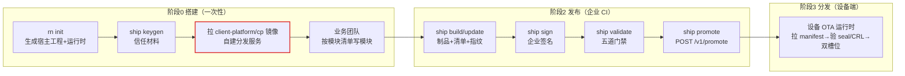

# 企业接入手册（按流程 · enterprise integration surface）

**Status:** draft · **Opened:** 2026-09-14 · 输入到「可企业推广」验收（见 [enterprise-promotion-gates.md](../agents/enterprise-promotion-gates.md)）
**Tracker:** 按 AGENTS.md，状态/认领走 GitHub Issues（本文档不承担 tracker 职责）

---

## 0. 对接模型（一句话）

> 企业**自建服务器**，**实现我们的服务契约**；平台交付「**契约 + 平台本地参考实现 + 验证探针**」。
> 企业**默认跑我们的实现**（🟢 跑 / 🟡 配 / 🔵 嵌），**偏离默认才实现契约**（🟠）。
> 不是「企业使用我们的数据库」，而是「企业按我们的服务要求自建服务器」。

**三元组（每个企业对接点都长这样）：**

| 成分 | 内容 |
|------|------|
| **契约（contract）** | 企业必须对齐的稳定接口 / 协议 / schema / 命令契约 |
| **平台本地实现（reference impl）** | 平台自带的一份实现，用于生产默认路径 + 本地自测 / 演练 |
| **企业实现（pluggable）** | 企业按契约自行实现的那一份（**仅偏离默认时**） |
| **探针即验收** | 同一套探针，平台和企业都能跑；探针过 = 接入验收 |

**成本分级：** 🟢 跑（拉镜像 / 跑 CLI，零实现）· 🟡 配（env / 证书 / 域名）· 🔵 嵌（模板自动带出）· 🟠 实现契约 · 🔴 演练（HITL）。

**防过度设计判据：** 契约只立在「企业真的会插拔」的点上；接缝的价值 = 此刻替代的复杂度，不是为将来预留的位置。

---

## 1. 主链路：以「某商城」App 为例的一次发布

> 以下每一跳标注 **平台交付** / **企业动作** / **契约锚点** / **验证探针**。

### 阶段 0 · 搭建（一次性）

| 跳 | 平台交付 | 企业动作 | 契约锚点 | 探针 |
|----|----------|----------|----------|------|
| 装工具链 | `rn` / `ship` CLI（发布产物） | 🟢 安装 | CLI 动词表（见 §3） | `pnpm test` / 架构门禁 |
| `rn init` | 宿主 App 工程（壳 + 模块骨架 + 生成式注册表 + 模板），**已嵌入设备 OTA 运行时**（shell-core） | 🔵 编译出 APK/IPA；🟡 烘焙设备端 RCA 公钥 | `client-platform.manifest.jsonc`（v2）· 生成式注册表 | `init-surface.test` / `module-registry.test` |
| `ship keygen` | keys 目录（K1/K2 + 证书链 ADR-024） | 🟡 保管私钥（异地 / HSM）；🟠 若用 HSM → 配 `RN_DELIVERY_HSM_SIGN_CMD` | keygen 产物：`label.rca.key/crt · label.key/csr/leaf.crt · .srl` | `signature.test` / `crl-sign.test` |
| 起分发服务 | `client-platform/cp` 容器（控制面 + 制品库 + 注册库 + 审计 + metrics + 控制台 + CRL） | 🟢 `docker compose up`（compose / helm 已提供）；🟡 配 `RN_CP_*` / 域名 / 备份 | CP HTTP API（§3）· 数据卷布局 · `RN_CP_*` env | 18 个 `verify-cp-*.mjs` 探针 · `serve-route-table.test` |
| 写第一个模块 | 契约面（getModuleApp / host-surface） | 🔵 业务团队按模块清单开发（不强推 TS） | `client-platform.module.jsonc`（v1）· ArtifactKind | `module-entry.test` |

### 阶段 1 · 开发（持续，企业研发本地）

| 跳 | 平台交付 | 企业动作 | 契约锚点 | 探针 |
|----|----------|----------|----------|------|
| `rn dev` | 多 Metro 调试 / dev-transport | 🔵 随模板带出 | `.rn/dev-session.jsonc`（schema v1）· `DEV_SESSION_PROTOCOL_VERSION=1` | `dev-transport.test` / `multi-metro-hmr-verify.test` |
| `rn module register` | 生成式注册表重写 | 🔵 | `regenerateDerivedArtifacts`（唯一再生成原语） | `declaration-derived.test` |

### 阶段 2 · 发布（企业 CI 里跑，平台交付 CLI）

| 跳 | 平台交付 | 企业动作 | 契约锚点 | 探针 |
|----|----------|----------|----------|------|
| `ship build/update` | 制品（HBC / APK / AAR / JS sidecar）+ 清单 + 指纹 | 🟢 跑 CLI | ArtifactKind · HBC 头 · JS sidecar · SBOM | `build-backend.test` / `js-update.test` |
| `ship sign` | 签名（软件 `signer=pem`，或企业 HSM 命令） | 🟢 / 🟠 | seal = `pem:ed25519:<b64>` · 证书链（ADR-024） | `signature.test` |
| `ship validate` | 五道门禁（quality / SBOM / governance / dependency / same-artifact） | 🟢 | 门禁判定在 `packages/core` | `sbom-gate.test` / `quality-gate.test` / `dependency-gate.test` |
| `ship promote` | 调「企业自建 CP」的 HTTP API | 🟢 | `POST /v1/promote`（staging→production） | `serve-route-table.test` / `candidate-lane.test` |

### 阶段 3 · 分发（设备端）

| 跳 | 平台交付 | 企业动作 | 契约锚点 | 探针 |
|----|----------|----------|----------|------|
| 设备 OTA | shell-core 运行时（已嵌入 App） | 🔵 无（随 App 编译） | check → manifest → 按 digest 下制品 → 验 seal/CRL → 双槽位回滚 | e2e 11 链（`scripts/e2e/`）· `ota-client.test` / `pull-ota.test` |
| 运营控制 | CP 控制台 / API | 🟡 配（CRL URL、RCA、租户） | `/v1/rollout/*` · `/v1/kill·pause·block` · `/v1/crl` | `verify-cp-rollout-steps.mjs` 等 |

### 阶段 4 · 运维与灾备

| 跳 | 平台交付 | 企业动作 | 契约锚点 | 探针 |
|----|----------|----------|----------|------|
| 备份 / 恢复 | `backup.mjs` / `restore.mjs`（ADR-014） | 🟢 跑 + 🟡 配备份计划 | 备份归档格式：`manifest.json + registry + artifacts.tar + secrets.tar.age` · 数据卷布局 | `verify-dr-backup-fail-closed.mjs`（CI）· `dr-drill.sh` |
| 冷重建演练 | `dr-drill.sh`（真机/容器） | 🔴 HITL | ADR-014 承诺（数据 + 信任材料） | drill 数据断言 + 信任负向对照 |
| 遥测 | `quality-signals.json` 提交 或 接企业后端 | 🟠 二选一（S10 未决） | `{schemaVersion:1, signals}` · `cp_http_*` · SLI/SLO | `quality-gate.test` |

---

## 2. 企业动作汇总（什么跑、什么配、什么实现）

| 服务面（= 链路上的跳点） | 默认路径 | 偏离默认才「实现契约」 |
|--------------------------|----------|------------------------|
| 分发服务 + 控制面 | 🟢 跑 `client-platform/cp` 容器 + 🟡 配 env | 自己的 DB → RegistryBackend（§4.2，待形式化） |
| 设备 OTA 运行时 | 🔵 随 `rn init` 嵌入 | 无（协议契约文档化即可） |
| 信任与签名 | 🟡 保管私钥 + 🟢 跑 keygen/revoke CLI | HSM → `RN_DELIVERY_HSM_SIGN_CMD`（§4.1，已有钩子） |
| 制品与清单契约面 | 🔵 模块作者按清单开发 | 无 |
| 发布管线 | 🟢 CI 跑 `ship` CLI | 自建管线 → 调 CP API |
| 部署栈 + DR | 🟢 跑 compose/helm + 🔴 演练 | 无 |
| 遥测与质量 | ⚪ 提交 `quality-signals.json` | 企业后端（§4.3，S10 决策） |
| 开发平面 | 🔵 随模板带出 | 无 |

---

## 3. 契约清单（定义的接口）

> 这就是「企业按我们定义的 API 对接」的完整清单。每项 = 形态 / 格式 / 锚点 / 探针。

| # | 契约 | 形态 | 锚点 | 探针 |
|---|------|------|------|------|
| C1 | **CP HTTP API** | HTTP（20 public / 14 mutate 路由） | `packages/ship/src/serve.ts` · `/v1/registry·promote·block·kill·pause·rollout·devices/lane·candidates·js-updates·crl·revocations·metrics·sli` | 18 个 `verify-cp-*.mjs` · `serve-route-table.test` |
| C2 | **制品布局** | 按 digest 寻址 | `packages/ship/src/artifact-store.ts`（ADR-020） | `artifact-store.test` |
| C3 | **注册库状态机** | `staging → production → blocked` + 灰度/吊销 | `packages/ship/src/candidate-store.ts` · `packages/core/src/release-rollout.ts` | `candidate-lane.test` / `stages-candidate.test` |
| C4 | **签名命令契约** | stdin=payload → stdout=base64 | `signature.ts` `signer=hsm`（本地 `signer=pem`） | `signature.test` / `crl-sign.test` |
| C5 | **seal / CRL 格式** | `pem:ed25519:<b64>` · `{revoked,payload,seal}` + cert_chain（ADR-024） | `signature.ts` · `serve.ts` `/v1/crl` | `crl-sign.test` / e2e chain-11 |
| C6 | **设备 OTA 协议** | check → manifest → artifact → seal/CRL → 双槽位 | `packages/shell-core/src/*` | e2e 11 链 / `ota-client.test` |
| C7 | **模块清单 / 清单** | `client-platform.module.jsonc`（v1）· `client-platform.manifest.jsonc`（v2） | `packages/core/src/module-manifest.ts` / `types.ts` | `module-entry.test` / schema 测试 |
| C8 | **发布 CLI** | `ship` 16 动词 | `packages/ship/src/cli.ts` | 各 gate 单测 |
| C9 | **备份归档格式** | `manifest.json + registry + artifacts.tar + secrets.tar.age` | `deploy/distribution-service/backup.mjs` / `restore.mjs` | `verify-dr-backup-fail-closed.mjs` / `dr-drill.sh` |
| C10 | **质量信号 schema** | `{schemaVersion:1, signals}`（含 business_module + update_id） | `packages/ship/src/quality-signals.ts` | `quality-gate.test` |
| C11 | **开发会话** | `.rn/dev-session.jsonc`（v1）+ 协议版本协商 | `packages/core/src/env.ts` | `dev-transport.test` |

---

## 4. 企业可「实现」的点（仅偏离默认，共 3 个）

### 4.1 信任与签名（HSM）—— 心智最重，但已是流程契约
- **本地实现**：`ship keygen` + `signer=pem` 软件签名。
- **企业实现**：任意 KMS/HSM 包装命令，配 `RN_DELIVERY_HSM_SIGN_CMD`（signer=hsm；stdin=payload → stdout=base64）。
- **剩下的企业动作是流程**：私钥保管（异地 / HSM）、轮换、吊销状态机（ADR-017/018）、证书链（ADR-024）。要的是文档 + 演练，不是接口。
- **探针**：`signature.test` / `crl-sign.test` / dr-drill 信任负向对照。

### 4.2 分发服务存储（RegistryBackend）—— 仅当企业强制用自己的 DB
- **现状**：file / sqlite 双适配器已存在（接缝为真）；Postgres 适配器种子已有（`registry-postgres.ts`，ADR-013 G9 延后）。
- **待形式化**：一个 `RegistryBackend` 接口（读 / 写 / 原子提交 / 一致性快照 / 能力声明：事务、多实例安全、备份一致）+ 注册表派发 + 能力协商（fail-closed）+ Postgres 参考适配器。
- **判据**：这是 pi-ai 式「接口 + 注册表 + 能力协商」唯一值得正式化的地方；**在企业时间表真实之前不写契约**（凭「各家 DB 不可知」猜出来的契约几乎必然错）。
- **探针**：企业适配器过同一套 `registry-*.test` + `verify-cp-*`。

### 4.3 遥测后端 —— S10 决策未决
- **零实现路径**：质量 CI 提交 `quality-signals.json`（文件即契约）。
- **企业后端路径**：按 C10 schema + `cp_http_*` + SLI 语义接自己的监控（S10 待人工决策）。

---

## 5. 现状与待办

**已就绪（平台本地实现 + 探针都齐）：** C1–C11 契约、`client-platform/cp` 容器、shell-core 运行时、keygen/sign、backup/restore/drill、verify-harness 探针、DR fail-closed 探针（本会话新增）。

**缺口（不阻塞，先待办）：**

| 缺口 | 性质 | resume-when |
|------|------|-------------|
| RegistryBackend 形式化（§4.2） | 契约设计 | 首个真实企业接入 / 企业强制用自己的 DB |
| sqlite 后端冷重建演练 | 验证（HITL） | 首个 sqlite 生产部署 / 企业推广前 DR 验收 |
| 遥测后端决策（§4.3） | 决策（S10） | 企业推广前 |
| 契约目录文档化（本文档持续维护） | 文档 | 随每次契约变更 |

**防过度设计提醒：** 不建平台级通用抽象；三元组只立在 3 个 🟠 点（§4.1–4.3）；其余服务面是 🟢🟡🔵，只需把契约写清楚。

---

## 相关

- [CONTEXT.md](../../CONTEXT.md) — 域术语（契约面 / 引擎适配器 / 宿主适配器 / 生成式注册表 / 模块清单 / 部署栈 / 冷重建）
- [seam-deepening-map.md](./seam-deepening-map.md) — Map I 的 7 个接缝（已全部关单）
- [enterprise-promotion-gates.md](../agents/enterprise-promotion-gates.md) — 「可企业推广」的 L0–L5 标尺
- ADR：013（SQLite，无 Postgres）· 014（冷重建）· 015（每业务独立部署）· 016（设备 OTA）· 017/018（信任模型 / 双密钥轮换）· 020（制品库接缝）· 022（引擎适配器）· 023（指纹权威）· 024（证书链 + HSM 签名）
