# Seam deepening map（架构深化图 · Map I）

**Status:** active · **Opened:** 2026-09-13 · **Tracker:** [#256](https://github.com/client-platform-labs/rn/issues/256) (`wayfinder:map`)

本文件是 2026-09-13 架构复盘的**入仓活文档**：5 个平面、4 条代码逻辑链、7 个待落地接缝、修复顺序与质量闸。
GitHub issue 是**权威 tracker**（状态/认领/关单只在 `gh` 上做）；本文件承载**结构与理由**，供人与 agent 导航。

术语约定：

- 架构词汇（module · interface · implementation · depth · seam · adapter · leverage · locality）按 `/codebase-design` 使用，**不得**替换为 component / service / API / boundary。
- 域内术语按 [CONTEXT.md](../../CONTEXT.md)（契约面 / 宿主适配器 / 生成式注册表 / 模块清单 / 引擎适配器）。
- 本文件**不**作为 tracker；不要把 ticket 状态写进这里（只写 ticket 号）。

---

## 1. 判据：什么才值得立一个接缝

立票前对每个可疑 module 做 **deletion test**：

| 删掉它，复杂度… | 结论 | 动作 |
| --- | --- | --- |
| **集中在别处**（必须有人接手这份复杂度） | 它 earning its keep | 保留 / **深化**（把接口收窄，把实现收进去） |
| **搬了个家**（换个调用点重写同样几行） | 它是 pass-through / shallow | 删除或**吸收**进调用方 |

配套判据：

- **接口即测试面**——如果为了测试必须绕过接口，说明 module 形状错了。
- **一个 adapter 是假想接缝，两个才是真接缝**——单实现的接缝必须证明它有第二个真实变化维度（测试 fake 也算），否则是空接缝。
- ADR 冲突只在**摩擦真实**时才提，且是"重开 ADR"而非"绕过 ADR"。

---

## 2. 系统地图：5 个平面

| # | 平面 | 拥有 | 不得 | 当前 depth 评估 |
| --- | --- | --- | --- | --- |
| ① | **契约层** `packages/core` · `packages/shell-core` | schema、门禁判定、selector、rollout 状态机、OTA 客户端、adapter 契约 | I/O 到 bundler / 磁盘产物 / store API；import `react-native` | **深且干净**（core 136 单测绿）。是接缝的**定义处** |
| ② | **宿主运行时** `packages/rn/templates/*` + 原生 Kotlin 模板 | 宿主启动、OTA boot 接线、原生 adapter 实现 | 静默降级；把信任根烘焙成默认值 | **深度缺失**：逻辑活在**模板文本**里（见 C1），原生安装落在**包外脚本**（见 C2） |
| ③ | **控制面** `packages/ship/src/serve.ts` + `candidate-store.ts` | HTTP 面、候选注册库、吊销、rollout 推进 | dev Metro 产物冒充交付物 | **store 深，transport 浅**：1223 行单回调 / 34 路由（见 C3） |
| ④ | **工具链 CLI** `packages/rn`（init/doctor/module/dev）· `packages/ship`（build/bundle/promote） | 用户可见动词、诊断、声明→派生、交付编排 | 泄漏内部代号/ADR 号到公共输出；把 dev 当 release | 诊断**分裂**（C4）、派生**被绕过**（C7）、交付后端**空接缝**（C6） |
| ⑤ | **验证** `packages/*/test` · `scripts/verify-*.mjs` · `scripts/e2e/` · `scripts/release-readiness/` | 单元断言、CLI 探针、真机链路、发布前闸 | 中间临时产物污染最终交付产物 | **三套 harness，只有一套真存在**（`e2e/lib.sh`）；61 个探针各写各的（见 C5） |

---

## 3. 代码逻辑链（7 张票都挂在四条链上）

```mermaid
flowchart TB
  subgraph CHAIN_A["A 声明 → 派生"]
    D1[".rn/dev-session.jsonc<br/>.rn/runtime.jsonc"] --> R["regenerateDerivedArtifacts<br/>（唯一再生成原语）"]
    R --> A1["generated-registrations.ts"]
    R --> A2["host-resolver.cjs"]
    R --> A3["generated-runtime.ts"]
    A1 --> TPL["宿主模板消费"]
    A2 --> TPL
    A3 --> TPL
  end
  subgraph CHAIN_B["B 信任根 → 烘焙 → 验签"]
    K["ship keygen"] --> KEYS["keys（规范位置）"]
    KEYS --> BAKE["烘焙进 Kotlin<br/>（今日：包外脚本 + 正则）"]
    BAKE --> DEV["设备 getOtaPublicKeys"]
    DEV --> VERIFY["seal / CRL 验签<br/>（今日：模板内联，未执行测试）"]
  end
  subgraph CHAIN_C["C 交付"]
    BUILD["ship build / bundle"] --> BB["BuildBackend<br/>（今日：pass-through，零调用方）"]
    BB --> CAND["候选 + 制品 store"]
    CAND --> PROMO["promote / rollout"]
    PROMO --> ROUTES["serve 路由<br/>（今日：34 路由单回调）"]
    ROUTES --> PULL["设备拉取"]
  end
  subgraph CHAIN_D["D 诊断"]
    DOC["rn doctor"] --> PRE["PreflightFinding 族<br/>31 处 push"]
    DOC --> FAM["ok/blocking/summary 族<br/>声明 5 次"]
    PRE --> OUT1["printHostLayers → 裁决 host.ok"]
    FAM --> OUT2["4 个打印循环 → 裁决 issues 空"]
  end
```

链的**触发点**（改 A 链时必须同时想到的）：

| 链 | 触发点 | 现状 |
| --- | --- | --- |
| A | `rn init` 尾 · `rn shell refresh` | 采用唯一原语 ✓ |
| A | `rn module register` | **绕过**原语，手写三次写入 ✗（C7） |
| A | `rn dev` 预检 | 采用唯一原语 ✓ |
| B | `rn init` | 只能**探测**适配器，不能安装 ✗（C2） |
| B | `scripts/apply-ota-to-project.mjs` | 实际安装者，位于包外 ✗（C2） |
| C | `ship cli` | **直接**调用 runner，不经 BuildBackend ✗（C6） |
| D | `rn doctor` | 两个结果族、两个裁决 ✗（C4） |

---

## 4. 接缝登记册（7 个）

| 接缝 | 票 | 优先级 | 证据锚点（已手验） | deletion test | 第二个 adapter |
| --- | --- | --- | --- | --- | --- |
| **发布 OTA boot 序列** | [#257](https://github.com/client-platform-labs/rn/issues/257) | P0 | `ShellHost.tsx.template:44-141` vs `ReleaseOtaBoot.tsx:52-132`（9 行逐字同，CRL 只在工业壳）；`industrial-shell.test.ts:67-90` 全是 `assert.match` | 删模板两份拷贝 → **集中** | 两个宿主（工业壳 / 绿色壳）+ 测试 fake adapter |
| **原生 OTA adapter 安装** | [#262](https://github.com/client-platform-labs/rn/issues/262) | P1 | `init.ts:343-366` 只探测 + hint；`industrial-shell.ts:151,199` 目录遍历；`scripts/apply-ota-to-project.mjs` 256 行在包外 | 删脚本 → 复杂度**无处可搬**，只能收进包内 | 无（这是归属地问题，非变化维度） |
| **控制面 transport / policy** | [#258](https://github.com/client-platform-labs/rn/issues/258) | P1 | `serve.ts:280` 单回调 1223 行 / 34 路由；`requireCpAuth()`×14 · `appendAudit()`×18 · `loadRegistry()`×14；`createControlPlane` 零单测进入 | 删 46 处内联仪式 → 策略**集中** | 直接 HTTP 调用 vs in-process 路由表测试 |
| **诊断结果契约** | [#260](https://github.com/client-platform-labs/rn/issues/260) | P2 | `{id,ok,blocking,summary}` 声明 5 处；`doctor.ts` 4+4 循环；`host.ok` 与 `issues` 双裁决 | 合并 5 个 evaluator → **集中**（净 −4 module） | 人读 printer vs JSON 消费者 |
| **verify fixture** | [#259](https://github.com/client-platform-labs/rn/issues/259) | P1 | 61 文件 7450 行；34 自带 `function step`、24 `mkdtemp`、24 spawn ship、16 手写 registry、8 内联 `fetchJson`（7 逐字节同）；≈15 孤儿；CI 跑 3 | 删任一探针脚手架 → **不集中**（被复制 11–34 次）→ 缺的是 interface | **已成立**：hermetic 临时工程 + 真机链（`e2e/lib.sh`） |
| **交付后端（BuildBackend）** | [#261](https://github.com/client-platform-labs/rn/issues/261) | P2 | `build-backend.ts:45` 单 adapter pass-through；`cli.ts:184/193/202` 直接调用；唯一消费者 `build-backend.test.ts:8-10` 断言 `typeof === "function"`；`runBuild`/`runUpdate` 零测试 | 删它 → **生产零变化**（假想接缝）；接线后 → 删除则复杂度散回调用点 | 真实 RN backend + 测试 fake backend |
| **声明→派生原语** | [#263](https://github.com/client-platform-labs/rn/issues/263) | P3 | `regenerateDerivedArtifacts` 被 `industrial-shell.ts:135`/`dev.ts:161` 采用、被 `commands/module.ts:158-168` 绕过；`readHostContextFromSidecar` 两侧各一份且已分叉（`OtaSidecar` vs `any`） | 删原语 → 三个调用点各自重推（搬家）→ 应把写入**集中**到原语 | 三个触发点（init / register / dev preflight） |

### 与 ADR 的关系（0 条冲突）

- C1、C2 是 **ADR-016 的未兑现决策**（GF/BF 共用 shell-core 运行时；`rn init` 自动链接 OTA 原生模板）——票面目标是**兑现**，不是重开。
- C6 是 **ADR-022 的未接线接缝**——接线，不是重开（PR 中记一条 wiring 说明即可）。
- C3/C4/C5/C7 不触及任何 ADR 决策边界。

---

## 5. 修复顺序与并发波次

**优先级顺序**（只能做一件时的顺序）：C1 → C3 → C5 → C4 → C6 → C2 → C7。

**并发原则**：7 张票**文件所有权互不相交**，因此**有意不设票间原生 blocked_by 边**（blocked_by 会序列化 frontier，与并发目标冲突）。顺序由优先级与波次表达：

| 波次 | 票 | 并发度 | 文件所有权（一个 writer 一个区） |
| --- | --- | --- | --- |
| W1 | #257 · #258 · #259 · #260 · #261 · #263 | 6 | shell-core+模板 / `serve.ts` / `scripts/` / `doctor*` / `ship cli+build` / `declaration-derived+module+dev` |
| W2 | #262 | 1 | `commands/init.ts` + 新增包内安装 module + 退役脚本 |

**唯一的硬顺序是验收顺序，不是实现顺序**：

1. **#262 的设备端验收必须在 #257 合入后**（boot 契约稳定后再验设备端）。
2. **#260（诊断）新增的检查项应经 #259 的 harness 注册**（否则又多一套断言写法）。
3. **#262 的安装器应经 #263 认定的唯一派生入口登记**（避免出现第 4 个触发点）。

---

## 6. 质量闸（每张票的 done 定义）

遵循仓内纪律 **done = 验收通过**，不接受"已实现"：

| 闸 | 内容 | 谁跑 |
| --- | --- | --- |
| G1 单测 | `pnpm test`（`tsc -b` + packages 全部单测）绿 | AFK |
| G2 架构门禁 | `node scripts/check-architecture-governance.mjs` 绿（ADR-021 DAG 只向上 / ADR-022 引擎无关纯度 / ADR-009 反模式） | AFK |
| G3 防复发探针 | 每票必须新增一条把 **deletion test 机器化**的断言（见登记册"验收探针"节） | AFK |
| G4 行为等价 | 结构收敛类票（C3/C4/C7）必须证明**行为未变**：既有探针/单测不减少、`--json` 字段兼容 | AFK |
| G5 设备 e2e | 触碰信任链/OTA 的票（C1、C2）最终验收需真机（`scripts/e2e/`） | **HITL** |
| G6 ADR | C1/C2 引用 ADR-016 兑现关系；C6 记 ADR-022 wiring | 评审 |

**AFK 阶段不得宣称 G5 已验收。** 涉及 G5 的票在 AFK 完成时状态为"实现+单元探针通过，设备验收待 HITL"。

---

## 7. 如何扩展这张图

1. 只在**有证据**时立接缝：先做 deletion test，再引用 `file:line`。
2. 新接缝 → 新 GitHub issue（`wayfinder:task` + `priority:*` + `Part of #256`），**不要**只改本文件。
3. 接缝的**命名**若引入 CONTEXT.md 里没有的概念，在设计与 grilling 定稿时补进 [CONTEXT.md](../../CONTEXT.md)（本文件只登记，不定义域术语）。
4. 接缝落地后，把探针写进 CI/治理门禁；然后从登记册移除该行，并在本文件的 Status 行更新日期。

## 相关

- [arch-onboarding.md](./arch-onboarding.md) — 新人与 agent 的架构入门
- [device-gate-plan.md](./device-gate-plan.md) — 真机验收闸（G5）
- [../agents/engineering-principles.md](../agents/engineering-principles.md) — 原则与 PR 检查表
- [../agents/architecture-governance.md](../agents/architecture-governance.md) — ADR/治理流程
- [../acceptance/0to1-findings.md](../acceptance/0to1-findings.md) — F01–F25 findings 与 SEAM-1..5（本图的 7 个接缝是其**结构层**续作）
