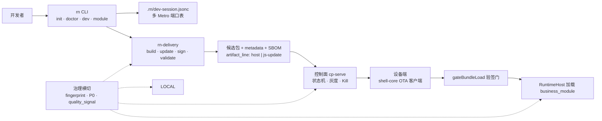

# rn 平台架构手册

> 面向三角色（壳开发 / rn 开发 / 运维）的平台全貌设计总览。本手册是**读者向**文档：讲清「每类角色触摸哪些层与平面、哪些数据流经他们的手、他们拥有哪些决策」，并把 Map A 脊柱、ADR 系列与本仓工业实践串成一张图。规范合同见各 ADR 与 `blueprint/`；本手册不替代它们。
>
> 写作日期：2026-09-07 · Ticket: [#204](https://github.com/client-platform-labs/rn/issues/204)（Map G G8）· 事实来源：`docs/architecture-roadmap.md`、`wayfinding-map-f/ATLAS.md`、ADR-001–020、`docs/agents/engineering-principles.md`、`docs/agents/gf-bf-unified-model.md`、`docs/handbook/research/architecture.md`。

---

## 读者地图（三角色导航）

| 角色 | 最常触摸的平面 | 经手的数据 | 拥有的决策 | 先读章节 |
|------|----------------|------------|------------|----------|
| **壳开发**（宿主/平台团队） | 本地环（`rn host`、doctor）· 运行时（RuntimeHost / SurfaceHost / shell-core） | `runtime_fingerprint`、`capability_set`、`.rn/host-profile.jsonc`、宿主列车制品 | Surface 如何打开、指纹窗与兼容矩阵、宿主发版节奏（商店列车） | §2 · §7 |
| **rn 开发**（业务 module 开发者） | 本地环（`rn dev` / 多 Metro）· 交付（`rn-delivery` per-module） | `business_module` id、`update_id`、`.rn/dev-session.jsonc` 端口表、`client-platform.manifest.jsonc` | 写业务代码、选 Metro 端口、按 module 发 JS 列车、声明 `required_capabilities` | §3 · §6 |
| **运维 / on-call** | 控制面（`rn-delivery cp-serve` / Distribution Service）· 治理（质量信号、channel_profile）· 部署与 DR | `release_unit`、候选包 + 签名 + SBOM、灰度/回滚状态、错误预算信号 | promote/block 时机、灰度节奏、DR 冷重建、双公钥轮换 runbook | §4 · §7 · §8 |

一句话模型：**壳开发拥有「壳」、rn 开发拥有「module」、运维拥有「发布单元与部署」**；三者通过 rn-core 的身份脊柱（`release_id` · `artifact_line` · `runtime_fingerprint` · `update_id` · `channel`）对齐，见 §10 与 `wayfinding/CONTEXT.md`。

---

## 1. 平台全貌（五平面 + 数据流图）

### 1.1 五平面拓扑

平台按「谁拥有什么、禁止碰什么」切成五平面（治理横切），来自 `docs/architecture-roadmap.md` §3 与 ATLAS §1：

| 平面 | 内容 | 拥有 | 禁止（Must not） |
|------|------|------|------------------|
| **Local（本地环）** | `rn` CLI（doctor / dev / init / module / host）、`.rn/dev-session.jsonc`、多 Metro 编排、DevTransport | 开发者机器 | 签名、seal、promote（见 `docs/agents/engineering-principles.md` §4） |
| **CI / Delivery** | `rn-delivery`（build / update / sign / validate / release / promote / block）、候选包 + metadata + SBOM、`ArtifactStore` | 构建与发布 | dev Metro 产物冒充 release（`G-DEV≠REL` 门禁） |
| **CP（控制面）** | `rn-delivery cp-serve`、Distribution Service（`deploy/distribution-service/`）、发布状态机、灰度/Kill、RBAC、SQLite/Postgres 适配 | 发布/on-call | 执行业务代码、当作 App 内发布页 |
| **RT（运行时）** | `rn-core` 合同、`shell-core` OTA 客户端、`RuntimeHost` / `SurfaceHost`、business_module bundles、A5 槽位（baseline / N / N-1） | 设备 | 从 OTA 载荷取验签代码（ADR-017 信任边界） |
| **Governance（治理横切）** | `runtime_fingerprint`、ADR-008 P0 门禁、doctor L3e、`check-architecture-governance.mjs`、compliance_profile、exception ledger | 平台/合规 | 只依赖人工 code review |

> 依赖规则：依赖指向**内**——`rn-core`（合同 + 纯函数，无 Metro I/O）← `rn` / 原生 / `rn-delivery`。`rn-core` 绝不 import Metro、Gradle 或商店 API（`docs/agents/engineering-principles.md` §1）。

### 1.2 全链路数据流（开发 → 设备）



即 `docs/architecture-roadmap.md` §5.1 的 Steel Thread：`doctor → init topology B → dev 真机 → delivery release 候选 → CP 登记 + promote → 客户端 gateBundleLoad 加载 → promote 或 block 一次`（M0–M10 已全绿，见 `docs/architecture-roadmap.md` §9.4）。

### 1.3 双列车（宿主列车 vs JS 列车）

| 列车 | 节奏 | 通道 | 兼容锚点 |
|------|------|------|----------|
| **宿主列车**（`ios-host` / `android-host`） | 慢（商店/装包台） | 商店原生更新路径 | `release_id` + 指纹窗 |
| **JS 列车**（`js-update`，生产默认开） | 快（per-module） | OTA（企业内 Android sideload/MDM，见 ADR-012） | `runtime_fingerprint` 匹配 + `required_capabilities ⊆ capability_set` + 渠道允许 |

定义见 `wayfinding/CONTEXT.md`（宿主列车 / JS 列车 / 发布通道）与 `wayfinding-impl-2/docs/adr/004-offline-package-channels.md`。放行档三态：`needs-native`（必须换壳）/ `js-standard`（可自动灰度）/ `js-gated`（JS 包但默认不可自动全量），见蓝图 #13 与 ATLAS §3.5。

---

## 2. 壳开发视角

### 2.1 壳是什么

壳 = 一个 `product_app`（商店包 / Debug Host）：原生骨架 + RN Runtime 宿主。壳拥有 `runtime_fingerprint` + `capability_set`（**壳级，所有 module 共享**），并决定 GF 还是 BF 形态（`docs/agents/gf-bf-unified-model.md`、ADR-005）。

宿主三层契约（`wayfinding/CONTEXT.md`、ADR-006）：

| 层 | 职责 | 壳开发要写的 |
|----|------|--------------|
| **AppHostKernel** | 进程、安全、观测、诊断会话 ID | 壳必给（L0 内核，ADR-007） |
| **RuntimeHost** | Bundle 装载、module 注册、BundlerResolver、dispose | 复用 `rn-core` 的 `createReferenceRuntimeHost`；**禁止自造第二套** |
| **SurfaceHost** | 打开某 module 的 UI 实例 | **唯一分叉点**：GF 用 RN 导航、BF 用原生 push（`SurfaceHostAdapter`） |

### 2.2 壳开发触摸的层 / 平面 / 数据流

- **本地环**：`rn host android`（装工具链）、`rn doctor`（宿主仓跑 `--profile brownfield` 才有 L3b 增量）、`.rn/host-profile.jsonc`（GF/BF 字段 + protocol 版本）。
- **运行时**：`shell-core`（`@client-platform/shell-core`：OTA 客户端、`ModuleEventBus`、`globalState`、`ShellRouter`、`BundleManager` 六态）；GF/BF 共用同一客户端（ADR-016）。
- **交付**：宿主走 `rn-delivery release`（`artifact_kind: app-host`）；壳团队负责 `release_id` 与指纹窗，按 `shell-change` 矩阵判断壳变更是否触发 JS 重验（`rn-core` 的 `shell-change-matrix.ts`、ADR-008 R13）。
- **数据流**：壳的 `runtime_fingerprint` 是**所有 module 的 OTA 门禁输入**；壳升级 = 新指纹窗 = 旧 JS 包可能整体重验。这就是「壳变更影响所有 module」的共命运关系（ADR-008 S1）。

### 2.3 壳开发拥有的决策

1. **GF vs BF**：谁拥有主 Activity、如何 open Surface（唯一合法分叉，ADR-006 表「允许差异」列）。
2. **指纹窗 / 兼容矩阵**：壳版本与 RN/Hermes/HBC 的兼容组合（`rn-core` 的 `validateSupportWindow`）。
3. **宿主发版节奏**：商店原生更新路径；`FORWARD_FIX` vs `RolledBack` 对宿主列车意味着「停止继续放量」而非「JS 回滚」（`docs/agents/gf-bf-unified-model.md` §8.3）。
4. **跨 module 通道**：事件总线、分区存储、能力注册的 schema 与 ACL（ADR-007 L0–L3）。

### 2.4 壳开发要守的边界

- 不新增 `rn dev-brownfield` 类命令（ADR-006 / YAGNI）；多 Metro 用 `rn dev --modules`。
- 不把 module 业务源码吞进壳仓（拓扑 B，ADR-005：壳只 `register/link`）。
- release 宿主包不得含 DevSession / Dev Support 残留（`G-DEV≠REL`、`verify-*-release-hygiene`）。
- 验签代码来自随 APK 下发的受信 shell 包，绝不来自待验 OTA 包（ADR-017 信任边界）。

---

## 3. rn 开发视角

### 3.1 module 是什么

一个 `business_module` = 一个可独立热更的 JS Bundle（+ 可选同包资源），一个独立 module workspace（`modules/<id>`），独立 OTA、独立 Metro 端口（ADR-005 topology B）。**GF/BF 对业务 module 无感**：目标态业务 JS 开发者 95%+ 不感知壳形态（`docs/agents/gf-bf-unified-model.md` §8.1）。

### 3.2 rn 开发触摸的层 / 平面 / 数据流

- **本地环**：`rn doctor`（module 仓契约，无 `--profile`）、`rn module init <id>` / `rn module link <id>`、`rn dev --modules main,trade`（多 Metro 并行，`packages/rn/src/metro-orchestrator.ts`）、`.rn/dev-session.jsonc`（自己 module 的 `metroPort` / env overlay）。
- **交付**：`rn-delivery update --module <id>` 产出 js-update（编译，非 dev Metro 输出）；`rn-delivery sign / validate`。
- **运行时**：业务代码只消费壳提供的 `runtime_fingerprint`（module **不拥有**指纹）；声明 `required_capabilities`，由选择器做「指纹 + 能力 + 渠道」门禁（ADR-004 / 005）。
- **数据流**：业务事件经 `ModuleEventBus` 带 `business_module` + `update_id` 关联（ADR-007 / A6）；崩溃与质量信号同样带这两个 id 归因（ADR-008 R10、P0.4）。

### 3.3 rn 开发拥有的决策

1. **module 内的一切**：业务代码、`client-platform.manifest.jsonc`、声明的能力、自己的 Metro 端口偏好（`preferredMetroPort` 登记 vs 运行时分离）。
2. **JS 列车发版**：按 module 独立 `update_id`；三档放行（`needs-native` / `js-standard` / `js-gated`）由策略层决定，业务声明所需档位。
3. **跨 module 协作方式**：走总线事件 / 能力 API / 壳导航契约——**不得**假定可同步调用另一 module 的 JS 导出，**不得** Bundle 互 import（ADR-007 规则 3 / ADR-008 P0.3）。

### 3.4 rn 开发要守的边界

- 不 `rn init` 出可上架第二壳冒充离线包（ADR-005 硬约束）。
- 不改 `global` / polyfill / prototype（公共基础包独占 polyfill；CI 扫描，ADR-008 R1 / P0.3）。
- 不抢原生单例 / 全局状态（能力契约单例归属壳，ADR-008 R7）。
- release 包无 Dev 残留；业务 module 仓不拷贝 `.rn/host-profile.jsonc`（`docs/agents/gf-bf-unified-model.md` §8.2）。

---

## 4. 运维视角

### 4.1 运维触摸的层 / 平面 / 数据流

- **控制面**：`rn-delivery cp-serve` / Distribution Service（`deploy/distribution-service/`，单一 Node · API-first · Compose/Helm，见 ATLAS §3.6）。经手 `release_unit`（app × module × train × channel）、候选包 + 签名 + SBOM、灰度/回滚状态机（Draft→…→Full→Paused→RolledBack）、审计日志（`cp-audit.log`，见 ATLAS §5.0 6.4）。
- **治理**：质量信号（`signal record` 六类 kind，其中 `e2e_fail` 挡 promote，Map C C1）、错误预算（P13 RN SLO，`verify-rn-slo-budget.mjs`）、channel_profile 七渠（Map C C3）、一致性闸（P8）、双 SBOM promote 挡板（C7）、Governance fail-closed（D3）。
- **部署与 DR**：每业务独立 Compose 栈（ADR-015）、SQLite 注册库（ADR-013）、`ArtifactStore` 本地目录（ADR-020）、冷重建 DR（ADR-014）、海外岸线（ADR-019）。oncall runbook：`docs/runbooks/cp-oncall.md`（D5）。
- **数据流**：设备 `checkUpdate` → CP 返回 update_id → 设备验签拉包 → 质量信号回流（`/v1/quality-signal`）→ 超错误预算自动 Paused。Kill/Pause 按 `business_module` 粒度（B9）。

### 4.2 运维拥有的决策

1. **promote / block 时机**：按 `release_unit` 走状态机；`rn-delivery block --reason '…'` 是回滚演练的主工具（Steel Thread 验收串）。
2. **灰度节奏**：P10 rollout tick（soak + SLO 自动放量 / breach pause，C5）、P11 `planJsRollback`（不切坏流量，C6）。
3. **DR 执行**：冷重建——每日加密异地备份（SQLite `.backup` + 制品 tar + 签名私钥 age 加密），任意装 Docker 的机器十几分钟重建（ADR-014）；RPO ≈ 每日，RTO ≈ 分钟级手动。
4. **信任根轮换**：K1 泄露时用 K2 私钥签发「K1 吊销」清单并改用 K2 签名，设备用烘焙的 K2 验证 → 1 次免重装应急轮换；双失陷 = 重打 APK 全量重装（ADR-018，状态机进 G8 runbook）。

### 4.3 运维要守的边界

- **E2E 永不挡 promote → submit / 生产全量**；硬门禁在 ADR-008 P0 + doctor L3e（`wayfinding/CONTEXT.md` 硬门禁 / E2E 信号）。
- 可执行 OTA 仅限 **Android 企业内部/私有分发**（sideload/MDM）；iOS 与商店渠道默认闭口（ADR-012）。上商店前须过法务/备案人工前置门（P0 合规前置）。
- 部署栈是「每业务独立」的隔离单元；不做共享行级多租户（ADR-015）。北京机 = dev/预发，海外机 = production，不得冒充（ADR-019）。
- DR 措辞：**冷重建**，不承诺常驻热切 standby（根 `CONTEXT.md`）。

---

## 5. GF vs BF 统一模型

### 5.1 本仓定义（与 Expo/Callstack 不同）

GF = BF：**两种交付形态共用一套架构契约（rn-core）**，是同一套契约的两个 entry point（`rn-core` 类型对外，pack/sign/promote 在 `rn-delivery`）。差异**只**留在两处：`SurfaceHost` 如何被宿主打开、构建产物外形（`app-host` vs `rn-module`）。**不允许**第二套 DevSession / 多 Metro / dispose / 交付协议（`docs/agents/gf-bf-unified-model.md`；ADR-006）。

`docs/handbook/research/architecture.md` 的对照：Expo/Callstack 把 greenfield/brownfield 当作**集成模式**（integrated vs isolated），且 Callstack 2025 提出「Every React Native App is brownfield」——与本仓「工程上无本质分野」方向一致。同业大厂（美团/字节/阿里）在容器叙事上普遍**淡化** GF/BF，强调「业务复用 / 场景通用 / 宿主解耦」两轴。

### 5.2 一张表看相同与不同

| 维度 | 必须相同（禁止 fork） | 允许不同（仅适配器/制品） |
|------|----------------------|---------------------------|
| DevSession / 端口表 / DevTransport | ✅ 同一 `dev-session.jsonc`、同一 CLI | — |
| Runtime 核心 / dispose / gateBundleLoad | ✅ `createReferenceRuntimeHost` | — |
| 跨 module 总线 / 分区存储 | ✅ 同一 `ModuleEventBus` 合同 | — |
| 交付与晋级 | ✅ 同一 `rn-delivery` + CP，按 `release_unit` | `artifact_kind`（app-host vs rn-module）由 CP 解析 |
| 谁拥有主 Activity / 如何 open Surface | — | GF：RN 导航；BF：原生 push `SurfaceHostAdapter` |
| 商店主包形态 | — | GF：`app-host`；BF：原生 App（内含 RN runtime） |
| Doctor | 宿主形态无关的 L3e P0 | BF 加 `--profile brownfield` L3b 增量 |

### 5.3 评审反模式（直接打回）

- 新增 `rn dev-brownfield` / BF 专用 Metro 命令 → 应扩展 `rn dev`（ADR-006）。
- BF 独立 `.rn/bf-session.jsonc` → 共用 `dev-session.jsonc`。
- BF 跳过 L3e / dispose → 同一 P0（ADR-008）。
- 在 `rn` 里做 BF 专用 delivery/seal → `rn-delivery`（dev≠delivery）。

---

## 6. 多 bundle 架构与隔离

### 6.1 对象模型（ADR-005）

```text
product_app (壳)
  ├─ runtime_fingerprint + capability_set   ← 壳级，共享
  │    ├─ business_module_1 → js-update 列车 + metroPort
  │    ├─ business_module_2 → js-update 列车 + metroPort
  │    └─ …
  └─ (host surface: GF | BF 适配器)
```

- `release_unit` = `app × module × train × channel`（`rn-core` 的 `release-unit.ts`）。
- 运行时**单 Runtime · 多 Bundle**：默认一套 `RuntimeHost`（一份 Hermes/Bridge），多个 module 以独立 JS Bundle / Surface 加载（ADR-005 HITL 钉死）。S2 多 Runtime 是**显式逃生**，非默认。
- 仓拓扑 **B**（工业默认）：壳 workspace + 外置 module workspaces；路径 A（`inline-main`）仅 onboarding。CLI/CP/Runtime **禁止**写死 `modules.length === 1`。
- 投放与仓拓扑正交：同一 js-update 可预置 baseline、装包台预置或远程 OTA（ADR-004）。

### 6.2 ADR-008 六条 P0（缺一不得宣称「可企业推广」）

| P0 | 内容 | 落地 |
|----|------|------|
| P0.1 | 生命周期：destroy→dispose，无残留定时器/订阅 | `rn-core` surface-lifecycle / dispose-probe；doctor L3e |
| P0.2 | 身份与加载：按 module 选择器 + 指纹/兼容窗 + **验签**，错误包不可执行 | `gateBundleLoad`（`rn-core` bundle-load-gate + ed25519-verify） |
| P0.3 | 跨包边界：仅壳总线/能力 API，禁 Bundle 互依赖与违规 global | `ModuleEventBus` + doctor 污染扫描 |
| P0.4 | 观测：崩溃/日志/质量信号带 `business_module` + `update_id` | `observability.ts` quality_signal |
| P0.5 | 发布矩阵：壳变更触发的 JS 重验/重打规则机读，晋级可阻断 | `shell-change-matrix.ts` |
| P0.6 | Doctor/CI 门禁：依赖对齐、指纹合同、禁全局污染扫描 | `rn doctor` L3e / `check-architecture-governance.mjs` |

推广口径：**「单 Runtime · 多 Bundle + 平台强制边界」**；不承诺 VM 级互不影响，需硬隔离的业务线走 S2 特例（ADR-008）。

### 6.3 跨 module 通信（ADR-007）

分层：L0 壳内核（壳必给）→ L1 能力契约（平台合同）→ L2 跨 module 总线（壳提供通道，事件名与 DTO schema 可插件化）→ L3 共享存储原语（分区 KV/DB/文件 + module ACL）→ **L4 禁止默认**（Bundle 间直接依赖业务源码 / 同堆共享可变全局 / 无契约裸桥）。

### 6.4 JS 列车 / 离线包列车分离（双列车）

- 本仓双列车 = **宿主列车（慢 · 商店/装包台）** vs **JS 列车（快 · OTA，生产默认开）**，见 §1.3 与 ADR-004。
- research 摘要（`docs/handbook/research/architecture.md`「JS train / 离线包 / 双列车分离」）：字节 AnnieX「引擎包 vs 业务包」、阿里 mPaaS「业务资源包 + 公共资源包（≥1 月节奏）」、美团 MRN「单工程多 Bundle + Eva 灰度」、微信小程序「主包 + 分包」——都是同一模式：**两条独立发布列车，版本分开管理、按不同节奏与回滚粒度治理**。本仓对应：宿主列车跟车规则 + 每 module 独立 `update_id` 槽位。
- 命名注意：**「双列车」是本仓命名，非行业通用词**；「bundle」「离线包」「容器」在同业各有多义，本手册按 ATLAS/ADR 语义使用（bundle = 可独立加载、可独立验签的运行期单元；离线包 = 预置/预下载投放方式，不等于 OTA bundle）。

---

## 7. 设备端信任模型（OTA 签名/验签/轮换）

### 7.1 分层（ADR-016：rn-core 纯验签 / shell-core 运行时 / 原生模块模板）

从 tiangong-host 已跑通实现**抽取**为三层，不另起炉灶（`docs/adr/016-on-device-ota-sdk.md`）：

| 层 | 内容 | 特性 |
|----|------|------|
| **rn-core** | 纯验签 / 门禁判定 | 无 I/O；真 Ed25519 verify + fail-closed 决策函数（替换字符串比较） |
| **shell-core** | 设备端 OTA 运行时客户端（拉取/下载/落盘/生效/回滚/崩溃环计数） | GF/BF 共用；`@client-platform/shell-core`（createOtaClient、pullOtaUpdate、crash-loop） |
| **packages/rn/templates** | OTA 原生模块模板（Android Kotlin）+ greenfield 模板 + rn init 自动链接 | 原生侧只持 key + 文件 I/O，不做签名数学 |

### 7.2 签名与验签（ADR-017：Ed25519 + 内置公钥 + fail-closed）

- **公钥烘焙在原生侧**（随 APK 下发，不进 OTA 载荷）；rn-core 用审计过的纯 JS **@noble/ed25519** 做真 Ed25519 verify（`verifyEd25519Seal`）。
- **fail-closed**：release 下拒绝 `signature === digest` 的 stub，只接受 `pem:ed25519:` 签名；验签失败拒绝加载并回退上个良好包。服务端 `sign.ts` 的 PEM ed25519 分支产出 `pem:ed25519:` 签名。
- **信任边界（必须）**：执行验签的代码来自随 APK 下发的受信 embedded/shell 包，**绝不**来自待验 OTA 包本身（ADV 防自提权）。
- dev 路径仍可 allowUnsigned；release 强制 fail-closed（`G-DEV≠REL` 的密码学版本）。

### 7.3 轮换与吊销（ADR-018：双公钥 K1/K2，1 次 OTA 应急轮换）

- App 烘焙两把公钥 **K1（当前签名）+ K2（备用）**。
- **K1 泄露**：服务端用 K2 私钥签「K1 吊销」清单并改用 K2 签名；设备用烘焙的 K2 验证吊销 → **无需重装完成 1 次应急轮换/吊销**（攻击者无 K2 私钥，伪造不了）。
- **新信任根只能烘焙进 APK**，经重打 + 重分发（MDM/sideload）下发；绝不走 OTA 自举（否则旧私钥持有者可签「新公钥」包自提权）。
- K1/K2 都用完或双失陷 → 重打 APK + 全量重装。措辞：「**双烘焙密钥支持 1 次 OTA 应急轮换；信任根耗尽/双失陷 = 全量重装**」。

### 7.4 设备端门禁链

`gateBundleLoad`（rn-core）= HBC Bytecode Version + `runtime_fingerprint` 全等 + `required_capabilities ⊆ host.capability_set` + 渠道允许（ATLAS §1.2）。A5 槽位：baseline（壳内）/ Active / Previous（N / N-1），选择器按 module 独立执行，失败不加载（ADR-004）。崩溃环计数在 shell-core，超限回滚上个良好包（`crash-loop.ts`）。

---

## 8. 部署拓扑与 DR

### 8.1 部署（ADR-013 / 015 / 019 / 020）

| 决策 | 内容 | ADR |
|------|------|-----|
| **注册库 = SQLite**（原子/WAL），不建 Postgres | 单节点生产无并发写/HA 需要时，真 PG 属过早引入实体；PG 作为 RDS/HA 升级接缝登记 G9（同引擎，pg_dump 恢复即迁移） | ADR-013 |
| **每业务独立部署** | 每个业务 App 一套独立 Compose 栈（独立卷/域名/签名密钥/反代 vhost/库），物理机可共宿主；不做共享行级多租户。本期只起一套栈，多栈延后到第二个真实业务 | ADR-015 |
| **海外岸线** | 阿里云海外区（香港/新加坡）+ 公共域名 + Caddy TLS，**免 ICP 备案**；北京机改作 dev/预发。「大陆 + ICP 备案」列为备选路径登记 G9 | ADR-019 |
| **制品存储 = ArtifactStore** | 按 digest 寻址的单一制品目录（`.rn/delivery/artifacts/<digest>`，数据卷内）；OSS/S3 以后加适配器只改配置 | ADR-020 |
| **Distribution Service** | 单一 Node · API-first · OpenAPI 合同（`docs/specs/distribution-service.openapi.yaml`）；Docker Compose L1 / Helm L2；装包台 + JS 发布面接同一 API | ATLAS §3.6 · Map E |

### 8.2 可执行 OTA 的渠道边界（ADR-012）

- 第一个 Greenfield App 目标 = **Android + 企业内部/私有分发**（sideload / MDM，不走大众商店）；可执行 OTA 保留主路径。
- **iOS 整包 out of scope**；iOS 与商店分发下可执行 OTA 默认闭口（Apple 2.5.2 禁下载可执行代码；华为/360/小米/OPPO 对热更新禁令明确）。
- 残留合规前置门（P0）：工信部 APP 备案、自建 OTA 控制面是否构成分发平台、个人信息/数据跨境判定——由法务/备案负责人判定，平台不得自行下结论。

### 8.3 DR = 冷重建（ADR-014）

- DR 契约 = **冷重建**：每日加密异地备份（注册库 `sqlite .backup` + 制品 tar + 签名私钥加密），任意装 Docker 的机器十几分钟重建后恢复。
- 备份加密用 **age**：age 公钥滚进脚本/仓库，解密私钥由人异地保管、不进 git、不上机；覆盖签名私钥 + 注册库 + `.env`。
- RPO ≈ 每日备份；RTO ≈ 分钟级手动重建。本地 Mac 仅作冷备/预发，不对设备提供服务。
- 私有不可再生项（私钥、注册库）必加密异地备份；JS 包可重打。**删「温备」一词**；真 HA 计入未来预算登记 G9。

### 8.4 回滚与灰度（运维的杠杆）

- `rn-delivery block --reason '…'`：按 module / release_unit 停止放量（B9 Kill/Pause）。
- P10 rollout tick：soak + SLO 自动放量 / breach 自动 Paused（C5）。
- P11 `planJsRollback`：同宿主公式，不切坏流量（C6）。
- 质量挡板：`quality_signal`（e2e_fail 挡 promote，C1）+ 一致性闸（P8）+ 双 SBOM/attest promote 挡板（C7）+ Governance fail-closed（D3）。

---

## 9. 与行业实践对照（research 摘要）

来源：`docs/handbook/research/architecture.md`（2026-09-07 调研）。本仓哪些做法和行业一致、哪些是独有的。

### 9.1 我们像行业的地方

| 行业实践 | 代表 | 本仓对应 |
|----------|------|----------|
| 单工程多 Bundle / 单壳多模块 | 美团 MRN（Talos 打包 + Eva 灰度） | 一壳多 Bundle + 每 module 独立 js-update + CP 灰度（ADR-005） |
| 双列车（基础慢 / 业务快） | 阿里 mPaaS 业务资源包 + 公共资源包；字节 AnnieX 引擎包 vs 业务包；微信主包/分包 | 宿主列车 vs JS 列车 + per-module `update_id`（§1.3） |
| 按指纹/运行时版本做 OTA 兼容 | Expo Updates / CodePush `runtimeVersion` / `channel` | `runtime_fingerprint` + 能力子集 + 渠道（GateJsCandidate） |
| Dev/Delivery 双 CLI | `npx expo` vs `eas`；Callstack `brownfield` CLI（只打包不 start） | `rn` vs `rn-delivery`（不按 GF/BF 拆） |
| 业务资源离线包预置 / CDN 预下发 | mPaaS / Gecko | baseline 预置 + 装包台预置 + 远程 OTA 三投放（ADR-004） |
| 容器降级兜底（最后一道闸门） | 美团 B 方案兜底 / Mach 三重降级 | A5 槽位 + 失败不加载 + 崩溃环回滚（ADR-004 / shell-core） |

### 9.2 我们独有的

1. **GF=BF 显式统一建模**：同业把 greenfield/brownfield 当「集成模式」或「迁移路径」分别建模（Expo/Callstack integrated vs isolated），没有公开材料把 GF/BF 当产品矩阵两端统一。本仓是同一 rn-core 契约的两个 entry point，差异只剩 `SurfaceHost` 打开方式 + 制品外形（§5）。
2. **开发体验对称**：GF/BF 共用同一 CLI / dev server / 多 Metro（ADR-006 统一 DevSession 协议）；同业普遍「GF 用 Metro fast-refresh、BF 手打 AAR」DX 不对称（Callstack 甚至承认 Dev Client 不支持 BF）。我们的差异化在统一 DevSession 协议，而非否认宿主差异。
3. **设备端密码学信任根 + 双公钥轮换**：同业多用平台级「包下载 + meta 验签」（AnnieX meta + 验签），本仓把它做成 rn-core 纯函数 + shell-core 客户端 + 原生模板三层，且支持 1 次免重装 OTA 应急轮换（K1/K2，ADR-017/018）。
4. **冷重建 DR + SQLite 无 PG + 免备案海外岸线**：对「单台 ECS、零额外托管费」约束的诚实回应——不 overpromise 温备/HA，RPO≈每日 / RTO≈分钟级手动（ADR-013/014/019）。

### 9.3 行业已踩过的坑（我们引以为戒）

- **微信独立分包 = 「不能引用主包任何资源」**：把「独立」推到极端有真实成本——本仓谨慎对待「完全独立 bundle」vs「复用契约 bundle」的边界（ADR-005 B 默认 + 壳总线而非互 import）。
- **mPaaS 公共资源包版本治理负担**：双列车一旦建立，公共/基础 train 的体积与版本治理是长期负担——本仓 JS 列车按 module 隔离，避免单一公共包膨胀（ADR-005）。
- **AnnieX 引擎预热命中率仅 81%**：双列车 ≠ 性能白嫖，预热路径与正常路径必须并存兜底——本仓 baseline/OTA 双路径并存（ADR-004）。
- **MRN「B 方案兜底」**：任何统一模型都必须把「容器降级到原生」作为最后一道闸门——本仓 A5 槽位 + `FORWARD_FIX` vs `RolledBack` 语义（§4.2）。
- **命名冲突**：「bundle」「离线包」「容器」「greenfield/brownfield」「双列车」同业多义，本仓按 §6.4 / §10 锁定语义。

---

## 10. 术语表（引用 CONTEXT.md）

系统级活体术语以根 `CONTEXT.md` 为准（Map G 起）；历史 era 索引见 `CONTEXT-MAP.md`；本仓完整领域术语见 `wayfinding/CONTEXT.md`。此处只列本手册高频词：

| 术语 | 含义（本仓） | 出处 |
|------|--------------|------|
| **runtime_fingerprint** | 壳内可执行运行时表面的机器指纹：RN 精确元组 + Hermes VM/compiler + hbc Bytecode Version + New Arch + 原生 ABI 表面 | `wayfinding/CONTEXT.md` |
| **JS 列车** | 生产默认开启的业务 JS/Hermes 发布路径；人对齐列车标签，机器按指纹/能力/渠道放行 | `wayfinding/CONTEXT.md` |
| **宿主列车** | 按 ios/android/harmonyos 分轨的原生壳与 Runtime 升级节奏；默认走商店通道 | `wayfinding/CONTEXT.md` |
| **发布通道** | 宿主通道承载原生/权限/隐私变化；JS 列车承载匹配指纹的业务可执行更新；内容通道承载静态资源 | `wayfinding/CONTEXT.md` |
| **business_module** | 一个可独立热更的 JS Bundle + 独立 module workspace（ADR-005） | ADR-005 / gf-bf |
| **release_unit** | `app × module × train × channel` 的发布单；CP 按它走状态机 | `rn-core` release-unit / gf-bf |
| **update_id / 槽位** | 每 module 的 baseline / Active / Previous（N/N-1） | ADR-004 |
| **可执行 OTA** | 安装后下载并由 App 执行、可改变行为的 JS/Hermes/字节码等；是否可执行由语义判断，不由扩展名 | `wayfinding/CONTEXT.md` |
| **冷重建（DR）** | 每日加密异地备份 + 任意 Docker 机器十几分钟重建恢复；不承诺常驻热切 standby | 根 `CONTEXT.md` |
| **部署栈** | 一个业务 App 的一套 Compose 实例及其卷/密钥/域名/反代路由 = 每业务独立部署的隔离单元 | 根 `CONTEXT.md` |
| **GF / BF** | 同一 rn-core 契约的两个 entry point；仅 SurfaceHost 打开方式 + 制品外形分叉（非 Expo/Callstack 的「是否集成现有原生」） | `gf-bf-unified-model.md` |
| **双列车** | 宿主列车（慢）+ JS 列车（快）；本仓命名，非行业通用词 | ADR-004 / research |

> 未覆盖词（如能力契约、渠道配置档、放行档、诊断剖面、硬门禁/E2E 信号、错误预算、合规配置档、同意链路等）见 `wayfinding/CONTEXT.md` 与根 `CONTEXT.md`；ADR-011 说明新旧 ADR 与术语表落点。

---

## 附：事实核查与不确定项

- 本手册所有关于本仓的断言均可从 `docs/architecture-roadmap.md`、`wayfinding-map-f/ATLAS.md`、ADR-001–020、`docs/agents/*`、`packages/{rn,rn-delivery,rn-core,shell-core}/src` 溯源。
- 少数未在必读源中直接验证的细节标注如下：
  - TODO(verify)：ADR-016 提到 shell-core 由孤儿 dist 转正式源码包（Map G G0），当前 `packages/shell-core/src/index.ts` 已导出 `createOtaClient` 等，证明已落地；但「原生模块模板自动链接」的完成态待 G7 端到端样本确认。
  - TODO(verify)：Distribution Service 的 Helm L2、per-tenant 多租户实现属 Map E 下一刀（ATLAS §5.2/§3.6.a），本手册按「契约/接缝」表述，未宣称已生产。
  - TODO(verify)：ADR-019 的海外实例与北京 dev 机分离是已接受决策，但「Caddy TLS 证书有效性」与翻转条件（跨境延迟/GFW 不可接受 → 切回大陆 + ICP 备案）属运行态事实，需 oncall 侧实证。
