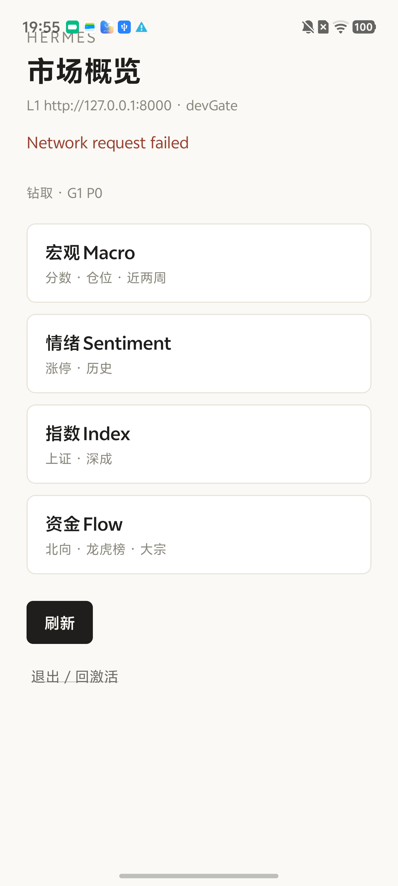

# HITL · hermes GF · R5 B5 product tabs + delivery hook

**Date:** 2026-08-31  
**Map:** wayfinding-hermes R5 · Task B5  
**App:** `~/code/hermes-gf-app` · module `hermes-market`  
**Device:** `10CEC62C7R000E3` (vivo)

## Product shell (B1–B4)

| Tab | Label | Screen / L1 |
|-----|-------|-------------|
| 概览 | 概览 | Health · Macro · Sentiment · index drill-down |
| 资金 | 资金 | FlowScreen (`/v1/flow/*`) |
| 消息 | 消息 | Messages list + detail (`/v1/messages`, `/v1/messages/:id`) |
| 我的 | 我的 | Session, API env, `update_id` / load mode, sign-out |

Shell gate (A2): `gateBundleLoad` → `__HERMES_UPDATE_ID__` / `__HERMES_LOAD_MODE__` readable on **我的**. See [`hermes-r5-a2-gate-mount-2026-08-31.md`](./hermes-r5-a2-gate-mount-2026-08-31.md).

## Delivery hook (`run-hermes-delivery.mjs`)

After `Device.overview_ui`, step **`Device.product_tabs`** (AUTO-HITL, **soft-fail**):

1. Re-read `/sdcard/ui.xml` from uiautomator dump.
2. Assert Unicode labels **资金 · 消息 · 我的** all present in dump.
3. **Soft-fail** if missing (overall script still PASS when hard gates pass); **hard fail** only for AFK / L4 / overview steps.

```bash
# Full run (device + L1)
node scripts/run-hermes-delivery.mjs

# AFK + L4 only (no adb)
node scripts/run-hermes-delivery.mjs --skip-device
```

Artifacts: `docs/hitl/hermes-delivery-latest.json` + `.md` (timestamped JSON copy).

## Run 2026-08-31

| Gate | Result |
|------|--------|
| L1 + Prod + SSH + L4 steel/js_gate | ✅ PASS |
| Device.overview_ui | ✅ overview visible |
| Device.product_tabs | ⚠️ **soft-fail** — found `资金` only; `消息` · `我的` not in uiautomator dump |

**Overall:** `ok: true` (12 hard pass, 1 soft-fail). Stamp: `2026-08-31T11-55-41-026Z`.

Likely cause: tab bar labels not all exposed as `text=` in one dump frame, or device build predates full B3/B4 tab labels. Manual: tap **消息** / **我的** and re-dump; rebuild Release if labels absent in app.

## Verify manually

1. `adb reverse tcp:8000 tcp:8000` · launch `com.hermesgfapp/.MainActivity`.
2. Skip activate if shown → **市场概览** visible.
3. Bottom bar: **概览 · 资金 · 消息 · 我的** — tap each; **我的** shows load mode / `update_id`.
4. Re-run `node scripts/run-hermes-delivery.mjs` for automated regression.

## Screenshot



## Prior

- M-H5 P0 E2E hub drill: [`hermes-mh5-p0-e2e-2026-08-31.md`](./hermes-mh5-p0-e2e-2026-08-31.md)
- A2 gate mount: [`hermes-r5-a2-gate-mount-2026-08-31.md`](./hermes-r5-a2-gate-mount-2026-08-31.md)
