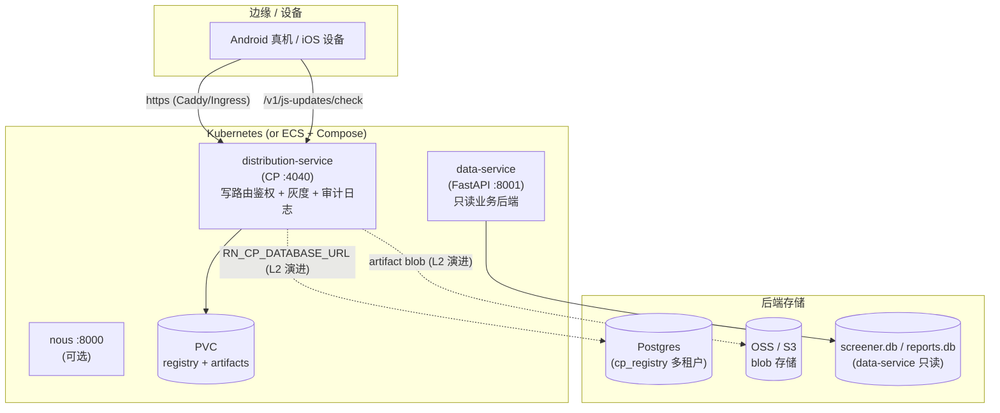

# Distribution Service — 生产形态（Production Shape）

> 定位：从「单机 demo / L1 self-host」到「企业推广可部署」之间的差距与演进路径。
> 不是替代现有 runbook，而是给出**生产部署的拓扑、多租户演进、灰度/审计落地**的统一视图。

## 1. 拓扑



- **distribution-service**：host 安装门户 + JS/离线包 train + 共享 CP API。写路由（promote/block/kill/pause/resume/rollout/dependency-manifest/device-lane）落**统一审计日志**。
- **data-service**：独立的、只读的 Python FastAPI 后端（`/v1/health`、`/v1/global/latest`、`/v1/macro/indicators`、`/v1/benchmark`、SSE 等），供业务离线包消费。
- **Nous**：现有业务 API 后端，`/v1/health`、`/openapi.json` 等。

## 2. 两条部署路径

| 路径 | 工具 | 适用 |
|------|------|------|
| **ECS + Compose** | `deploy/distribution-service/docker-compose.yml` | 单机起步、私有化交付 |
| **Kubernetes** | `deploy/distribution-service/helm/` | 企业推广、多副本、多租户 |

### 2.1 ECS + Compose（沿用 L1）

```bash
cp deploy/distribution-service/.env.example deploy/distribution-service/.env
# 设 RN_CP_TOKEN + DATA_SERVICE_API_KEY
docker compose -f deploy/distribution-service/docker-compose.yml up -d --build
```

- data-service 现在与 distribution 并行编排（`DATA_SERVICE_CONTEXT` 指向 `~/code/data-service`）。
- 两个服务都带 healthcheck；`curl http://127.0.0.1:4040/health` 与 `curl http://127.0.0.1:8001/v1/health`。

### 2.2 Kubernetes（Helm）

```bash
helm install distribution-service deploy/distribution-service/helm \
  --set distribution.env.cpToken='<strong-secret>' \
  --set dataService.enabled=true
```

- distribution 与 data-service 各自 Deployment + Service 端口；
- `distribution.persistence.enabled`（默认 true）挂 PVC；（可选）data-service 用 hostPath 只读挂载源 SQLite；
- Ingress 双域名 `dist.tiangong.local` / `dist-staging.tiangong.local`。

## 3. 多租户演进路径

| 阶段 | 鉴权 / 隔离 | 存储 | 说明 |
|------|------------|------|------|
| **当前（L1）** | 单值 Bearer `RN_CP_TOKEN` 保护写路由 | file (`registry.json`) 或 `sqlite` | 单机 demo / 私有化单租户 |
| **演进（L2）** | per-tenant（`tenant_id` + `product_app`） | Postgres（`RN_CP_DATABASE_URL`） | 见 `registry-postgres.ts` 的 DDL 与 `CpRegistryTenantKey` |

- 单值 token **不是** per-tenant 隔离——这是已知 backlog（`arch-onboarding §6`）。演进点明确：`RN_CP_DATABASE_URL` 一设，`/v1/service` 报 `postgres=true`，registry 行按 `(tenant_id, product_app)` 作用域切分。
- token 形态演进（单值 → per-tenant JWT / API-key 表）是独立 backlog，不在本 runbook 落地代码。

## 4. 灰度 + 审计落地

### 4.1 灰度设备切片（C6.3）

- 每个设备可被 PUT 到 `staging` / `production` / `gray` lane：

```bash
curl -X PUT "$CP/v1/devices/$SERIAL/lane" \
  -H "Authorization: Bearer $RN_CP_TOKEN" \
  -H "Content-Type: application/json" \
  -d '{"serial":"'$SERIAL'","lane":"gray"}'

curl "$CP/v1/devices/$SERIAL/lane"   # → {"serial":..., "lane":"gray"}
```

- registry 结构含 `gray` 数组 + `devices` 路由表；`/v1/candidates?lane=gray` 和 `/v1/js-updates?lane=gray` 过滤生效。
- `device-manifest.json`（`.rn/` 下）是设备切片配置（`allow` 列表 + `default_lane`），首次 seed 自动生成。

### 4.2 七阶段审计日志（C6.4）

- 所有 CP **写路由**落结构化审计行：`<projectRoot>/.rn/distribution-lab/logs/cp-audit.log`。
- 每行 JSON：`{ ts, method, path, actor, outcome, detail }`，`outcome ∈ {ok, denied, error}`。
- 鉴权失败（401/403）也落 `denied` 条目——企业合规审计可据此追查。

```bash
tail -5 .rn/distribution-lab/logs/cp-audit.log | jq -c '{ts,method,path,actor,outcome}'
```

## 5. 上市前高质量交付产物核对

| 产物 | 位置 | 状态 |
|------|------|------|
| 真签名（工业 CA） | `rn-delivery sign`（当前 digest-seal 占位） | 🟡 真 CA 是 backlog |
| SBOM（CycloneDX） | `rn-delivery sign` 写入 SBOM slot（stub） | 🟡 真 SBOM 是 backlog |
| 审计日志 | `cp-audit.log` | ✅ 已落地 |
| 灰度设备切片 | `/v1/devices/:serial/lane` + `gray` lane | ✅ 已落地 |
| 鉴权 | `RN_CP_TOKEN`（单值，写路由） | ✅ L1 现状 |
| 多租户 | `RN_CP_DATABASE_URL` → Postgres | 🟡 契约就位，真后端 L2 |
| 健康检查 | distribution + data-service Docker healthcheck / K8s probe | ✅ 已落地 |
| Helm chart | `deploy/distribution-service/helm/` | ✅ 已落地 |

## 6. 相关文档

- 本地服务：`distribution-service-local-server.md`
- ECS：`distribution-service-aliyun-ecs.md`
- OpenAPI：`../specs/distribution-service.openapi.yaml`
- 存储规范：`../specs/distribution-service-storage.md`
- 架构自测手册：`../architecture/arch-onboarding.md`