> **2026-08-31:** Topology B「业务源嵌壳 modules/」**DEPRECATED**。工业终点 → 方案 D · map #43 · 本地 `~/code/desk` + `~/code/host-android`（目标 GitHub `tiangong-labs/desk` · `tiangong-labs/host-android`）。

# Hermes GF App — 工业级系统架构方案

**Map:** [#29](https://github.com/client-platform-labs/rn/issues/29)  
**关联:** [DESTINATION.md](DESTINATION.md) · [R1](research/R1-ecosystem-architecture.md) · [R2](research/R2-screen-api-inventory.md)  
**状态:** 草案 v1.1（边界 HITL 2026-08-31：Nous=服务层 · GF=交付层；G1–G4 路径仍 *待决策*）  
**术语:** [`CONTEXT.md`](CONTEXT.md)

---

## 0. 文档范围

**边界锚点:** Nous 提供 L1 数据/能力服务；GF App 只做客户端交付（壳 + Bundle + rn 平台）。五仓→nous 为服务侧 Depth，不挡本图 L4。

本文给出 **新 GF RN App（Hermes 投研）** 的完整工业架构——从用户设备到数据服务、从日常开发到 CP 发布的 **全链路**。

| 读者 | 看什么 |
|------|--------|
| 产品 / 架构 | §1 上下文 · §2 容器 · §5 双列车 |
| 客户端 | §3 运行时 · §4 仓拓扑 · §8 Module 内部分层 |
| 后端 | §6 业务域 · §7 数据流 |
| 发布 / 运维 | §9 部署 · §10 Delivery · §11 CP |
| 验收 | §12 环境矩阵 · §13 与里程碑映射 |

---

## 1. 系统上下文（C4 Level 1）

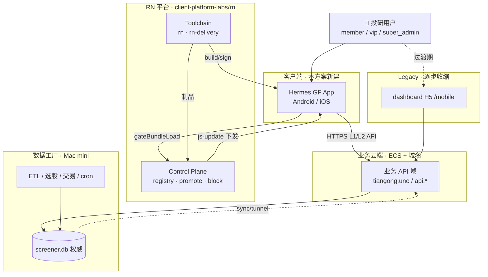

**系统边界说明：**

- **Hermes GF App** = 新系统核心交付物（非 H5 换壳）
- **RN 平台** = 通用工业能力（Toolchain + Delivery + CP），Hermes 是首个真实业务实例
- **业务云端** = 现有 ECS + API，RN 通过 HTTP/SSE 消费
- **数据工厂** = Mac 上 screener/advisor/cron，**不重写**

---

## 2. 容器架构（C4 Level 2）

### 2.1 总览

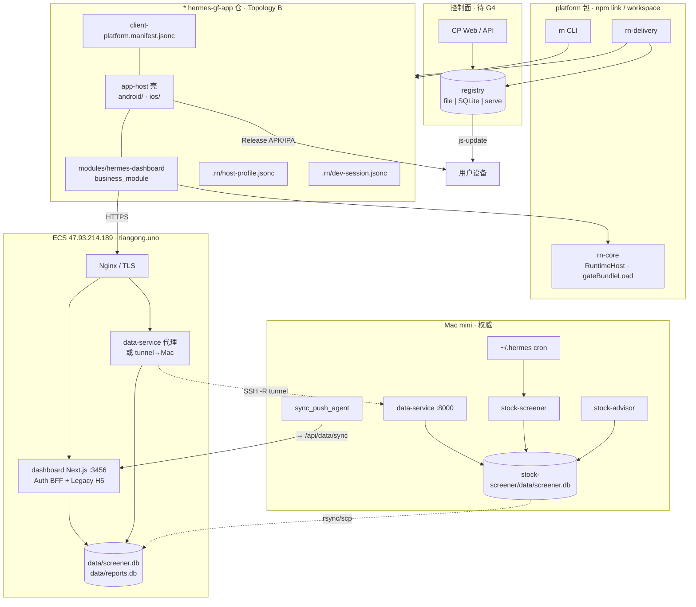

### 2.2 容器职责表

| 容器 | 技术 | 职责 | 新建/保留 |
|------|------|------|-----------|
| **app-host** | RN 0.87 · Gradle · Xcode | 进程壳、原生能力、Debug Host、Release 宿主 | **新建** |
| **modules/hermes-dashboard** | RN · TypeScript | 业务 UI、导航、API Client、状态 | **新建** |
| **rn-core** | TS · native bridges | RuntimeHost、gateBundleLoad、dispose、EventBus | 平台已有 |
| **Control Plane** | rn-delivery serve / file | 制品登记、promote、block、JS 选择器 | 平台已有 · 部署待 G4 |
| **data-service** | FastAPI | 只读 REST + SSE over SQLite | **保留 + 扩展** T2 |
| **Auth BFF** | Next.js `/api/activate/*` | 邀请码、JWT、device_fp | **保留或下沉** G2 |
| **dashboard H5** | Next.js `/mobile/*` | Legacy 移动 Web | **逐步退役** |
| **stock-screener** | Python | ETL → screener.db | **保留** |
| **stock-advisor** | Python | 交易/sim/quant 写库 | **保留** |
| **~/.hermes** | bash · launchd | cron、备份、隧道 | **保留** |

---

## 3. 客户端运行时架构（Runtime SDK 三层）

### 3.1 宿主三层 + Module

```mermaid
flowchart TB
  subgraph device["用户设备 · Hermes GF App"]
    subgraph kernel["AppHostKernel"]
      CFG["配置 · env · secrets 注入"]
      SEC["安全 · cert pinning · root检测"]
      OBS["观测 · crash · A6 信号"]
      DEG["崩溃降级 · baseline 回退"]
    end

    subgraph runtime["RuntimeHost"]
      BR["BundlerResolver<br/>dev: Metro · release: HBC"]
      GL["gateBundleLoad<br/>指纹 · 验签 · 槽位"]
      CAP["CapabilityRegistry<br/>Network · SecureStore · SSE"]
      BUS["ModuleEventBus"]
      LC["LifecycleController<br/>Boot→Ready→Background"]
    end

    subgraph surface["SurfaceHost · GF"]
      NAV["RN Navigation<br/>Stack · Tab"]
      ROOT["Root Surface"]
    end

    subgraph module["business_module: hermes-dashboard"]
      subgraph features["Feature 层"]
        ACT["ActivateFlow"]
        OVR["OverviewHub"]
        MAC["Macro · Sentiment · Flow"]
        MSG["Messages"]
        TRD["TradingHub"]
      end
      subgraph shared["Shared 层"]
        API["ApiClient · SSEClient"]
        AUTHC["SessionStore · SecureStore"]
        UI["DesignSystem · Charts"]
      end
      features --> shared
    end

    kernel --> runtime
    runtime --> surface
    surface --> ROOT
    ROOT --> module
  end

  METRO["Metro :8081<br/>dev only"] -.->|USB/WiFi| BR
  CPART["js-update HBC<br/>release"] --> GL
  HTTPS["业务 API"] <-- API
```

### 3.2 Dev vs Release 运行时差异

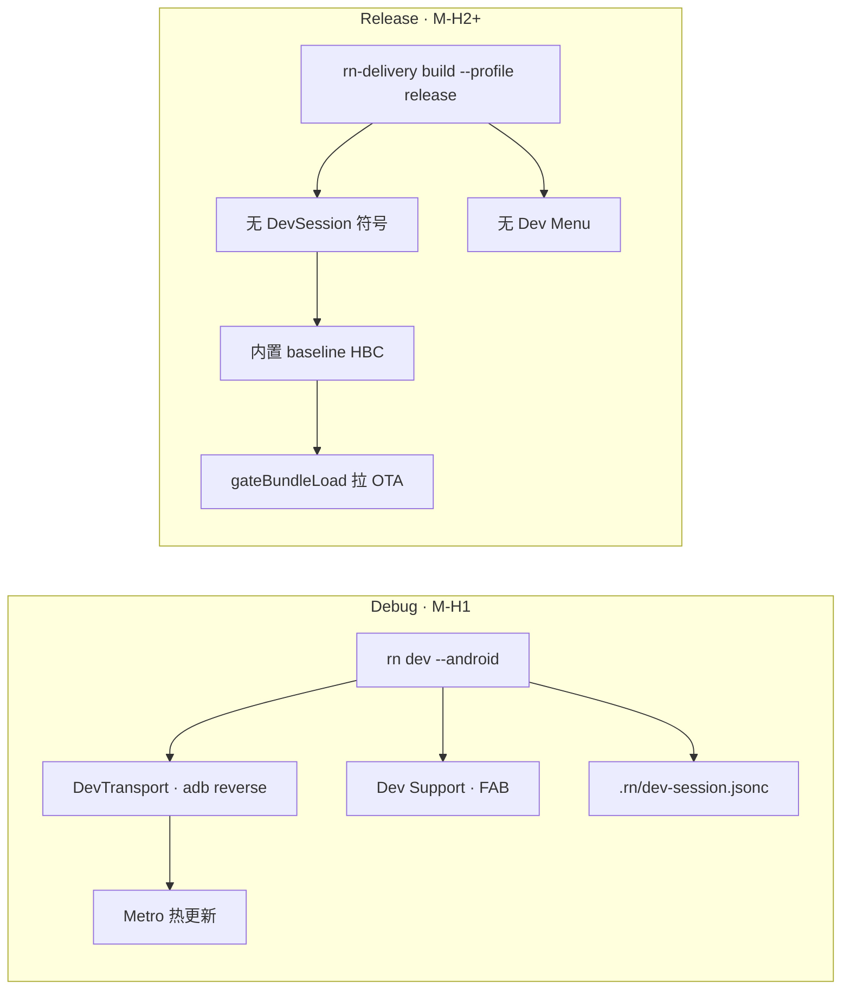

| 维度 | Debug | Release |
|------|-------|---------|
| JS 来源 | Metro 实时 | baseline + OTA js-update |
| 配置 | dev-session.jsonc |  baked env + remote config |
| 原生调试 | Debug Host · FAB | 无 |
| API 指向 | local/staging（可切换） | production（G4 定） |
| 门禁 | doctor L3e | Release 洁净扫描 |

---

## 4. 工程仓拓扑（Topology B）

### 4.1 目录结构（*待 G3 确认路径*）

```text
~/code/hermes-gf-app/                    # 壳仓根 · G3
├── android/                             # app-host 原生工程
├── ios/
├── app-host/                            # RN 壳入口（或根 index）
├── modules/
│   └── hermes-dashboard/                # business_module
│       ├── src/
│       │   ├── features/                # 按屏幕域划分
│       │   ├── shared/                  # api · auth · ui
│       │   └── app/                     # navigation root
│       ├── package.json
│       └── metro.config.js
├── client-platform.manifest.jsonc       # module 注册 · fingerprint 输入
├── .rn/
│   ├── host-profile.jsonc               # surfaceKind: greenfield
│   └── dev-session.jsonc                # 端口表 · protocol（gitignore dev）
├── .rn/delivery/                        # 本地 CP stub · registry
└── package.json                         # workspace root
```

### 4.2 Manifest 与身份脊柱实例

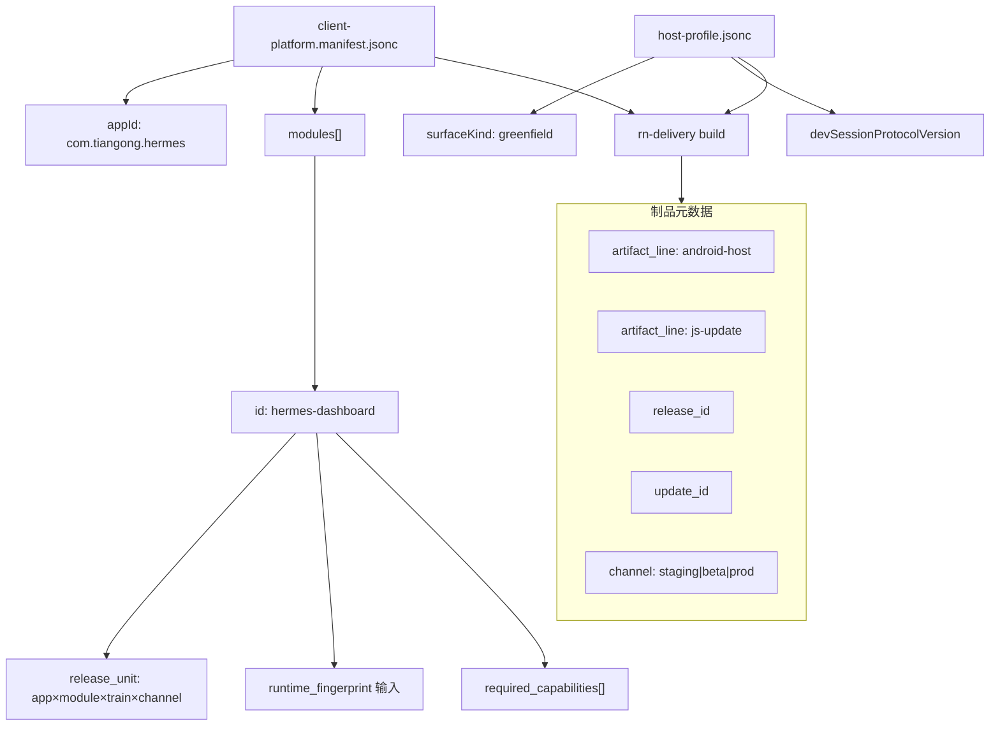

---

## 5. 双列车 + 制品流

### 5.1 两列车并行

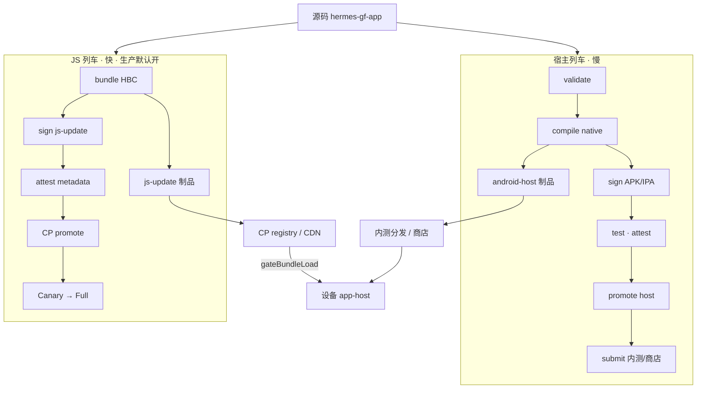

### 5.2 回滚语义分岔

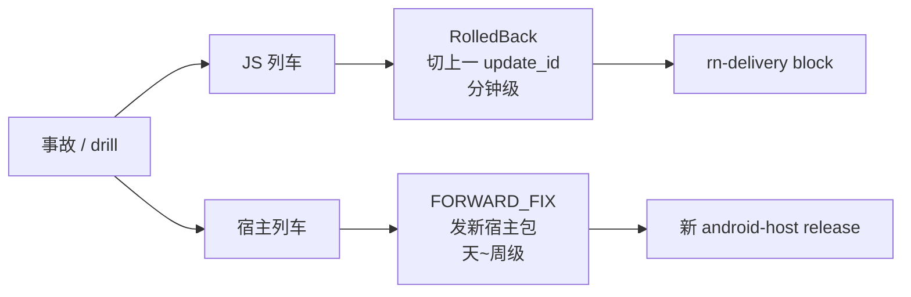

---

## 6. 业务域架构（~/code 五面）

### 6.1 逻辑分面

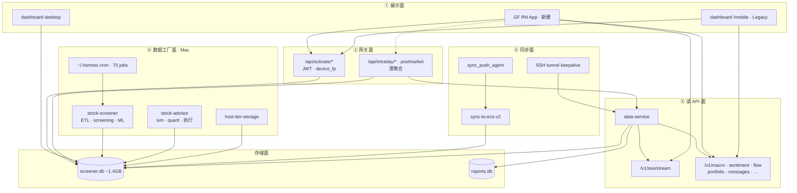

### 6.2 六仓映射

| ~/code 仓 | 分面 | 与新 App 关系 |
|-----------|------|---------------|
| `dashboard` | ①② + ECS 部署 | mobile UI **由 RN 替代**；Auth BFF **保留** |
| `data-service` | ③ | RN **主依赖**；T2 扩展 SQLite-only 端点 |
| `stock-screener` | ④ | 无变更；写 screener.db |
| `stock-advisor` | ④ | 无变更；RN 读组合/风险 API |
| `nous` | ④③ 未来 | 跟踪；`nous serve` 兼容 data-service |
| `host-tier-storage` | ④ infra | 无变更 |

---

## 7. 端到端数据流

### 7.1 日批 → 用户屏幕

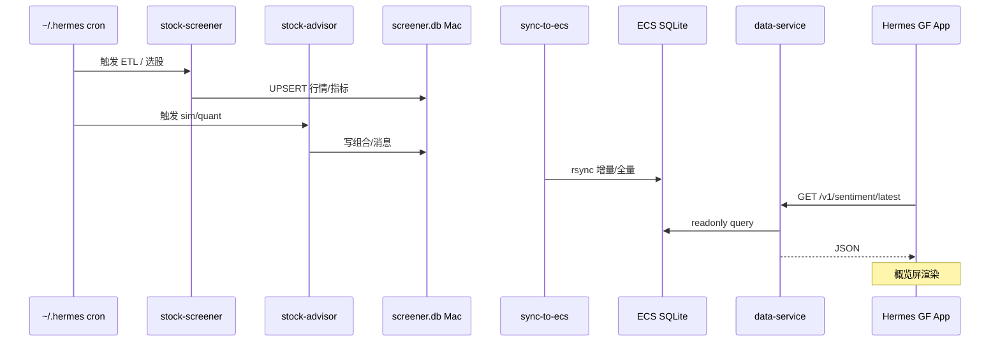

### 7.2 激活与会话

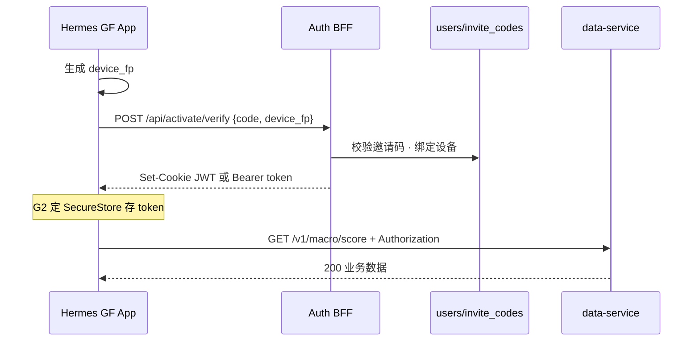

### 7.3 JS OTA 加载

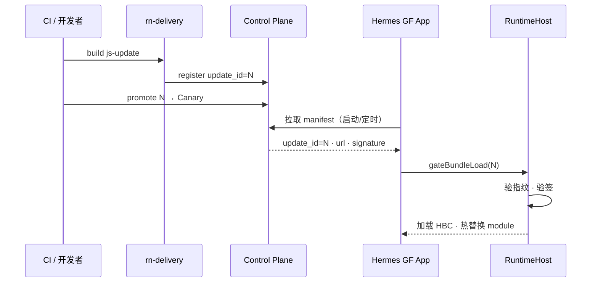

---

## 8. Module 内部分层（hermes-dashboard）

### 8.1 功能域（对齐 R2 · 待 G1 裁剪）

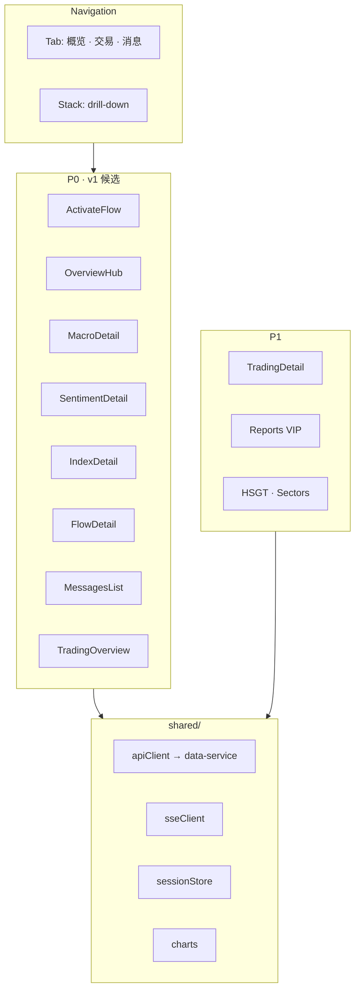

### 8.2 API Client 分层

| Client | 目标 | 屏幕 |
|--------|------|------|
| `DataServiceClient` | `/v1/*` | 概览、macro、sentiment、flow、messages |
| `AuthClient` | `/api/activate/*` | 激活、自动登录 |
| `SessionManager` | SecureStore + JWT | 全局 |
| `SSEClient` | `/v1/sse/stream` | 消息、广度（v1+） |
| `BffClient` | `/api/intraday/*` 等 | P2 屏幕 · 长期下沉 |

**禁止：** Module 内 `better-sqlite3`、quant 解密密钥、直连 screener.db。

---

## 9. 物理部署拓扑

### 9.1 现网 + 目标态

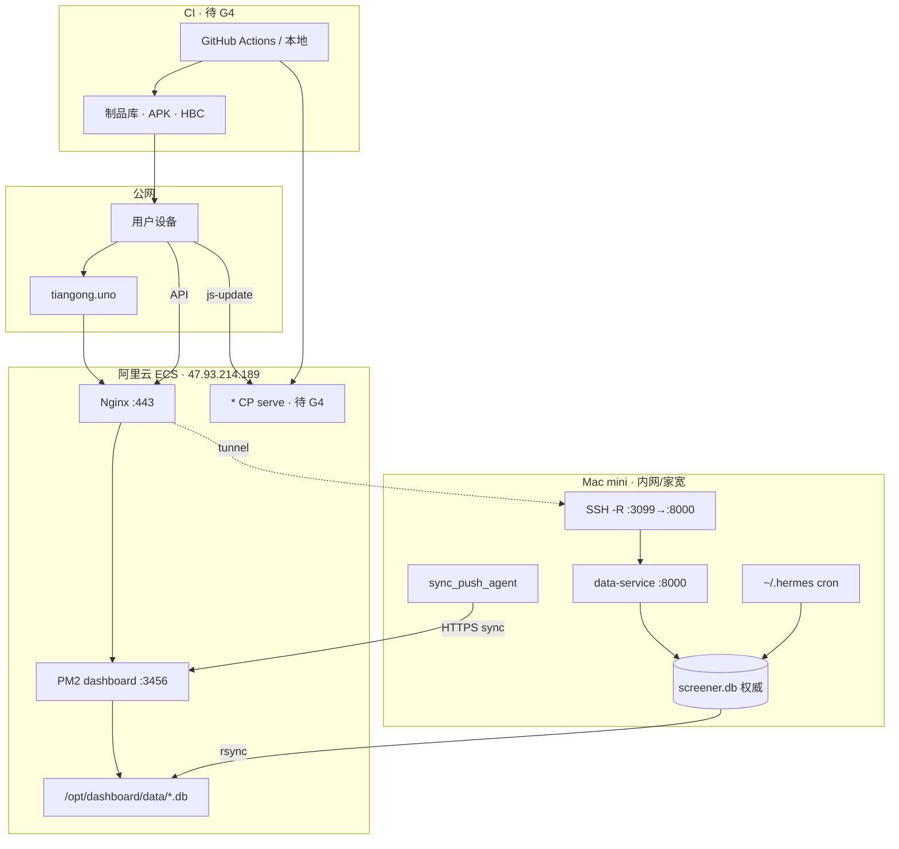

### 9.2 三环境矩阵

| 环境 | GF App | 业务 API | CP / registry | 数据来源 |
|------|--------|----------|---------------|----------|
| **local** | Metro + Debug Host | `localhost:8000` 或 tunnel | `.rn/delivery/` 本地 file | Mac screener.db |
| **staging** | 候选 APK + staging channel | ECS 或 staging 子域 | serve / file · staging | ECS 同步副本 |
| **production** | promoted 宿主 + prod channel | `tiangong.uno` | promoted registry | ECS 同步库 |

---

## 10. Delivery 管线（C 平面详图）

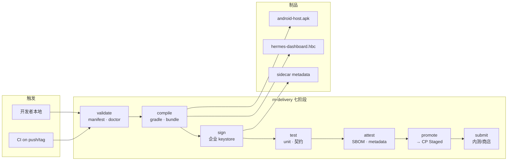

**Hermes 硬门禁（L4 前必过）：**

- Release APK 无 DevSession / Dev Support 符号（M-H2）
- `gateBundleLoad` 验签失败 → 拒绝加载（M-H4）
- SBOM + update_id 进 registry（M-H3+）

---

## 11. Control Plane（D 平面详图）

### 11.1 状态机（JS 列车实例）

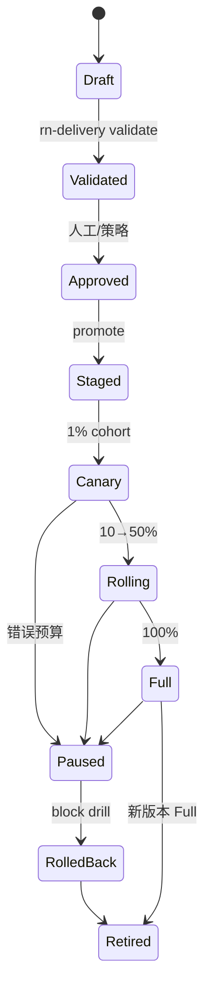

### 11.2 JS 选择器（客户端）

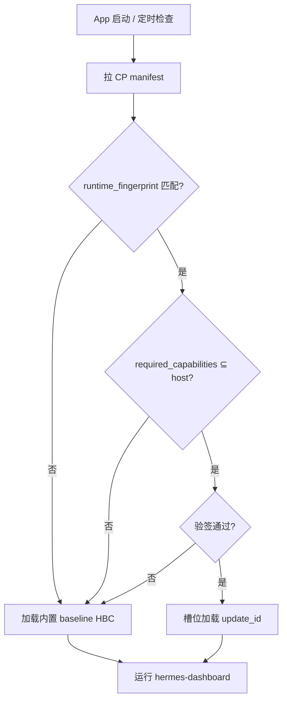

---

## 12. 安全与治理

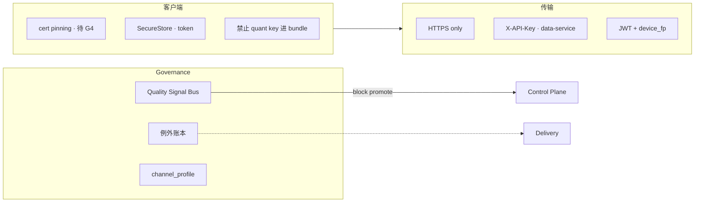

| 红线 | 说明 |
|------|------|
| 无 SQLite 进 App | 全部走 API |
| 无密钥进 JS | quant 解密留服务端 |
| 无 Dev 残留进 Release | M-H2 扫描 |
| JS 生产默认开 | 但受 fingerprint + 放行档约束 |
| 合规 | 热更新不改主功能/权限/隐私范围 |

---

## 13. 里程碑 ↔ 架构就绪度

| 里程碑 | 架构就绪 | 关键交付 |
|--------|----------|----------|
| M-H0 | §4 仓拓扑 · §6 manifest 合同 | G3 · doctor L3e |
| M-H1 | §3 Dev 路径 · §7.2 Auth 通 | T4 · P1 |
| M-H2 | §3.2 Release 洁净 | 扫描报告 |
| M-H3 | §10 宿主制品 · §9 可安装 | release --install |
| M-H4 | §7.3 OTA · §11 选择器 | promote + gateBundleLoad |
| M-H5 | §8 全功能域 · §7.1 数据通 | P2 E2E + block |
| M-H6 | §12 A6 挡 promote | Depth |

---

## 14. 待 HITL 决策（影响架构图标注 *）

| # | 决策 | 影响章节 |
|---|------|----------|
| G1 | v1 屏幕范围 | §8.1 |
| G2 | Bearer vs Cookie · Auth 服务落点 | §7.2 · §6 gateway |
| G3 | 仓路径 `hermes-gf-app` vs nous | §4.1 |
| G4 | CP 落点 · 三环境 URL · Android/iOS 优先级 | §9 · §11 |

---

## 15. 相关文档

- [DESTINATION.md](DESTINATION.md) — 地图终点与验收串
- [map.md](map.md) — 子票索引
- [research/R1](research/R1-ecosystem-architecture.md) — ~/code 盘点
- [research/R2](research/R2-screen-api-inventory.md) — 屏幕/API 对照
- [architecture-roadmap.md §5](../docs/architecture-roadmap.md) — 平台 Steel Thread
- [blueprint/00-entry.md](../blueprint/00-entry.md) — 五边界权威
