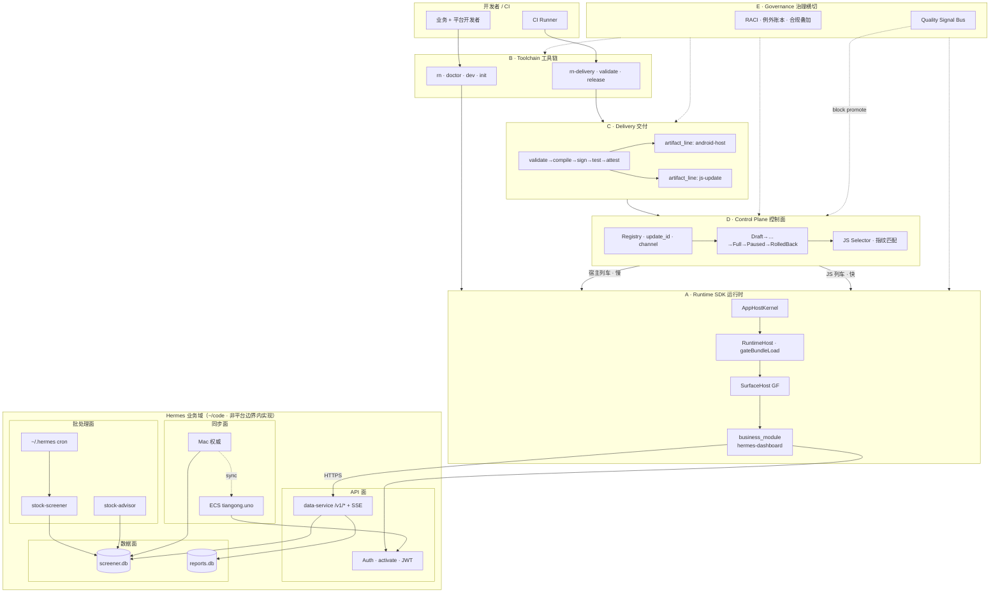
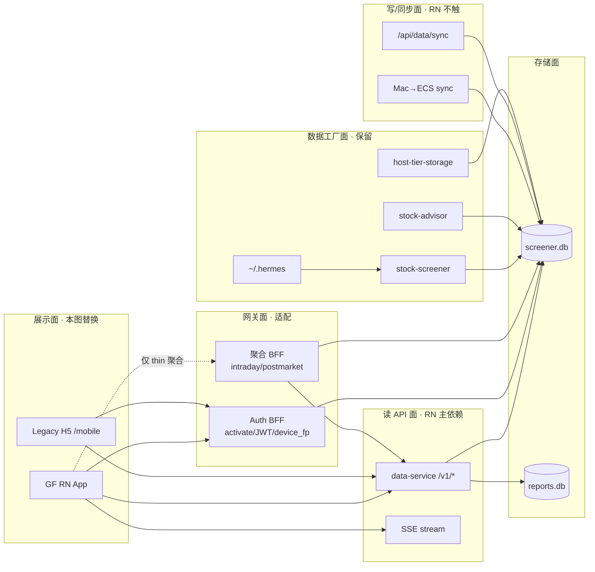

# Hermes GF App — 工业级全链路地图终点

**Map:** [#29](https://github.com/client-platform-labs/rn/issues/29)  
**定位:** 以 ~/code 投研业务为底，从 0 到 1 跑通 **GF 全链路**（可多 Bundle）。平台 Spine 已在 demo 仓证明；本图证明 **真实业务可接入且可推广**。

**边界锚点（HITL 2026-08-31）:** 见 [`CONTEXT.md`](CONTEXT.md)

| 层 | 角色 |
|----|------|
| **Nous** | **服务层** — L1 数据/能力（`nous serve` `/v1/*` + SSE；过渡可等同 data-service） |
| **GF App** | **客户端交付层** — Topology B 壳 + business_module + rn-delivery/CP |

_Avoid:_ 五仓物理合并挡 L4；App 直连 SQLite；ETL/交易进 Bundle。

---

## 1. 北极星（一句话）

**Hermes GF App 达到 L4**：真机可装宿主候选、JS 列车可 promote/block、`gateBundleLoad` 真加载、经 Nous L1 联通业务、身份脊柱可追溯。

L5 与 nous monorepo cutover 均为 Depth，不挡 L4 关单。

---

## 2. 系统上下文：平台五边界 × Hermes 业务域



**关键分界：**

| 属于平台证明（本图必须走通） | 属于业务域（保留/适配，不重写） |
|------------------------------|----------------------------------|
| 壳 + module 拓扑、dev/release 分离 | stock-screener / stock-advisor ETL |
| 双列车制品、签名、晋级 | screener.db 权威在 Mac |
| CP 状态机、promote/block | ECS SQLite 同步、现有 cron |
| gateBundleLoad、dispose、A6 归因 | dashboard H5（逐步退役 mobile） |
| doctor L3e、identity spine | nous 整合（跟踪，不阻塞） |

---

## 3. 身份脊柱（Hermes 实例化）

对齐 [blueprint/00-entry.md](../blueprint/00-entry.md)：

```text
release_id          hermes-gf-app · 2026-Q3
  └─ artifact_line
       ├─ android-host   （宿主 APK · 慢列车 · 商店/内测通道）
       └─ js-update       （business_module=hermes-dashboard · 快列车）
            └─ runtime_fingerprint   （RN 0.87 + Hermes + New Arch · 随宿主变）
                 └─ capability_set    （Networking · SecureStore · SSE · …）
                      └─ update_id / channel   （staging · beta · production）
                           └─ compatibility_profile_id
```

**Hermes 特有约束：**

- `business_module` = `hermes-dashboard`（Topology B 外置 module）
- Auth 会话携带 `device_fp` — 进 A6 归因维度，不进 fingerprint
- Quant 解密 **不得**进 JS bundle — 走 API/BFF（治理红线）

---

## 4. 双列车策略（Hermes v1）

| 列车 | 制品 | 变更触发 | v1 节奏 | 回滚语义 |
|------|------|----------|---------|----------|
| **宿主/商店（慢）** | `app-host` APK | RN 升级、原生能力、权限、签名 | 周~月 | `FORWARD_FIX`（新发宿主） |
| **JS（快，生产默认开）** | `js-update` HBC | 屏幕、业务逻辑、API 对接 | 日~周 | 真·RolledBack（切上一 update_id） |

**v1 放行档建议（待 G4 HITL）：**

| 变更 | 放行档 | 列车 |
|------|--------|------|
| 新屏幕 / API 对接 / UI 修复 | `js-standard` | JS |
| 新增 SecureStore / 原生推送 | `needs-native` | 宿主 |
| 登录主路径大改 | `js-gated` | JS（人工 Canary） |

---

## 5. 推广等级路线图（Hermes 里程碑）

平台 L0–L5 在 demo 仓已证；本图按 **同一标准** 在 Hermes 业务仓重跑：

| 里程碑 | 平台等级 | 验收（Hermes 实例） | 子票 |
|--------|----------|---------------------|------|
| **M-H0** 合同就位 | L0 | manifest + host-profile + API 契约 + `rn doctor` L3e | G3 · R1/R2 |
| **M-H1** 开发工业 | L1 | `rn dev` 真机 · module Metro · dispose HITL · 连 staging API | T4 · P1 |
| **M-H2** Release 洁净 | L2 | `--profile release` 无 DevSession/Dev Support | T4 |
| **M-H3** 宿主候选 | L3 | `validate` + `release --install` · metadata 完整 | T4 |
| **M-H4** JS 列车贯通 | L4− | js-update promote → `gateBundleLoad` 真加载一屏 | T3 · P1 |
| **M-H5** 业务 L4 | **L4** | v1 屏幕集 E2E + promote + **block** 各一次 | P2 · T2 |
| **M-H6** 质量闭环 | L5 path | A6 信号阻断 promote 一次（Depth） | 后续 |

**地图关单点 = M-H5（L4）**，不是「有个 APK」或「能调 API」。

---

## 6. 工业验收串（Steel Thread · Hermes）

```bash
# ── B · Toolchain ─────────────────────────────────────
cd <hermes-gf-root>          # G3 定路径
rn doctor                    # L3e · topology B
rn dev --android             # M-H1 · 真机 Debug Host

# ── Hermes 业务域 · API 联通 ───────────────────────────
curl -sf "$API/v1/health"
# 激活 → JWT（G2 定 Bearer/SecureStore 形态）

# ── C · Delivery · 宿主列车 ────────────────────────────
rn-delivery build --platform android --profile release
rn-delivery validate
rn-delivery release --install              # M-H3

# ── D · Control Plane · JS 列车 ──────────────────────
# promote hermes-dashboard js-update → update_id=N
# 客户端 gateBundleLoad(N) 加载成功        # M-H4

# ── 业务 E2E ─────────────────────────────────────────
# 真机：激活 → v1 主路径（G1 定范围）      # M-H5

# ── 回滚演练 ─────────────────────────────────────────
rn-delivery block --module hermes-dashboard --reason 'drill'
# JS → RolledBack；宿主 → 停止继续放量
```

---

## 7. ~/code 生态 — 分面职责（全面梳理）

不是「六个 repo 列表」，而是 **业务域分面 + RN 接入点**：

### 7.1 分面架构



### 7.2 各组件工业决策

| 组件 | 分面 | v1 策略 | RN 接入 |
|------|------|---------|---------|
| **dashboard** | 展示+网关 | mobile **退役**；BFF/auth **保留或下沉** | 不复用 Next SSR |
| **data-service** | 读 API | **扩展** v1 端点（T2） | 主依赖 |
| **stock-screener** | 数据工厂 | **不动** | 无直连 |
| **stock-advisor** | 数据工厂 | **不动** | 读组合/风险 API |
| **nous** | 未来整合 | 跟踪；API 兼容 data-service | 不阻塞 |
| **host-tier-storage** | 基础设施 | **不动** | 无感知 |
| **~/.hermes** | 运维/批处理 | **不动** | 无直连 |
| **ECS** | 部署 | 现网 + 增量 API 部署 | prod base URL |

### 7.3 API 契约分层（RN 接入规范）

| 层级 | 契约 | 版本策略 | 负责票 |
|------|------|----------|--------|
| L1 读 | `/v1/*` + SSE |  semver 文档化 | T2 |
| L2 会话 | activate/JWT/device_fp | 与 H5 1:1 或 G2 新形态 | G2 |
| L3 聚合 | intraday/postmarket | v1 可保留 BFF；长期下沉 L1 | T2 Depth |
| L4 运维 | sync/rebuild/admin | **RN 禁止** | — |

---

## 8. 环境与部署拓扑

| 环境 | 用途 | 宿主/JS | 业务 API | 数据 |
|------|------|---------|----------|------|
| **local** | 开发 | Metro + Debug Host | Mac data-service :8000 或 tunnel | 本地 screener.db |
| **staging** | CP 集成 / QA | 候选 APK + staging channel | ECS 或 tunnel | 同步副本 |
| **production** | 内测/商店 | promoted 宿主 + Full JS | tiangong.uno API | ECS 同步库 |

**部署职责矩阵（待 T3 + G4）：**

| 组件 | 部署目标 | 工具 |
|------|----------|------|
| app-host APK | 内测分发 / 商店 | rn-delivery → submit |
| js-update | CP registry → CDN/本地 | rn-delivery promote |
| CP serve | 本地 / ECS / CI artifact | T3 定 |
| data-service | ECS（现网） | 现有 + T2 扩展 |
| Auth BFF | ECS 随 dashboard 或独立 | G2 |
| 批处理 | Mac + cron | 不动 |

---

## 9. 子票与里程碑映射（修订）

| 阶段 | 工业含义 | 票 |
|------|----------|-----|
| 架构盘点 | 业务域分面 + 接入点 | R1 ✅ · R2 ✅ |
| HITL 决策 | 范围/Auth/拓扑/双列车/环境 | G1–G4 |
| L0–L1 | 合同 + dev 环 | T4 scaffold · P1 PoC |
| 业务 API | 读/会话契约就绪 | T1 ECS · T2 v1 端点 |
| L2–L4 | 交付 + CP + E2E | T3 部署方案 · P2 全链路 |
| L5 Depth | 质量挡板 | 后续票 |

---

## 10. 明确不做（边界）

- 不把 stock-screener/nous **重写**进 RN 或 Node
- 不用 RN **直连 SQLite**
- 不另造第二套 DevSession / delivery / CP 协议
- 不把「ECS 上跑 Next.js」当 RN 终点——H5 是 **Legacy 展示面**
- 不跳过 M-H2 Release 洁净直接「能跑就行」

---

## 附录：文档索引

- **[ARCHITECTURE.md](ARCHITECTURE.md)** — 工业级完整架构方案（C4 · 运行时 · 双列车 · 部署 · 时序图）
- [R1 生态架构](research/R1-ecosystem-architecture.md)
- [R2 屏幕/API 对照](research/R2-screen-api-inventory.md)
- 平台权威：[architecture-roadmap.md §5](../docs/architecture-roadmap.md) · [gf-bf-unified-model.md](../docs/agents/gf-bf-unified-model.md)
