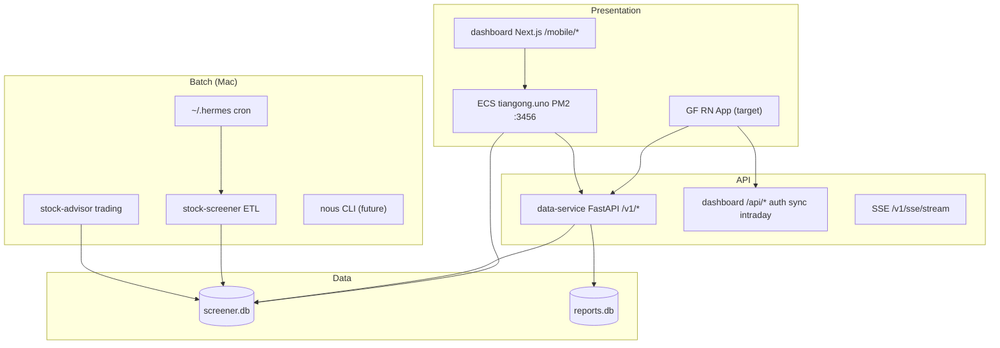

# [hermes/R1] ~/code 生态架构与 ECS 拓扑盘点

GitHub: #30 · Map: #29

## Executive Summary

Hermes 投研栈是 **Mac 权威数据源 + 阿里云 ECS 展示层** 的混合架构。`~/code` 下六仓各司其职；生产环境非 Docker/K8s，而是单 VPS（`47.93.214.189` → `tiangong.uno`）上 **PM2 跑 Next.js standalone**，SQLite 从 Mac 同步。

GF RN 迁移：**替换 `dashboard` `/mobile/*` H5**；**保留** `data-service` `/v1/*`、Mac 批处理管线、ECS 同步链路。

## Mermaid



## Repo Table

| Repo | Role | RN Impact |
|------|------|-----------|
| **dashboard** | Next.js 15 UI + auth + sync receiver | **High** — replace `/mobile/*` |
| **data-service** | Read-only REST + SSE over SQLite | **None** — stable contract |
| **stock-screener** | ETL → screener.db (~1.4GB) | **None** — batch stays Mac |
| **stock-advisor** | sim/quant execution, scoring | **None** — RN reads via API |
| **nous** | Consolidation monorepo (in progress) | **Low now** — API mirrors data-service |
| **host-tier-storage** | macOS Hot/Cold/Replica tiers | **None** — infra only |

## External Dependencies (outside ~/code)

| Path | Role |
|------|------|
| `~/.hermes/` | ~70 cron scripts, secrets, backups, launchd |
| `~/wiki/finance/` | Report paths for stock-advisor |
| `~/nous-data/` | Nous data dir (converging with screener) |

## ECS Topology

```
Mac (authoritative)                    ECS 47.93.214.189
├── screener.db ← ETL/cron            ├── /opt/dashboard/ PM2
├── data-service :8000                ├── data/screener.db (synced)
├── sync_push_agent → ECS             ├── data/reports.db
└── SSH reverse tunnel :3099          └── tiangong.uno HTTPS
```

## Stable Contracts for RN (Tier 1)

1. `data-service` REST `/v1/*`
2. SSE `/v1/sse/stream?topics=breadth,quote,northbound,messages`
3. Auth: `/api/activate/*` + JWT (`TIANGONG_JWT_SECRET`) + device fingerprint
4. Optional `X-API-Key` on data-service

## Tier 2 — BFF to keep or promote

- `/api/intraday/*`, `/api/premarket/*`, `/api/postmarket/*`, `/api/recommendations/*`

## Do NOT embed in RN

- Direct SQLite (`better-sqlite3`)
- `~/.hermes` scripts
- Quant AES key in client bundle
