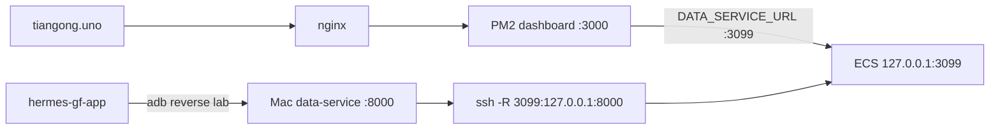

# [hermes/T1] ECS 生产环境与 API 契约核实

GitHub: #36 · Map: #29 · Date: 2026-08-31（含 SSH 恢复）

## Verdict

| 面 | 状态 | 证据 |
|----|------|------|
| **Dashboard** `https://tiangong.uno` | ✅ | `/api/health` → `dashboard:"ok"` |
| **Auth BFF** | ✅ | `/api/activate/auto` → `400 no_fingerprint` |
| **data-service（经 tunnel）** | ✅ | `/api/health` → `data_service:"ok"` |
| **公网 `/v1/*`** | ❌ 未直出 | 走 ECS `127.0.0.1:3099` ← Mac `:8000` |
| **Mac L1** `:8000` | ✅ | health + 业务 API + messages/reports detail |
| **SSH** | ✅ | `ssh -i ~/.ssh/hermes-ecs root@47.93.214.189` |

## 拓扑

## SSH 恢复（2026-08-31）

| 项 | 内容 |
|----|------|
| 根因 | ufw 仅放行旧出口 `183.241.153.90` |
| 修复 | VNC → 放行 `114.103.64.85` + `100.104.0.0/16` |
| 验证 | SSH OK · ECS `:3099/v1/health` ok · 公网 `data_service:ok` |

辅助：`~/code/data-service/scripts/recover-ecs-ssh.sh`

## RN 配置

| URL | Lab | Prod 读路径 |
|-----|-----|-------------|
| L1 | `http://127.0.0.1:8000` | Dashboard → ECS `:3099`（tunnel） |
| Auth | `https://tiangong.uno` | 同 |

## Acceptance

- [x] `/v1/health` + 业务 API（Mac + ECS tunnel）
- [x] env 契约表
- [x] SSH 恢复
