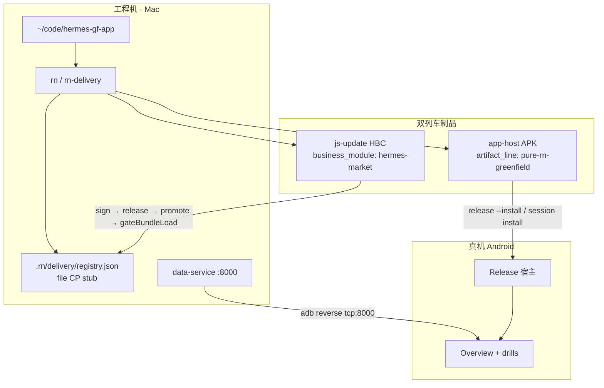

# [hermes/T3] GF 交付链 + CP 工业级 Runbook

GitHub: #39 · Map: #29 · G4: #35 · Date: 2026-08-31  
Dry-run 证据：HITL [mh2](../../docs/hitl/hermes-mh2-release-2026-08-31.md) · [mh4](../../docs/hitl/hermes-mh4-js-update-2026-08-31.md) · [mh5](../../docs/hitl/hermes-mh5-p0-e2e-2026-08-31.md) · R5 [A2 gate mount](../../docs/hitl/hermes-r5-a2-gate-mount-2026-08-31.md)

## 1. 拓扑（G4）



| 环境 | API | CP | 分发 |
|------|-----|----|------|
| **lab** | `127.0.0.1:8000` + adb reverse | 项目内 file registry | `adb` / vivo「继续安装」 |
| **staging** | 同 lab 或 tunnel 恢复后 ECS L1 | `rn-delivery serve`（可选） | 内测 APK |
| **production** | ECS 常驻 L1（T1 缺口：tunnel/SSH） | 先本地 CP；上云不挡已关 L4 | 内测；商店=Depth |

## 2. Delivery 管线（谁跑 · 在哪跑）

**默认：工程机本地**（G4：不上云不挡 M-H5）。CI 可选复刻同一命令。

| 阶段 | 命令 | 产物 |
|------|------|------|
| hygiene | `node …/verify-release-hygiene.mjs .` | DevSupport 洁净 |
| compile host | `rn-delivery build --platform android --profile release` | APK + `last-candidate.json` |
| compile JS | `rn-delivery update --module hermes-market` | bundle + sidecar |
| sign | `rn-delivery sign` | digest-stub 签名 + stub SBOM |
| validate | `rn-delivery validate` | hygiene + metadata |
| promote staging | `rn-delivery release` [`--install`] | registry.staging |
| promote prod | `rn-delivery promote` | **同物** staging→production |
| block | `rn-delivery block --reason '…'` | registry.blocked |
| gate | `verify-js-update-load.mjs . --production` | `gateBundleLoad` |
| A6 | `rn-delivery signal record --module … --update-id …` | quality-signals.json |

**禁止：** promote 前重建不同 digest（同物晋级）。

### 宿主 vs JS

| 列车 | 触发 | 回滚 |
|------|------|------|
| app-host | RN/原生/权限/网络安全配置 | 新 APK `FORWARD_FIX` |
| js-update | 屏幕/业务/API 对接 | `block` + 切上一 `update_id`（热换 HBC=Depth） |

## 3. Control Plane

- **v1 落点：** `hermes-gf-app/.rn/delivery/registry.json`  
- **HTTP 演示：** `rn-delivery serve --port <n>`（Map B 深度 Bearer/RBAC 另票）  
- **命名：** `update_id = {business_module}-{digest12}` · channel：staging → production  
- **兼容：** `runtime_fingerprint_digest` 随宿主；指纹变则 JS 列车需重编

## 4. 与业务域交界

| 组件 | 跑哪 | 与 App 发布 |
|------|------|-------------|
| data-service / 未来 nous serve | Mac lab；Prod 目标 ECS | **解耦** — API 可用性 ≠ APK 发版 |
| Auth BFF | ECS `tiangong.uno` | 激活流独立 |
| Mac ETL / sync_push | Mac cron + launchd | **解耦** — 不进 rn-delivery |
| CP registry | 工程机（现） | 随交付目录备份 |

详见 [R3 ECS 核实](./R3-ecs-api-verify.md)：公网未暴露 `/v1`；ECS L1 依赖 reverse tunnel。

## 5. Android dry-run（已执行）

```bash
export PATH="$HOME/.nvm/versions/node/v24.19.0/bin:$PATH"
export ANDROID_HOME="/opt/homebrew/share/android-commandlinetools"
cd ~/code/hermes-gf-app

rn-delivery build --platform android --profile release
rn-delivery sign && rn-delivery validate
rn-delivery release --install   # vivo：勾「已了解」→「继续安装」

rn-delivery update --module hermes-market
rn-delivery sign && rn-delivery release && rn-delivery promote
node ~/Work/client-platform-labs/rn/scripts/verify-js-update-load.mjs . --production
node ~/Work/client-platform-labs/rn/scripts/verify-l4-steel-thread.mjs .

adb reverse tcp:8000 tcp:8000
# 真机：激活 → 概览 → Macro/Sentiment/Index/Flow
```

**结果：** M-H2…M-H5 PASS · 例 `update_id=hermes-market-2a686c20e016`。

### Gate mount vs sidecar-only M7

Map A **M7** 有两层口径，勿混为「真·OTA HBC execute」：

| 层 | 在哪跑 | 证明什么 | 不证明什么 |
|----|--------|----------|------------|
| **sidecar-only M7** | `verify-js-update-load.mjs . --production`（工程机 / CI） | promoted sidecar 经 `gateJsCandidate` + `gateBundleLoad`（digest · signature · `rnExactTuple`） | 真机 Release 槽位、UI 挂载、HBC 文件执行 |
| **gate mount（R5 A2）** | Release APK · 无 Metro · `shell/ModuleLoader` | 同上 gate + **真机一屏**；`__HERMES_UPDATE_ID__` / `__HERMES_LOAD_MODE__=ota-gated` | 从 `bundle_path` 加载新 HBC（**Depth** — A4 spike FAIL，见 [R6](./R6-ota-hbc-execute-spike.md)） |

**操作顺序（A2 HITL）：**

```bash
cd ~/code/hermes-gf-app
rn-delivery update --module hermes-market && rn-delivery sign && rn-delivery release && rn-delivery promote
cp .rn/delivery/updates/hermes-market/hermes-market-*.json shell/fixtures/last-ota-sidecar.json
node shell/verify-a2-gate.mjs   # valid → ota；坏签 → failed
# Release build → 真机启动 → 一屏 + identity globals（至 B4「我的」可读 update_id）
```

**回滚：** `rn-delivery block` + 换上一 `update_id` 的 sidecar fixture — CP 可指新 digest，**设备仍跑内嵌 baseline JS** 直至 Depth 交付 runtime execute。

证据：[M-H4](../../docs/hitl/hermes-mh4-js-update-2026-08-31.md)（sidecar M7）· [R5 A2 gate mount](../../docs/hitl/hermes-r5-a2-gate-mount-2026-08-31.md) · [R6 A4 spike](./R6-ota-hbc-execute-spike.md)（HBC execute **Defer Depth**）。

### vivo 安装注意

`adb install` / `pm install-commit` 常挂起 → session install + UI 勾选风险提示。

## 6. Acceptance

- [x] Runbook + 拓扑 Mermaid（本文）  
- [x] Android dry-run：release → promote → gateBundleLoad（mh4/mh5）  
- [x] Gate mount vs sidecar-only M7 口径（§5 · R5 A2 + R6）  
- [x] 与 G4 一致：Android 先行 · 本地 CP · Dev API `:8000`  
