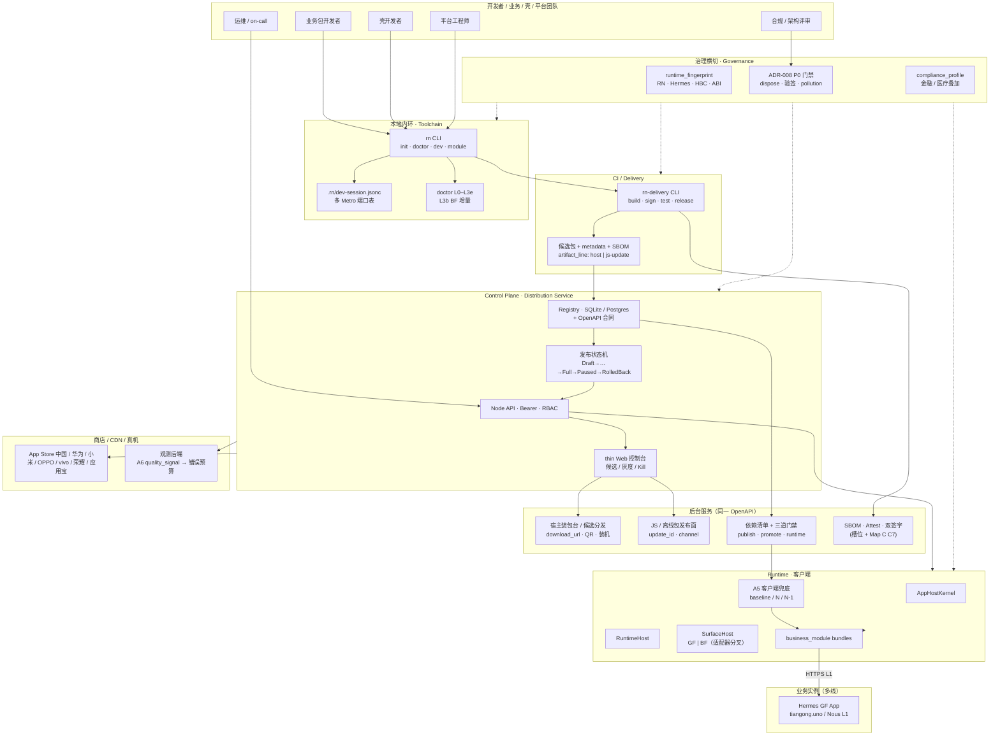
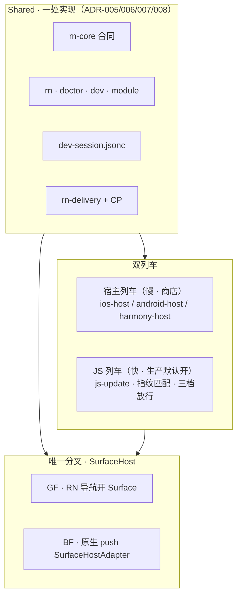

# Atlas · RN 平台全链路架构与自测手册

> **本文件不是 wayfinder map，也不是 contract**。它是一份**读者向诊断文档**——
> 站在系统层面盘点：有哪些节点、每条链路成熟度到 L 几、产物落在哪里、缺什么，
> 并附一份可执行的自测手册，按角色 × 链路跑通端到端。
>
> **写作日期：** 2026-09-05
> **覆盖范围：** 本仓 `client-platform-labs/rn`（平台） + Hermes 业务实例
> **不覆盖：** 业务实例内部细节（Hermes 走 #43/DESTINATION.md）· Harmony 主路径（#93 shelved）

---

## 0. 阅读地图

| 章节 | 一句话 |
|------|--------|
| §1 全链路架构图 | 把壳/包/工具链/交付/控制面/治理/后台服务画在一张图 |
| §2 五平面 × L0–L5 成熟度 | 每条链路当前在哪个等级 + 差什么 |
| §3 9 大类工业环节产物清单 | 你点名的 9 大类全部列节点 + 状态 + 链接 |
| §4 自测手册（按角色 × 链路） | 你可以按这份手册，模拟每个角色跑通 |
| §5 缺口与下一刀 | 哪里要补、下一阶段去哪里 |

---

## 1. 全链路架构图

### 1.1 系统上下文（一张图）



### 1.2 五平面 / 双宿主 / 双列车 一图速记



**关键约束（一句话版）：**
- GF = BF 同一 RuntimeHost，仅 `SurfaceHost` 适配器分叉（ADR-005/006）
- JS 列车生产默认开启 · 机器门禁 = HBC Bytecode Version + `runtime_fingerprint` + `required_capabilities ⊆ host.capability_set` + 渠道允许
- E2E 信号永不挡 `promote`/`submit`；硬门禁在 ADR-008 P0

---

## 2. 五平面 × L0–L5 成熟度

### 2.1 等级定义（统一 bar）

| L | 名称 | 含义 | 关键验收 |
|---|------|------|----------|
| **L0** | 合同 + CI | doctor L3e · governance script · ADR-008 落地 | `rn doctor` 通过；治理 CI 绿 |
| **L1** | 开发工业可用 | init → 多 Metro → dispose HITL | 真机 dispose；多 module 端口表 |
| **L2** | Release 洁净 | release 包无 DevSession / Dev Support | `verify-*-release-hygiene` 绿 |
| **L3** | 候选可装可验 | `rn-delivery release --install` · metadata 完整 | 真机安装 + 校验通过 |
| **L4** | 可企业推广（单 module） | sign + CP promote/block 一次 | 一次完整 promote + block 演练 |
| **L5** | 企业闭环 | gray + rollback + 质量挡板 | A6 信号阻断 promote 一次 |

来源：[enterprise-promotion-gates.md](./agents/enterprise-promotion-gates.md) · GF 与 BF **同一 bar**。

### 2.2 五平面 · 等级现状（2026-09-01 · 实证）

| 平面 | 现状 | 等级 | 主要证据 / 缺口 |
|------|------|------|----------------|
| **A. Runtime SDK** | 落地 + 三层契约 + 能力四级 | **L5** | `packages/rn-core` · `createReferenceRuntimeHost` · A5 槽位 · `gateBundleLoad` |
| **B. Toolchain（CLI）** | 薄核心 + 三 ABI 插件 + 双宿主 | **L5** | `rn` / `rn-delivery` · CLI 三维模型 (#175) · 模块化 dev |
| **C. Delivery** | 七阶段合同 + 候选 metadata + HMAC sign + SBOM 槽 | **L4 thin** | 缺企业 attestation / 真 CycloneDX（#90 shelved） |
| **D. Control Plane** | Node API + Web demo + 状态机 + RBAC + SQLite/Postgres 适配 | **L4 thin**（Map C AFK EXITED） | 缺真观测后端 · C3b 店侧 submit (#89 deferred) |
| **E. Governance** | ADR-008 P0 + fingerprint + compliance_profile + 例外账本 | **L5** | governance 脚本 + `check-architecture-governance.mjs` |

### 2.3 GF vs BF（同一 bar）

| 维度 | GF | BF | 证据 |
|------|----|----|------|
| L0 合同 | ✅ | ✅ | `examples/pure-rn-demo` / `examples/brownfield-host` |
| L1 dev 工业 | ✅ | ✅ | `m3b-bf-2026-08-26.md` |
| L2 release 洁净 | ✅ | ✅ | `verify-*-release-hygiene` |
| L3 候选 | ✅ | ✅ | `m3-gf-2026-08-26.md` |
| L4 可推广 | ✅ | ✅ | `m8-l4-gf` + `bf-l4-bf` |
| L5 企业闭环 | ✅ | ✅ | `m9` + `bf-l5-quality-gate` |

### 2.4 推广切面：Map A–E / Module-first

| Map | 范围 | 状态 | 关键产出 |
|-----|------|------|----------|
| **Map A**（#18） | 六切片 Spine | ✅ Closed | GF/BF L5 · M0–M10 |
| **Map B**（#23） | CP 生产化 · BF 深度 · Harmony | ✅ Closed | B1–B6/B8–B11 · B7 → #93 |
| **Map C**（#73） | CP 服务化 · 七渠 · tick · 故障链 | ✅ AFK EXITED | C1–C9 · C3b → #89 |
| **Map D**（#80） | 合规叠加 · 例外账本 · 迁移 · 薄 oncall | ✅ AFK EXITED | D1–D5 · GRC → #90 |
| **Map E**（#94） | Distribution Service · 装包台 · JS 发布面 | 🔄 Charting | E-T1…E-T12 · L1 本机+ECS 跑通；差 L2 Helm/Postgres |
| **Module-first** | 8 张子图（#115/126/133/143/149/160/166/175） | 🔄 Open | 多离线包 · 剥核 · 角色 · 壳生命周期 · Catalog · CLI 三维 |

### 2.5 关键节点 · 决策门（防散落）

| 节点 | 门控 | 验证 |
|------|------|------|
| G-ADR | 新 CLI/合同字段需 ADR + compliance | `check-architecture-governance.mjs` |
| G-P0 | ADR-008 六条 + Release 洁净 | `rn doctor` L3e |
| G-PROTO | GF/BF `devSessionProtocolVersion` 一致 | 协议同构测试 |
| G-DEV≠REL | dev Metro 不进 delivery | `#20` 门禁 |
| G-HITL | 真机证据归档 | `docs/hitl/*.md` |
| G-L4 | 单 module promote+block 演练 | `m8-l4-gf` / `bf-l4` |

---

## 3. 9 大类工业环节产物清单

每条标注：本仓路径 / 主 issue / 状态 / 下一刀。

### 3.1 命令行工具（rn / rn-delivery / 装包代理）

| 产物 | 路径 | 状态 | 备注 |
|------|------|------|------|
| `rn` 本地 CLI | `packages/rn` | ✅ L5 | `init/doctor/dev/module/host` |
| `rn-delivery` 交付 CLI | `packages/rn-delivery` | ✅ L5 | `build/sign/test/release/update` |
| `rn-core` 合同库 | `packages/rn-core` | ✅ L5 | 类型 + 纯函数；无 Metro I/O |
| `@client-platform/shell-core` SDK | `packages/shell-core` | 🟡 partial | bus / state / dispose（WIP #126/#137–#140） |
| Distribution 装包代理 | `scripts/distribution-console-agent.mjs` | ✅ landed | Map E |
| CLI 三维模型 | (#175) | ✅ | 角色 × 环境 × Porcelain/Plumbing |
| 业务 CLI 表面 | (#143 · #175) | 🔄 Open | 心智极简 DX |

### 3.2 debug 包加载多离线包策略

| 产物 | 路径 / 票 | 状态 | 备注 |
|------|-----------|------|------|
| DevSession 合同 | `.rn/dev-session.jsonc` · ADR-001 | ✅ L5 | 多 Metro 端口表 |
| `DevTransport` | `packages/rn/src/dev-transport.ts` | ✅ L5 | usb / wifi / lan |
| Debug Host（壳不重装） | #14 · `m4` | ✅ L5 | warm reinstall SLA |
| 多 Metro 并行 | ADR-006 · #17 | ✅ L5 | `--modules` 开关 |
| 多离线包本地 Bind | #149（ScriptManager / 双 ReactHost） | 🔄 Open | 与 #115/#126 边界 |
| Metro 智能端口分配 | #158 | 🔄 Open | 壳 × 多包防错绑 |
| 壳×多包 Debug Host CLI | #160 | 🔄 Open | 装/卸/版本感知 |
| 跨团队 Module Catalog | #166 | 🔄 Open | 申请 / 壳方注册 / 元数据合同 |

### 3.3 release 壳加载离线包策略

| 产物 | 路径 / 票 | 状态 | 备注 |
|------|-----------|------|------|
| `gateBundleLoad` 验签 | `packages/rn-core` | ✅ L5 | HBC + fingerprint + capability + channel |
| A5 选择器（baseline / N / N-1） | #8 · ADR-007 | ✅ L5 thin | 按 module 独立 |
| `@client-platform/shell-core` bus | #139 | 🟡 partial | ModuleEventBus |
| ShellRouter + routePrefix | #137 | 🟡 partial | YES/PARTIAL |
| BundleManager 六态 | #138 | 🟡 partial | 基座 ensure / 预下载 / 降级 |
| Tiangong 运行时调度贯通 | #140 | 🟡 partial | HITL 证据 + 运维手册 |
| 剥核产线（Metro id 映射 / Re.Pack MF） | #133 → #135/#136/#141 | 🔄 Open | 公共基座制品 |
| 业务 module first 联调 | #115 → #118–#125 | 🔄 Open | Catalog / Broker / 面板 |

### 3.4 壳的开发 / 调试 / 部署 / 运维 方案

| 产物 | 路径 | 状态 |
|------|------|------|
| 壳团队 cheatsheet | `docs/guides/shell-team-cheatsheet.md` | ✅ |
| 宿主集成指南 | `docs/guides/host-integration.md` | ✅ |
| Debug Host 指南 | `docs/guides/debug-host.md` | ✅ |
| oncall 运维 runbook | `docs/runbooks/cp-oncall.md` · #88 | ✅ D5 |
| 真机钢线（参考实现） | Hermes #29 · `host-android` 仓 | ✅ L4 |
| Shell iOS Debug Host 对称 | #165 | 🔄 Open |

### 3.5 业务包 init/开发/连调/热更新/部署/灰度/发布/运维/OTA

| 产物 | 路径 | 状态 |
|------|------|------|
| 业务 module 开发者指南 | `docs/guides/module-developer.md` | ✅ |
| Expo 互操作口子 | #16 | 🔄 低优 |
| JS 列车放行档（needs-native / js-standard / js-gated） | 蓝图 #13 | ✅ |
| P11 planJsRollback（不切坏流量） | C6 · #79 | ✅ |
| P10 rollout tick（soak + SLO 自动） | C5 · #78 | ✅ |
| 灰度粒度（tenant / platform / channel / cohort） | 蓝图 #13 | ✅ |
| Quality Signal Bus | A6 · #9 · `m9` | ✅ L5 thin（E2E 挡晋级 → #74） |
| Tiangong OTA 运行时 | Hermes D1/D2 · #58/#59 | ✅ L4 |
| tiangong-host 钢线 | E-T9 · #111 | ✅ |

### 3.6 壳发布平台（Distribution Service）

| 产物 | 路径 | 状态 |
|------|------|------|
| OpenAPI 合同 | `docs/specs/distribution-service.openapi.yaml` · E-T7 #109 | ✅ |
| 表合同（SQLite / Postgres） | `docs/specs/distribution-service-storage.md` · E-T1 / B8 #91 | ✅ |
| Docker Compose L1 | `deploy/distribution-service/docker-compose.yml` · E-T8 #110 | ✅ |
| ECS 部署 runbook | `docs/runbooks/distribution-service-aliyun-ecs.md` · #110 | ✅ |
| tiangong 钢线 | E-T9 · #111 | ✅ |
| 装包台原型 | `wayfinding-map-e/prototypes/host-distribution.html` · E-P2 #100 | ✅ |
| 本机双域名完整服务 | E-T12 · #114 | ✅ |
| Helm L2 | — | 🔄 下一刀 |

### 3.7 离线包管理平台（CP / JS 列车 / 依赖）

| 产物 | 路径 | 状态 |
|------|------|------|
| CP 状态机 | `blueprint/04-control-plane.md` + `appendix/release-state-machine.md` | ✅ |
| CP Node API（Bearer + RBAC） | Map B #24 · `verify-cp-auth.mjs` | ✅ |
| CP Registry（SQLite / Postgres adapter） | #26 · #91 | ✅ |
| 依赖清单合同 | E-T1 · #101 · `dependency-manifest` | ✅ |
| 三道门禁（publish / promote / runtime） | E-T2/E-T3 · #102/#103 | ✅ |
| thin CP console | E-T4 / E-T10 · #104/#112 | ✅ |
| 装包台薄接线 | E-T5 / E-T11 · #105/#113 | ✅ |
| 装机 / 下载 / QR | Distribution Agent · `distribution-console-agent.mjs` | ✅ |
| 七渠 channel_profile | C3 · #76 | ✅ 合同 + 适配器 pending |
| 店侧 submit 适配器 | C3b · #89 | 🔄 deferred |

### 3.8 离线包更新策略（OTA）

| 产物 | 路径 | 状态 |
|------|------|------|
| JS 选择器样例 | `blueprint/appendix/js-selector.sample.json` | ✅ |
| 三档放行 | 蓝图 #13 | ✅ |
| HBC Bytecode Version 校验 | 蓝图 #11 | ✅ |
| fingerprint 字段 | `appendix/runtime-fingerprint.fields.md` | ✅ |
| P10 soak + SLO 自动放量 | C5 · #78 | ✅ |
| P11 planJsRollback | C6 · #79 | ✅ |
| Kill/Pause by business_module | B9 · #70 | ✅ |
| Tiangong OTA 运行时（D1/D2） | Hermes #58/#59 | ✅ L4 |
| 设备 checkUpdate API | E-T11 · #113 | ✅ landed |

### 3.9 后台服务 / 企业推广对接

| 服务 | 路径 | 状态 |
|------|------|------|
| Distribution Service（HTTP Node） | `deploy/distribution-service/` · E-T8 | ✅ L1 跑通 |
| OpenAPI（consume 即可对接） | `docs/specs/distribution-service.openapi.yaml` | ✅ |
| 注册 / 壳版本管理 / 离线包版本管理 API | OpenAPI + `cp_*` 表 | ✅ |
| Bearer / RBAC | B1/B5 · #24/#28 | ✅ |
| SQLite/Postgres adapter | B3/B8 · #26/#91 | ✅ |
| 双 SBOM / Attest | C7 · #84 | ✅ thin（真 CycloneDX → #90） |
| Governance fail-closed | D3 · #83 | ✅ |
| Migration dry-run | D4 · #85 | ✅ |
| 运维 oncall runbook | D5 · #88 | ✅ thin |
| GRC backends | #90 | 🔄 shelved |
| 七渠 submit 适配器 | #89 | 🔄 deferred |

**企业推广对接流程：**

```text
1. 申请 OpenAPI 凭证（Bearer / OAuth）
2. POST /v1/release-units            → 注册宿主 + module 组合
3. PUT  /v1/dependency-manifest      → 提交依赖清单
4. POST /v1/candidates               → 上传候选包 + SBOM + sign
5. POST /v1/js-updates               → 上传 JS 列车
6. POST /v1/promote                  → 走状态机（Draft→…→Full）
7. 客户端 gateBundleLoad 拉取
8. /v1/quality-signal                → 错误预算超限 → Paused
9. /v1/exception-ledger              → 紧急 break-glass
```

---

## 4. 自测手册（按角色 × 链路 × 命令）

> **目的：** 你（评审/新成员）能按这份手册，在不阅读所有 map 的前提下，模拟任一角色跑通全流程。
> **环境：** macOS 14+ / Linux · Node 24 (`engines` ≥22 <25) · pnpm 9 · Android SDK（任选其一即可走）· adb device 可选

### 4.0 准备：克隆与安装

```bash
# 1. 克隆（仓库）
git clone https://github.com/client-platform-labs/rn.git
cd rn
nvm use            # 切 Node 24
corepack enable
pnpm install

# 2. 验证：仓库骨架
ls packages/                 # rn-core / rn / rn-delivery / shell-core
ls scripts/                  # ~30 个 verify-*.mjs + loop 脚本
ls deploy/distribution-service/    # Docker Compose L1

# 3. 跑主合同测试（10s 内）
pnpm -r test
```

### 4.1 角色 R-BIZ（业务包开发者）

| 链路 | 命令 | 期望结果 | 验证脚本 |
|------|------|----------|----------|
| doctor | `node packages/rn/bin/rn.js doctor` | exit 0 | `verify-governance.mjs` |
| init topology B | `node packages/rn/bin/rn.js init --demo` | 生成 `examples/pure-rn-demo` | — |
| module init | `cd examples/pure-rn-demo && pnpm exec rn module init main` | 生成 `modules/main` | — |
| dev 真机 | `pnpm exec rn dev --android`（需 adb） | 真机 Metro + HMR | `bench-dev-warm-reinstall.mjs` |
| 多 module | `pnpm exec rn dev --modules main,trade` | 多个 Metro 端口 | `verify-multi-bundler.mjs` |
| release candidate | `pnpm exec rn-delivery build --platform android --profile release` | APK + metadata | `verify-m3-gf.mjs` |
| 调 A1/A5 verify | `node scripts/verify-a5-fallback.mjs` | PASS | — |

### 4.2 角色 R-HOST（壳开发者）

| 链路 | 命令 | 期望结果 | 验证脚本 |
|------|------|----------|----------|
| 装壳 | `bash scripts/setup-host-android.sh` | adb 装 host-android 仓 | `verify-bf-consumer-device.mjs` |
| 切 BF profile | `pnpm exec rn doctor --profile brownfield` | L3b 增量 PASS | `verify-bf-native-doctor.mjs` |
| 真机装壳 | `pnpm exec rn host install --android` | 装到设备 | `verify-bf-consumer-device.mjs` |
| 装 iOS Debug Host 对称 | 跟 #165 WIP | — | — |
| 发布壳版本 | `pnpm exec rn-delivery release --platform android --install` | staging 装包 | `verify-m3-gf.mjs` |
| 切宿主列车灰度 | 走 CP（§4.5） | Full / Paused | `verify-cp-kill-pause.mjs` |

### 4.3 角色 R-PLAT（平台工程师）

| 链路 | 命令 | 期望结果 | 验证脚本 |
|------|------|----------|----------|
| 拉全图 | `node scripts/run-afk-hitl-loop.mjs --plan` | 打印依赖图 | — |
| AFK 回归 | `node scripts/run-afk-hitl-loop.mjs ~/Work/my-rn-app` | afk-hitl-loop-latest.md 全绿 | — |
| Map B 工业切面 | `node scripts/run-map-b-loop.mjs` | map-b-loop-latest.md 全绿 | — |
| Map C 控制面 | `node scripts/run-map-c-loop.mjs` | map-c-loop-latest.md 全绿 | — |
| Map D 治理 | `node scripts/run-map-d-loop.mjs` | map-d-loop-latest.md 全绿 | — |
| 治理 CI | `node scripts/check-architecture-governance.mjs` | exit 0 | — |
| Distribution 镜像 | `bash scripts/push-distribution-image-ecs.sh` | ECS 镜像 | `verify-distribution-compose.mjs` |
| 装包代理 | `node scripts/distribution-console-agent.mjs --help` | 命令列表 | — |
| CLI 表面三维 | 走 #175 验收串 | — | — |
| Multi-pack Bind 选型 | 走 #149 / #153 钢线 | — | — |
| 剥核产线 | 走 #141 P1 follow-up | — | — |
| 角色/岗位手册 | 走 #143/#148 一页纸 | — | — |

### 4.4 角色 R-OPS（运维 / on-call）

| 链路 | 命令 | 期望结果 | 验证脚本 |
|------|------|----------|----------|
| 装包台原型 | `open wayfinding-map-e/prototypes/host-distribution.html` | 浏览器可见 | — |
| JS 发布面原型 | `open wayfinding-map-e/prototypes/js-offline-publish.html` | 浏览器可见 | — |
| 装包台生产（tiangong） | 走 `docs/runbooks/map-e-tiangong-steel-thread.md` | `verify-map-e-tiangong-steel-thread.mjs` | ✅ |
| CP 状态机演练（promote） | 走 `verify-cp-rollout-steps.mjs` | PASS | ✅ |
| CP 状态机演练（block） | 走 `verify-cp-kill-pause.mjs` | PASS | ✅ |
| SLO 错误预算超限 | 走 `verify-cp-rollout-tick.mjs` | 自动 Paused | ✅ |
| planJsRollback | 走 `verify-js-rollback-plan.mjs` | 不切坏流量 | ✅ |
| oncall runbook | `docs/runbooks/cp-oncall.md` + #88 | — | ✅ |
| 双 SBOM promote 挡板 | 走 `verify-cp-sbom-promote-gate.mjs` | FAIL → 阻断 | ✅ |
| Governance fail-closed | 走 `verify-cp-governance-promote-gate.mjs` | FAIL → 阻断 | ✅ |
| 一致性闸 | 走 `verify-consistency-gate.mjs` | FAIL → 阻断 | ✅ |

### 4.5 角色 R-COMP（合规 / 架构评审）

| 链路 | 命令 | 期望结果 | 验证脚本 |
|------|------|----------|----------|
| ADR / 合同 check | `node scripts/check-architecture-governance.mjs` | exit 0 | — |
| dual-landing compliance | 走 `verify-compliance-profile.mjs` | PASS | ✅ |
| release_unit 身份 + module 隔离 | 走 `verify-release-unit.mjs` | PASS | ✅ |
| 治理 fail-closed | 走 `verify-cp-governance-promote-gate.mjs` | PASS | ✅ |
| 迁移 dry-run（expo / bare） | 走 `verify-migration-dry-run.mjs` | PASS | ✅ |
| P13 RN SLO + error budget | 走 `verify-rn-slo-budget.mjs` | PASS | ✅ |
| P15 mixed-stack attribution | 走 `verify-attribution-contract.mjs` | PASS | ✅ |
| exception ledger | 走 #81 D1 合同 | PASS | ✅ |
| 七渠 channel_profile | 走 `verify-channel-profile.mjs` | PASS | ✅ |

### 4.6 角色 R-BIZ × 端到端钢线（Hermes 业务实例）

```bash
# ── 准备：克隆业务实例（host-android + desk） ───────────────
cd ~/code
# 走 #43 方案 D · 路径见 wayfinding-hermes/DESTINATION.md

# ── B · Toolchain ─────────────────────────────────────────
cd <hermes-gf-root>
node ~/Work/client-platform-labs/rn/packages/rn/bin/rn.js doctor

# ── Hermes 业务域 · API 联通 ─────────────────────────────
curl -sf "$API/v1/health"
# activate → JWT（G2 定 Bearer/SecureStore 形态）

# ── C · Delivery · 宿主列车 ───────────────────────────────
pnpm exec rn-delivery build --platform android --profile release
pnpm exec rn-delivery validate
pnpm exec rn-delivery release --install

# ── D · Control Plane · JS 列车 ──────────────────────────
# promote hermes-dashboard js-update → update_id=N
# 客户端 gateBundleLoad(N) 加载成功

# ── 业务 E2E ──────────────────────────────────────────────
# 真机：激活 → v1 主路径

# ── 回滚演练 ─────────────────────────────────────────────
pnpm exec rn-delivery block --module hermes-dashboard --reason 'drill'
# JS → RolledBack；宿主 → 停止继续放量

# ── 走 D1/D2 工业条 ──────────────────────────────────────
node ~/Work/client-platform-labs/rn/scripts/run-hermes-d1-loop.mjs
node ~/Work/client-platform-labs/rn/scripts/run-hermes-d2-loop.mjs
node ~/Work/client-platform-labs/rn/scripts/run-hermes-43-loop.mjs
```

### 4.7 端到端 Distribution Service 钢线

```bash
# 1. 本机起双域名服务
bash scripts/setup-local-distribution-server.sh
# → 验证
node scripts/verify-local-distribution-chain.mjs

# 2. ECS 部署（Aliyun）
bash scripts/push-distribution-image-ecs.sh
# → runbook: docs/runbooks/distribution-service-aliyun-ecs.md

# 3. 装包台/JS 发版台接 API（原型 + thin）
# → open http://localhost/portal/host
# → open http://localhost/portal/js

# 4. 设备 checkUpdate
# → GET /v1/js-updates/check?device_fp=...&channel=production
```

### 4.8 验证脚本总目录（45+ 个 verify-*.mjs）

```bash
ls scripts/verify-*.mjs | wc -l          # 当前 45+ 个
# 分类：
# - GF 验收：verify-m3-gf / m8-l4 / m9 / a5-fallback
# - BF 验收：verify-bf-* (aar / bom / bundler / consumer / gradle / ios-stub / l4 / l5 / native-doctor[-depth] / rn-module / xcframework-build / rct-host)
# - CP 验收：verify-cp-* (auth / kill-pause / registry-sqlite / registry-postgres / rbac / rollout-steps / rollout-tick / js-rollback-plan / sbom-promote-gate / service / consistency-gate / e2e-promote-gate / channel-profile / governance-promote-gate / dependency-gates / dependency-manifest-api)
# - Delivery 验收：verify-*-release-hygiene / distribution-compose / local-distribution-chain / distribution-compose
# - Quality / 业务：verify-rn-slo-budget / attribution-contract / compliance-profile / migration-dry-run
# - Map E 钢线：verify-map-e-tiangong-steel-thread / map-e-portal-prototypes / distribution-compose
```

### 4.9 故障排查：跑挂了的常见原因

| 现象 | 排查 | 修复 |
|------|------|------|
| `rn doctor` 报 L3e fail | `node scripts/verify-*-release-hygiene.mjs` | 修污染：删 `.rn/`、清 `__DEV__` 残留 |
| 多 Metro 端口冲突 | `lsof -i :8081,8082` | `kill` 占用的；`rn dev --modules` 自动分配 |
| 壳装不上 | `adb devices` | 重新连 USB；`adb reverse` |
| gateBundleLoad BLOCKED_INCOMPATIBLE | 检查 `runtime_fingerprint` 全等 + 能力子集 | `rn-delivery validate` 给的诊断 |
| CP promote 失败 | `verify-cp-*` 系列 | 看 `*-latest.md` 第一行 fail 原因 |
| oncall 拉不到 metric | 观测后端未接 | 走 Map C C8 P13 合同 + 真 SLO 后端 |
| Harmony 钢线失败 | DevEco 未装 | shelved → #93 |

---

## 5. 缺口 · 下一刀

### 5.1 已 shelved / deferred（不在本季度范围）

| 项 | 票 | 类别 |
|----|----|------|
| HarmonyOS 真机钢线 | #93 | shelved（Map B B7 lab） |
| 七渠店侧 submit 适配器 | #89 | deferred（Map C C3b） |
| GRC backends + 真 CycloneDX | #90 | shelved（Map D D6） |
| 真观测后端 / 真 SLO | — | Map C depth |

### 5.2 Open 子图（module-first 时代 · 需按顺序推进）

| 子图 | 票 | 一句话 | 优先级 |
|------|----|--------|--------|
| 多离线包本地 Bind | #149 → #151–#159 | ScriptManager / 双 ReactHost 选型 + 落地 | **P0**（与 #115/#126 衔接） |
| RN module first 联调 | #115 → #118–#125 | Catalog / Broker / 面板 | P0 |
| 运行时调度 | #126 → #127–#132 · #137–#140 | shell-core SDK / BundleManager / ShellRouter | P0 |
| 剥核产线 | #133 → #134–#136 · #141 | Metro 公共基座 / Re.Pack MF | P1 |
| 角色/岗位手册 | #143 → #144–#148 | 心智极简 DX | P1 |
| 壳 Debug Host 生命周期 CLI | #160 → #161–#165 | 装/卸/版本感知 | P1 |
| 跨团队 Module Catalog | #166 → #167–#172 | 申请 / 注册 / 元数据 | P1 |
| CLI 三维模型 | #175 → #176–#180 | 角色 × 环境 × Porcelain/Plumbing | P2 |

### 5.3 Map E 下一刀

| 阶段 | 目标 | 验收 |
|------|------|------|
| **L2 Helm** | Helm chart + Postgres + OSS | `verify-helm-install.mjs` |
| **L3 API-only 镜像** | 纯 API 部署，UI 由企业 Portal 接入 | `verify-distribution-api-only.mjs` |
| **L4 SaaS 远期** | 多租户 + 计量 | — |

### 5.4 真正可优化点（按"已交付 / 可深化 / 缺口"三档诊断）

| 类别 | 节点 | 现状 | 建议 |
|------|------|------|------|
| **已工业级** | Runtime · CLI · A5 兜底 · Governance · CP 状态机 · GF/BF L5 钢线 | L5 | 仅运维加固 |
| **可深化** | Distribution Service（L1→L2）· Quality Signal Bus（真 SLO）· 多离线包 Bind 选型 | L4 thin | 推进 Map E L2 / module-first #149 |
| **真正缺口** | Harmony 主路径 · 七渠 submit 适配器 · GRC · 真观测后端 | shelved/deferred | 待产品立项 |

---

## 附录 A · 文件索引

| 类别 | 路径 |
|------|------|
| 入口 | [blueprint/00-entry.md](../blueprint/00-entry.md) |
| 脉络总图 | [docs/architecture-roadmap.md](../docs/architecture-roadmap.md) |
| 当前位 | [docs/architecture.md](../docs/architecture.md) |
| 统一模型 | [docs/agents/gf-bf-unified-model.md](../docs/agents/gf-bf-unified-model.md) |
| 推广门禁 | [docs/agents/enterprise-promotion-gates.md](../docs/agents/enterprise-promotion-gates.md) |
| 工程原则 | [docs/agents/engineering-principles.md](../docs/agents/engineering-principles.md) |
| 治理 | [docs/agents/architecture-governance.md](../docs/agents/architecture-governance.md) |
| 蓝图五卷 | [blueprint/](../blueprint/) |
| OpenAPI | [docs/specs/distribution-service.openapi.yaml](../docs/specs/distribution-service.openapi.yaml) |
| 表合同 | [docs/specs/distribution-service-storage.md](../docs/specs/distribution-service-storage.md) |
| Docker Compose | [deploy/distribution-service/](../deploy/distribution-service/) |
| Loop 入口 | [docs/agents/afk-hitl-loop.md](../docs/agents/afk-hitl-loop.md) |
| 跑通 4 大 loop | `node scripts/run-afk-hitl-loop.mjs` · `run-map-{b,c,d}-loop.mjs` |
| 业务实例 | [wayfinding-hermes/](../wayfinding-hermes/) · #29 · #43 |

## 附录 B · Map 状态速查

| Map | 状态 | 关键 ticket |
|-----|------|-------------|
| 蓝图 wayfinding | ✅ Closed | issues/01–23 |
| 实施 A wayfinding-impl-2 | ✅ Closed #18 | A1–A6 + M0–M10 + #20 #21 #22 #17 |
| Map B wayfinding-map-b | ✅ Closed #23 | B1–B6/B8–B11 · B7→#93 |
| Map C wayfinding-map-c | ✅ AFK EXITED #73 | C1–C9 · C3b→#89 |
| Map D wayfinding-map-d | ✅ AFK EXITED #80 | D1–D5 · GRC→#90 |
| Map E wayfinding-map-e | 🔄 Charting #94 | E-R1..E-R3 · E-G1..E-G3 · E-P1/P2 · E-T1..E-T12 |
| Hermes wayfinding-hermes | ✅ Closed #29 · #43 | D0–D2 · M-H0..M-H6 |
| Module-first | 🔄 Open 8 张 | #115/126/133/143/149/160/166/175 |
| **Atlas（本文件）** | ✅ v1 落地 | 无 tracker 依赖 |

## 附录 C · 维护说明

- 本文件 **不是 wayfinder map**，**不创建 issue / ticket**
- 增量维护点：每张新子图 close 时，把对应节点从 §5.2 移入 §3 / §2
- 每张 map 状态变化时（CLOSED / AFK EXITED），更新 §附录 B
- Loop 脚本新增时，更新 §4.8 验证脚本总目录
- 不重决议；不复制 blueprint 合同；只盘点 + 导航 + 诊断
